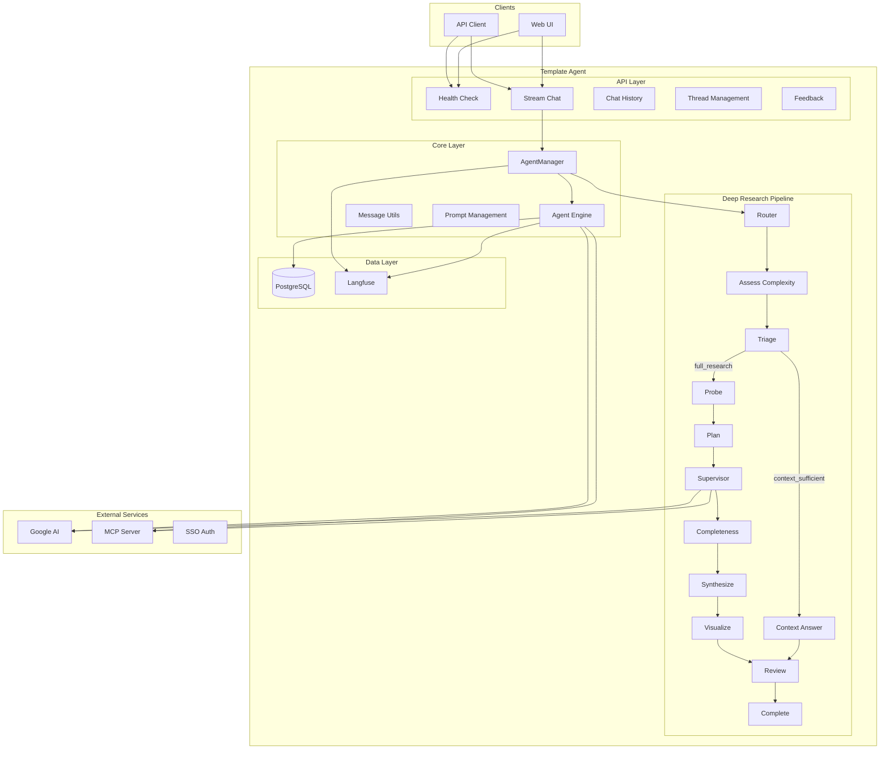
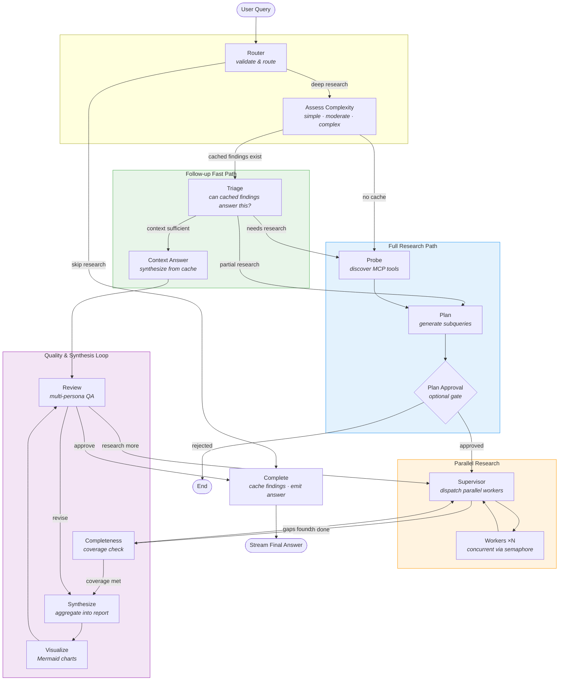

# Template Agent

[](https://www.python.org/downloads/)
[](https://github.com/redhat-data-and-ai/template-mcp-server/actions/workflows/ci.yml)
[](https://codecov.io/gh/redhat-data-and-ai/template-mcp-server)
[](https://opensource.org/licenses/Apache-2.0)

A production-ready template for building AI agents with streaming capabilities, conversation management, and enterprise-grade features. Includes a generic **Deep Research** pipeline for multi-phase, multi-agent research with parallel workers, triage-based follow-up optimization, and Langfuse tracing.

## Features

- **Simplified Streaming API**: Clean, consistent event format for easy client integration
- **Real-time Streaming**: Server-Sent Events (SSE) with token and message streaming
- **Deep Research Mode**: Multi-phase research pipeline with planning, parallel worker execution, multi-persona review, and synthesis -- toggle on/off per request
- **Follow-up Optimization**: Triage node detects when cached findings can answer a follow-up query, skipping full research via a fast context-answer path
- **Multiple Client Examples**: Python async and Streamlit demo applications with deep research support
- **Conversation Management**: Multi-turn conversations with thread persistence
- **Enterprise Integration**: Langfuse tracing (graph-level and worker-level), PostgreSQL checkpointing, SSO support
- **Modular Architecture**: AgentManager abstraction with clean separation of concerns
- **Production Ready**: Health checks, error handling, cancellation support, and comprehensive logging
- **Google AI Integration**: Built-in support for Google Generative AI models (Gemini 2.5 Flash / Pro)

## Architecture



## Streaming API

### Single Streaming Endpoint

```http
POST /v1/stream
Content-Type: application/json
Accept: text/event-stream
```

### Standard Request

```json
{
  "message": "User input message",
  "thread_id": "conversation-thread-id",
  "session_id": "session-id",
  "user_id": "user-identifier",
  "stream_tokens": true
}
```

### Deep Research Request

```json
{
  "message": "Tell me about Red Hat",
  "thread_id": "thread-123",
  "session_id": "session-123",
  "user_id": "user-456",
  "deep_research_enabled": true,
  "deep_research_require_plan_approval": false,
  "deep_research_model": "gemini-2.5-flash",
  "deep_research_max_subqueries": 10,
  "deep_research_max_mode": false
}
```

### Response Events

**Standard mode:**
```
{"type": "token", "content": "Hello"}
{"type": "token", "content": " world"}
{"type": "message", "content": {"type": "ai", "content": "Hello world"}}
[DONE]
```

**Deep research mode:**
```
{"type": "deep_research_status", "content": {"stage": "started", "event_type": "started", "display_text": "Starting deep research analysis...", "ui_visible": true, "details": {}}}
{"type": "deep_research_status", "content": {"stage": "agent_conversation", "event_type": "subquery_complete", "display_text": "Worker 1/7: ...", "ui_visible": true, "details": {...}}}
{"type": "deep_research_status", "content": {"stage": "completed", "event_type": "final_answer", "display_text": "Answer: ...", "ui_visible": true, "details": {"final_answer": "..."}}}
{"type": "message", "content": {"type": "ai", "content": "# Research Report\n..."}}
[DONE]
```

### Client Examples

Ready-to-use client examples are available in the [`examples/`](./examples/) directory:

- **[Streamlit Demo App](./examples/streamlit_app.py)** - Interactive chat with deep research support
- **[Python Async Client](./examples/client_python.py)** - Server-to-server integration with deep research

See the [examples README](./examples/README.md) for detailed usage instructions.

## Quick Start

### Prerequisites

- Python 3.12+
- Google AI API credentials
- Template MCP Server running (for tool access)
- PostgreSQL database (optional -- in-memory mode available)
- Langfuse account (optional)

### Installation

1. **Clone the repository**
   ```bash
   git clone https://github.com/redhat-data-and-ai/template-agent.git
   cd template-agent
   ```

2. **Create virtual environment**
   ```bash
   uv venv
   source .venv/bin/activate
   ```

3. **Install dependencies**
   ```bash
   uv pip install -e ".[dev]"
   ```

4. **Set up environment variables**
   ```bash
   cp .env.example .env
   # Edit .env with your configuration
   ```

5. **Run template-mcp-server** following https://github.com/redhat-data-and-ai/template-mcp-server

6. **Run the application**
   ```bash
   uv run python -m template_agent.src.main
   ```

## API Reference

### Endpoints

| Endpoint                  | Method | Description |
|---------------------------|--------|-------------|
| `/health`                 | GET | Health check |
| `/v1/stream`              | POST | Stream chat responses (standard and deep research) |
| `/v1/history/{thread_id}` | GET | Get conversation history |
| `/v1/threads/{user_id}`   | GET | List user threads |
| `/v1/feedback`            | POST | Record feedback |

### Standard Chat

```bash
curl -X POST "http://localhost:5002/v1/stream" \
  -H "Content-Type: application/json" \
  -d '{
    "message": "Hello, how can you help me?",
    "thread_id": "thread_123",
    "user_id": "user_456",
    "stream_tokens": true
  }'
```

### Deep Research Chat

```bash
curl -X POST "http://localhost:5002/v1/stream" \
  -H "Content-Type: application/json" \
  -d '{
    "message": "Tell me about Red Hat",
    "thread_id": "thread_123",
    "user_id": "user_456",
    "deep_research_enabled": true,
    "deep_research_require_plan_approval": false
  }'
```

### Health Check

```bash
curl "http://localhost:5002/health"
# Response: {"status": "healthy", "service": "Template Agent"}
```

## Deep Research Pipeline

Deep Research is a multi-agent research system built on LangGraph. When a user enables it, their question goes through a structured pipeline that plans the research, runs parallel workers to gather data, checks for gaps, synthesizes a report, and runs a multi-persona quality review -- all streamed back to the client in real time.

### Architecture



### How It Works

The pipeline is a directed graph where each node performs a focused task and routes to the next based on the result. There are two main paths and two feedback loops.

#### 1. Entry: Routing & Complexity

Every query first passes through the **Router**, which validates the input and determines if deep research is appropriate. If so, the **Assess Complexity** node classifies the query as simple, moderate, or complex, which controls how many research rounds and subqueries are allowed.

#### 2. Follow-up Fast Path

When a follow-up question arrives on the same thread, cached findings from the previous research may already have the answer. The pipeline checks this early to avoid redundant work:

| Node | What it does |
|------|-------------|
| **Triage** | Compares the new query against cached findings and conversation history. Decides: *context sufficient*, *partial research*, or *full research*. |
| **Context Answer** | If the cache is enough, synthesizes a draft answer in a single LLM call and skips straight to Review. |

This fast path typically completes in 2-3 seconds instead of the 30-60 seconds a full research run takes.

#### 3. Full Research Path

For new topics or when existing findings are insufficient:

| Node | What it does |
|------|-------------|
| **Probe** | Discovers all available MCP tools (search, database, web, etc.) and tests their capabilities with sample queries. |
| **Plan** | Uses the probe results to generate a structured research plan with targeted subqueries. Each subquery specifies which tools to use and what data to look for. |
| **Plan Approval** | Optional gate. When enabled (`deep_research_require_plan_approval: true`), the plan is sent to the client for human approval before execution. |

#### 4. Parallel Research (Supervisor + Workers)

The **Supervisor** is the heart of the research engine. It dispatches subqueries as concurrent workers and manages the overall research progress:

- **Concurrency**: Workers execute in parallel using `asyncio.Semaphore` (default: 4 concurrent workers). Each worker independently calls MCP tools, runs LLM analysis, and produces findings.
- **Quality checks**: Each worker self-evaluates its results and runs a plausibility check for numeric anomalies. Low-quality results are retried with a reformulated query (up to 2 retries).
- **Conflict resolution**: When multiple workers return contradictory findings, the supervisor runs a conflict resolution pass to reconcile them.
- **Reflection**: After each round, the supervisor reflects on coverage gaps and can generate follow-up subqueries for the next round.

#### 5. Completeness Check

After each research round, the **Completeness** node evaluates whether enough data has been gathered:

- An LLM scores research coverage as a percentage against the original query.
- If coverage is below the threshold (default: 70%) and there are uncovered aspects, the pipeline loops back to the **Supervisor** for another round.
- A convergence check prevents infinite loops -- if coverage improves by less than 5% over two consecutive checks, research stops.
- Early exit triggers at 90%+ coverage with no contradictions.
- Maximum rounds are capped (default: 3) regardless of coverage.

#### 6. Synthesis, Visualization & Review

Once research is complete, the findings go through a quality pipeline:

| Node | What it does |
|------|-------------|
| **Synthesize** | Aggregates all findings into a structured report with sections, key findings, and data tables. |
| **Visualize** | Generates Mermaid.js charts (bar, pie, flowchart, timeline) based on the data. Chart types are selected automatically -- bar charts for comparisons, pie charts only for parts-of-a-whole data. |
| **Review** | A panel of AI reviewers (Factual Skeptic, User Advocate, Numerical Auditor, Completeness Checker) scores the report on accuracy, clarity, and coverage. |

The Review node can take three actions based on the quality score:

| Score | Action | What happens |
|-------|--------|-------------|
| **≥ 60%** | Approve | Proceed to Complete and deliver the answer |
| **40-60%** | Revise | Loop back to Synthesize for a rewrite |
| **< 40%** | Research More | Loop back to Supervisor with follow-up subqueries |

### Real-time Event Streaming

Every node in the pipeline emits progress events through an `asyncio.Queue` as they happen -- not in batches when a node completes. The client receives a continuous stream of SSE events showing exactly what the pipeline is doing:

```
started → complexity assessed → triage decision → probe results → plan generated
→ worker 1/7 started → worker 1/7 complete → worker 2/7 started → ...
→ synthesis started → visualization created → review started → review complete
→ final answer
```

### Key Capabilities

- **Parallel workers** -- Subqueries execute concurrently with configurable concurrency limits (`DEEP_RESEARCH_LLM_CONCURRENCY`)
- **Follow-up optimization** -- Triage detects when prior findings answer a follow-up, routing to a fast context-answer path (2-3s vs 30-60s)
- **In-memory findings cache** -- Findings persist across requests on the same thread within the process lifetime
- **Langfuse tracing** -- Graph-level, worker-level, and node-level LLM call tracing for full observability
- **Cancellation support** -- Active research sessions can be cancelled mid-flight via the cancellation store
- **Token tracking** -- Per-phase token usage and cost estimation with configurable cost-per-million rates
- **Auto chart selection** -- Visualization node selects appropriate chart types based on data shape (bar charts for comparisons, pie only for proportional data)
- **Session locking** -- Once deep research starts in a conversation, the mode cannot be toggled off to prevent state corruption

## Configuration

### Environment Variables

#### Server
| Variable | Default | Description |
|----------|---------|-------------|
| `AGENT_HOST` | `0.0.0.0` | Server bind address |
| `AGENT_PORT` | `5002` | Server port |
| `PYTHON_LOG_LEVEL` | `INFO` | Logging level |
| `USE_INMEMORY_SAVER` | `false` | Use in-memory checkpointer (no PostgreSQL needed) |

#### Database
| Variable | Default | Description |
|----------|---------|-------------|
| `POSTGRES_USER` | `pgvector` | Database username |
| `POSTGRES_PASSWORD` | `pgvector` | Database password |
| `POSTGRES_DB` | `pgvector` | Database name |
| `POSTGRES_HOST` | `pgvector` | Database host |
| `POSTGRES_PORT` | `5432` | Database port |

#### MCP Server
| Variable | Default | Description |
|----------|---------|-------------|
| `MCP_SERVER_NAME` | `template-mcp-server` | MCP server identifier |
| `MCP_SERVER_URL` | `http://localhost:5001/mcp/` | MCP server endpoint |
| `MCP_TRANSPORT_PROTOCOL` | `streamable_http` | Transport protocol |
| `MCP_CONNECTION_TIMEOUT` | `30` | Connection timeout in seconds |
| `MCP_SSL_VERIFY` | `false` | Enable SSL verification for MCP |

#### Deep Research
| Variable | Default | Description |
|----------|---------|-------------|
| `DEEP_RESEARCH_ENABLED` | `true` | Enable deep research pipeline |
| `DEEP_RESEARCH_DEFAULT_MODEL` | `gemini-2.5-flash` | Default model for deep research LLM calls |
| `DEEP_RESEARCH_MAX_SUBQUERIES` | `10` | Maximum number of research subqueries |
| `DEEP_RESEARCH_MAX_TOOLS` | `50` | Maximum tools to include in prompts |
| `DEEP_RESEARCH_LLM_CALL_TIMEOUT_SECONDS` | `120` | Timeout for individual LLM calls |
| `DEEP_RESEARCH_REQUIRE_PLAN_APPROVAL` | `true` | Require user approval before executing plan |
| `DEEP_RESEARCH_ENABLE_VISUALIZATION` | `true` | Enable visualization node |
| `DEEP_RESEARCH_MAX_SESSION_SECONDS` | `600` | Maximum session duration (10 min) |
| `DEEP_RESEARCH_LLM_CONCURRENCY` | `5` | Maximum concurrent LLM calls |
| `LLM_INPUT_COST_PER_MILLION` | `1.25` | Cost per 1M input tokens (USD) |
| `LLM_OUTPUT_COST_PER_MILLION` | `10.0` | Cost per 1M output tokens (USD) |

#### Langfuse (optional)
| Variable | Default | Description |
|----------|---------|-------------|
| `LANGFUSE_PUBLIC_KEY` | - | Langfuse public key |
| `LANGFUSE_SECRET_KEY` | - | Langfuse secret key |
| `LANGFUSE_BASE_URL` | - | Langfuse host URL |
| `LANGFUSE_TRACING_ENVIRONMENT` | `development` | Langfuse environment |

#### Google AI
| Variable | Default | Description |
|----------|---------|-------------|
| `GOOGLE_SERVICE_ACCOUNT_FILE` | - | Path to service account JSON |
| `GOOGLE_APPLICATION_CREDENTIALS_CONTENT` | - | Inline service account JSON |

## Testing

### Run Tests

```bash
# Run all tests
pytest

# Run with coverage
pytest --cov=template_agent.src --cov-report=html

# Run specific test file
pytest tests/test_prompt.py -v
```

## Deployment

### Podman Compose

```bash
podman-compose up -d --build
```

### Production Considerations

- **SSL/TLS**: Configure SSL certificates for HTTPS
- **Database**: Use managed PostgreSQL service
- **Monitoring**: Set up Langfuse for tracing
- **Scaling**: Configure horizontal pod autoscaling
- **Security**: Implement proper authentication

## Development

### Project Structure

```
template-agent/
├── template_agent/
│   ├── src/
│   │   ├── core/
│   │   │   ├── agent.py            # Agent initialization
│   │   │   ├── agent_utils.py      # Message utilities
│   │   │   ├── manager.py          # AgentManager (routes standard / deep research)
│   │   │   ├── prompt.py           # Prompt management
│   │   │   └── deep_research/      # Deep research pipeline
│   │   │       ├── streaming.py    # Graph builder & streaming orchestration
│   │   │       ├── agents.py       # ResearchContext factory & worker execution
│   │   │       ├── state.py        # State schema, ResearchContext dataclass
│   │   │       ├── events.py       # SSE event emitters
│   │   │       ├── prompts.py      # LLM prompt templates
│   │   │       ├── mode_config.py  # Model/mode configuration
│   │   │       ├── sentinel.py     # Loop circuit breaker
│   │   │       ├── cancel.py       # Cancellation store
│   │   │       ├── context_manager.py  # Hierarchical context window
│   │   │       ├── plan_store.py   # Plan persistence
│   │   │       ├── findings_store.py   # Cross-chat findings
│   │   │       ├── token_tracker.py    # Token usage re-export
│   │   │       ├── utils.py        # Shared utilities
│   │   │       └── nodes/          # Pipeline nodes
│   │   │           ├── probe.py
│   │   │           ├── triage.py
│   │   │           ├── complexity.py
│   │   │           ├── context_answer.py
│   │   │           ├── plan.py
│   │   │           ├── supervisor.py
│   │   │           ├── completeness.py
│   │   │           ├── synthesize.py
│   │   │           ├── visualize.py
│   │   │           ├── review.py
│   │   │           └── complete.py
│   │   ├── routes/
│   │   │   ├── health.py
│   │   │   ├── stream.py
│   │   │   ├── history.py
│   │   │   ├── threads.py
│   │   │   └── feedback.py
│   │   ├── api.py
│   │   ├── main.py
│   │   ├── schema.py
│   │   └── settings.py
│   └── utils/
│       ├── tracing.py              # Token tracking & tracked_invoke
│       └── pylogger.py             # Structured logging
├── examples/
│   ├── client_python.py
│   ├── streamlit_app.py
│   └── README.md
├── tests/
└── README.md
```

### Code Quality

```bash
# Run linting
ruff check .

# Run type checking
mypy template_agent/src/

# Run formatting
ruff format .

# Run pre-commit hooks
pre-commit run --all-files
```

## Related Projects

- [Template MCP Server](https://github.com/redhat-data-and-ai/template-mcp-server) - MCP tools server
- [Template UI](https://github.com/redhat-data-and-ai/template-ui) - React frontend
- [LangGraph](https://github.com/langchain-ai/langgraph) - Stateful LLM applications
- [FastAPI](https://fastapi.tiangolo.com/) - Modern web framework
- [Langfuse](https://langfuse.com/) - LLM observability platform

---

**Built with care by the Red Hat Data & AI team**
