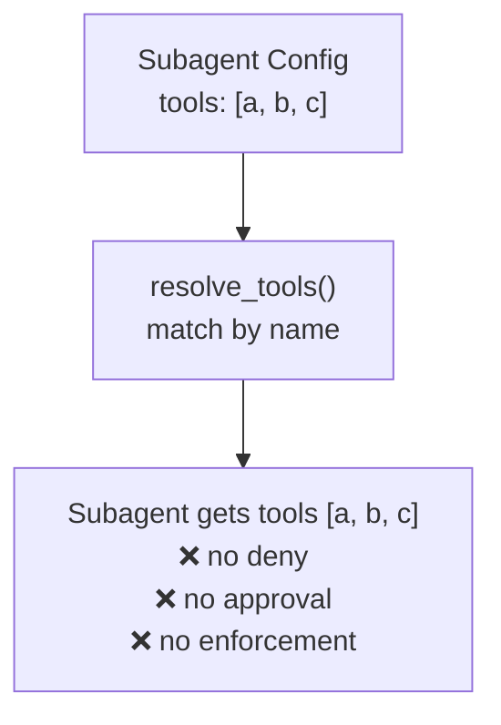
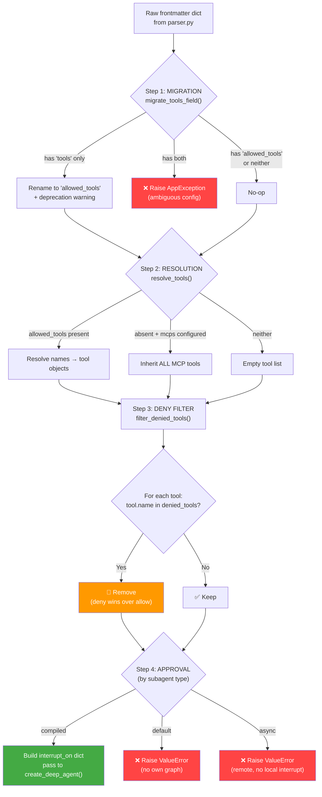
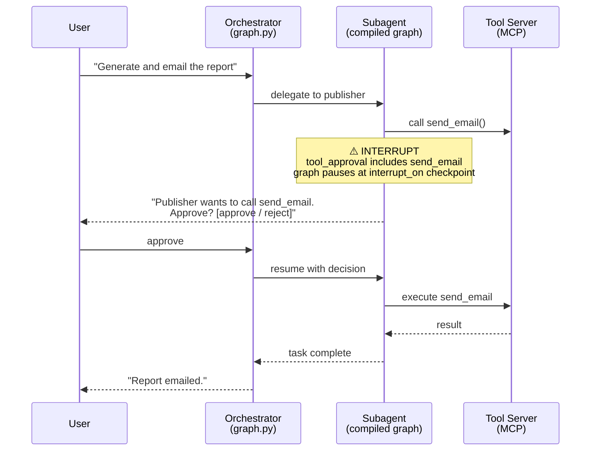
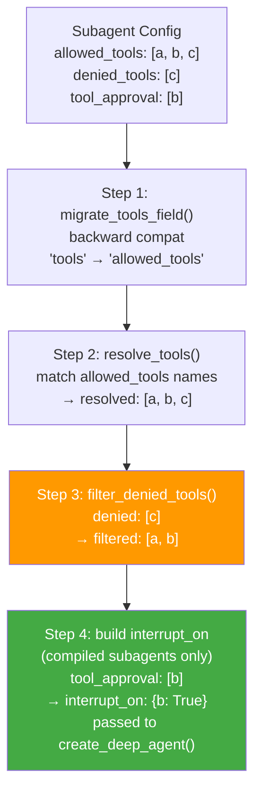

# Tool Access Control Per Subagent

### Submitters

- Naveen Saharan

## Change Log

- **Added:** `allowed_tools` frontmatter field -- explicit allowlist replacing the deprecated `tools` field
- **Added:** `denied_tools` frontmatter field -- denylist that removes tools even if resolved (deny wins over allow)
- **Added:** `tool_approval` frontmatter field -- per-subagent human-in-the-loop approval for sensitive tools
- **Added:** `tool_access.py` -- centralized enforcement module (migration, deny filtering, approval wrapping)
- **Added:** Backward compatibility -- automatic migration from `tools` to `allowed_tools` with deprecation warning
- **Added:** Compiled subagents receive their own `interrupt_on` dict via `create_deep_agent()` for tool approval
- **Added:** Validation errors for `tool_approval` on `default` and `async` subagent types

## Referenced Use Case(s)

- When an orchestrator delegates to multiple subagents (e.g., analyst and publisher), each subagent should only access the tools it needs. An analyst subagent that calculates BMI should not be able to send emails. A publisher subagent that sends emails should not be able to run arbitrary web searches.
- Compliance and security teams require defense-in-depth: even if a subagent's system prompt says "do not use tool X," the tool must be structurally unavailable, not just discouraged.
- Certain tools are sensitive enough to require human confirmation before execution (e.g., `send_email`, `publish_report`), but only for specific subagents. The orchestrator may use those same tools freely.
- The original `tools` field provided basic allowlisting but no deny capability, no per-subagent approval, and no enforcement beyond "only resolve these names."

## Context

The template-agent framework runs a LangGraph orchestrator that delegates work to subagents. Subagents come in three types: `default` (inline LLM call), `compiled` (own compiled graph via `create_deep_agent()`), and `async` (remote Agent Protocol server). All three types can access MCP tools registered at startup.

### The core problems

1. **No denylist.** If a subagent inherited MCP tools (via `mcps` config or orchestrator inheritance), it received every tool from those servers. There was no way to exclude specific tools. The only control was the `tools` allowlist, which was optional -- omitting it meant "give me everything."

2. **No per-subagent approval.** The only human approval mechanism was the orchestrator-level `human_approval` middleware, configured globally in `agent.yaml`. This was all-or-nothing: either every tool call across the entire agent required approval (`mode: all`), or none did. There was no way to say "require approval for `send_email` only when the publisher subagent calls it."

3. **No enforcement architecture.** Tool filtering was scattered across `loader.py`, `graph.py`, and `subagents.py` with no single module responsible for access control logic. Adding deny or approval behavior required touching multiple files with no clear contract.

4. **Naming confusion.** The `tools` field was ambiguous -- it could mean "tools this agent has" or "tools this agent is allowed to use." The name carried no access-control semantics.

### What existed before

- **`tools` field in frontmatter** -- a list of tool names resolved against available MCP tools. Optional; omitting it gave the subagent all tools from its configured MCP servers.
- **`human_approval` middleware** -- orchestrator-level only, configured in `agent.yaml`. Modes: `all` (approve every tool call), `none` (approve nothing). Could exclude specific tools via an `exclude` list. Applied globally, not per-subagent.
- **`resolve_tools()` in `resolver.py`** -- name-to-object resolution. Logged warnings for missing names but did no access control beyond matching.

#### Before: Subagent YAML

```yaml
---
name: analyst
type: compiled
model: gemini-2.5-pro
tools:
  - calculate_bmi
  - search_web
  - send_email          # no way to deny this
skills:
  - bmi-report
---
```

#### Before: Tool Resolution Flow



## Proposed Design

### Architecture

#### Component Diagram

```mermaid
graph TB
    subgraph "agent/config/"
        parser["parser.py\nparse_frontmatter()\nYAML + body"]
        loader["loader.py\n_load_all_subagents()\ncalls migrate_tools_field()"]
        resolver["resolver.py\nresolve_tools()\nname → object resolution"]
        hitl["hitl.py\nbuild_interrupt_on()\norchestrator-level HITL"]
    end

    subgraph "infrastructure/"
        tool_access["tool_access.py\n✦ migrate_tools_field() — backward compat\n✦ filter_denied_tools() — deny enforcement\n✦ apply_tool_approval() — approval wrapping"]
        subagents["subagents.py\nload_subagents()\n├ _build_default — deny only\n├ _build_compiled — deny + approval\n└ _build_async — no tool resolution"]
    end

    subgraph "aegra/"
        graph["graph.py\nagent() — per-request graph factory\nreads allowed_tools, calls load_subagents(),\ncalls create_deep_agent() with interrupt_on"]
    end

    parser --> loader
    loader --> tool_access
    resolver --> subagents
    tool_access --> subagents
    subagents --> graph
    hitl --> graph
```

#### Enforcement Pipeline



#### Request Flow Diagram



### Cross-Agent Tool Access Matrix

Example configuration for an agent with two subagents (analyst and publisher):

| Tool | Orchestrator | analyst | publisher |
|------|:---:|:---:|:---:|
| `calculate_bmi` | has | has | denied |
| `search_web` | has | has | denied |
| `send_email` | has | denied | has (approval) |
| `publish_report` | has | denied | has (approval) |
| `format_data` | has | has | has |

Legend:
- **has** -- tool is available, no approval required
- **denied** -- tool is structurally removed, cannot be called regardless of prompt
- **has (approval)** -- tool is available but triggers HITL interrupt before execution

### Key Design Decisions

#### 1. Orchestrator and subagent tool sets are independent

The orchestrator resolves its own `allowed_tools` from its own frontmatter (`PROMPT.md`). Each subagent resolves its own `allowed_tools` from its own frontmatter (`subagents/*.md`). There is no inheritance chain, no override mechanism, and no implicit sharing. If the orchestrator has `send_email` and a subagent does not list it in `allowed_tools`, the subagent does not get it. This prevents accidental tool leakage through configuration inheritance.

#### 2. Deny always wins over allow

If a tool name appears in both `allowed_tools` and `denied_tools`, the tool is removed. `filter_denied_tools()` runs after resolution, so it removes tools regardless of how they were resolved (explicit allowlist or implicit MCP inheritance). This provides defense-in-depth: even if a future code change adds implicit tool inheritance, the denylist still blocks the tool.

#### 3. tool_approval only works for compiled subagents

Compiled subagents get their own compiled graph via `create_deep_agent()`. This graph supports `interrupt_on` -- when a tool call matches an `interrupt_on` entry, the graph pauses at a checkpoint and waits for a human decision (approve or reject). Default subagents run inline as a single LLM call within the orchestrator's graph; they have no checkpoint mechanism. Async subagents run on remote servers; they cannot trigger local interrupts. Both types raise `ValueError` if `tool_approval` is configured.

#### 4. Backward compatibility via automatic migration

The `migrate_tools_field()` function silently renames `tools` to `allowed_tools` in memory during config loading. This means existing subagent configs with `tools:` continue to work without modification. If both `tools` and `allowed_tools` are present, a configuration error is raised immediately to prevent ambiguity. The migration is logged as a deprecation warning so operators can update their configs at their own pace.

### After: Subagent YAML

```yaml
---
name: analyst
type: compiled
model: gemini-2.5-pro
allowed_tools:
  - calculate_bmi
  - search_web
denied_tools:
  - send_email
tool_approval:
  - search_web
skills:
  - bmi-report
---
```

```yaml
---
name: publisher
type: compiled
model: gemini-2.5-pro
allowed_tools:
  - send_email
denied_tools:
  - calculate_bmi
  - search_web
tool_approval:
  - send_email
skills:
  - email-formatter
---
```

### After: Tool Resolution Flow



### Module Layout

```
deep_agent/
├── aegra/
│   └── graph.py                          # Orchestrator graph factory; reads allowed_tools,
│                                         # calls load_subagents(), builds interrupt_on
├── src/
│   ├── agent/config/
│   │   ├── loader.py                     # AgentConfig._load_all_subagents() calls
│   │   │                                 # migrate_tools_field() during config load
│   │   ├── resolver.py                   # resolve_tools() -- name-to-object matching
│   │   ├── parser.py                     # parse_frontmatter() -- YAML extraction
│   │   └── hitl.py                       # build_interrupt_on() -- orchestrator-level HITL
│   └── infrastructure/
│       ├── tool_access.py                # migrate_tools_field(), filter_denied_tools(),
│       │                                 # apply_tool_approval() -- all access control logic
│       └── subagents.py                  # load_subagents(), _build_default_subagent(),
│                                         # _build_compiled_subagent(), _build_async_subagent()
└── tests/
    └── unit/infrastructure/
        └── test_tool_access.py           # Unit tests for tool_access.py
```

## Considerations

### Why separate allowed_tools and denied_tools instead of a single field?

An allowlist alone is insufficient when subagents inherit tools from MCP servers. If a subagent declares `mcps: [my-server]` but omits `allowed_tools`, it gets every tool from that server. The denylist provides a safety net: "give me everything from this server except these specific tools." Without it, adding a new tool to an MCP server would silently expose it to every subagent that inherits from that server.

### Why does tool_approval only work for compiled subagents?

The HITL interrupt mechanism requires a compiled LangGraph graph with checkpoint support. When a tool call matches an `interrupt_on` entry, the graph pauses at a checkpoint node and waits for the orchestrator to provide a human decision (approve or reject). Default subagents run as a single inline LLM call within the orchestrator's graph -- they have no independent graph, no checkpoint nodes, and no mechanism to pause and resume. Async subagents run on remote servers and cannot trigger local graph interrupts. Extending approval to these types would require fundamentally different mechanisms (e.g., wrapping tool functions with approval prompts for default, or forwarding interrupt signals over Agent Protocol for async).

### Why deny wins over allow unconditionally?

A deny-wins policy prevents accidental exposure. If a tool appears in both lists due to a configuration mistake, the safe default is to block it. This matches the principle of least privilege and aligns with how firewall rules, RBAC policies, and file permission systems work. The alternative -- allow-wins or last-writer-wins -- creates scenarios where a tool thought to be blocked is actually accessible.

### Why not inherit tools from the orchestrator?

Explicit is better than implicit. If subagents inherited the orchestrator's tool set by default, adding a tool to the orchestrator would silently propagate it to every subagent. This violates the principle of least privilege and makes it difficult to reason about what each subagent can do. Each subagent declares exactly what it needs.

### Why is apply_tool_approval() in tool_access.py but not called from subagents.py?

The `apply_tool_approval()` function implements a wrapper-based approach to tool approval: it replaces a tool's coroutine/function with a wrapper that calls `interrupt()` before execution. This is an alternative to the `interrupt_on` dict approach used by `create_deep_agent()`. The wrapper approach exists as a tested fallback for environments where `create_deep_agent()` does not support `interrupt_on` (checked at runtime via `inspect.signature()`). The current pipeline uses `interrupt_on` because it integrates with LangGraph's native checkpoint system rather than wrapping tool functions.

## Decision

### Three-Field Tool Access Control with Enforcement Pipeline

Implement three frontmatter fields that control tool access per subagent:

| Field | Type | Purpose | Required |
|-------|------|---------|----------|
| `allowed_tools` | `list[str]` | Explicit allowlist. Only these tools are resolved. Replaces deprecated `tools` field. | No (omit = inherit all from MCP) |
| `denied_tools` | `list[str]` | Explicit denylist. Removes tools even if resolved. Deny wins over allow. | No (omit = deny nothing) |
| `tool_approval` | `list[str]` | Tools requiring human approval before execution. Compiled subagents only. | No (omit = no approval) |

**Enforcement order:** migration -> resolve -> deny filter -> approval (for compiled subagents).

**File-level changes:**

| File | Purpose |
|------|---------|
| `deep_agent/src/infrastructure/tool_access.py` | New module. `migrate_tools_field()`, `filter_denied_tools()`, `apply_tool_approval()` |
| `deep_agent/src/infrastructure/subagents.py` | Modified. Calls `filter_denied_tools()` for all types. Builds `interrupt_on` for compiled subagents. Raises `ValueError` for `tool_approval` on default/async types. |
| `deep_agent/src/agent/config/loader.py` | Modified. Calls `migrate_tools_field()` during config loading for both orchestrator and subagent configs. |
| `deep_agent/aegra/graph.py` | Modified. Reads `allowed_tools` (not `tools`) from orchestrator config. |
| `config/agent/subagents/*.md` | Modified. Frontmatter uses `allowed_tools`, `denied_tools`, `tool_approval`. |
| `tests/unit/infrastructure/test_tool_access.py` | New. Unit tests for all tool_access.py functions. |

## Consequences

### Positive

- **True tool isolation per subagent.** Each subagent gets exactly the tools it declares, minus anything denied. No implicit inheritance, no accidental exposure.
- **Defense-in-depth.** Even if a system prompt says "do not use tool X," the tool is structurally unavailable. The LLM cannot call a tool that was never registered.
- **No runtime overhead for filtering.** Deny filtering happens once at graph build time, not on every tool call. The filtered tool list is passed to `create_deep_agent()` and never changes.
- **Backward compatible.** Existing configs with `tools:` continue to work via automatic migration. No breaking changes.
- **Per-subagent approval granularity.** Sensitive tools can require human confirmation for specific subagents without affecting the orchestrator or other subagents.

### Negative

- **tool_approval is limited to compiled subagents.** Default and async subagents cannot use tool approval. This is a structural limitation of how these subagent types execute (no independent graph with checkpoint support).
- **No runtime policy changes.** Tool access is determined at graph build time. Changing access requires updating frontmatter and rebuilding the graph (restarting the agent or redeploying).
- **apply_tool_approval() is unused in the current pipeline.** The wrapper-based approval approach exists and is tested but is not wired into the subagent build flow. It may cause confusion for future contributors who find tested code that appears to be dead.

### Future

- **Orchestrator-level `denied_tools`.** Apply the same deny mechanism to the orchestrator's own tool set, not just subagents.
- **RBAC profiles.** Define named access profiles (e.g., `read-only`, `analyst`, `admin`) that map to predefined `allowed_tools`/`denied_tools` sets. Subagents reference a profile instead of listing individual tools.
- **Dynamic policy.** Load tool access rules from an external policy engine (e.g., OPA) at runtime instead of static frontmatter. This would enable per-user, per-tenant, or per-environment access control without redeployment.
- **Async subagent approval.** Extend the Agent Protocol to support interrupt signals, enabling tool approval for async subagents running on remote servers.
- **Audit logging.** Log every tool call with the subagent name, tool name, approval decision, and timestamp for compliance reporting.

## References

### Code References

| File | Purpose |
|------|---------|
| `deep_agent/src/infrastructure/tool_access.py` | Tool access control: migration, deny filtering, approval wrapping |
| `deep_agent/src/infrastructure/subagents.py` | Subagent builder: dispatches by type, applies deny filter, builds interrupt_on |
| `deep_agent/src/agent/config/loader.py` | Config loader: calls migrate_tools_field() during load |
| `deep_agent/src/agent/config/resolver.py` | Tool resolver: name-to-object matching |
| `deep_agent/src/agent/config/parser.py` | Frontmatter parser: YAML extraction from markdown |
| `deep_agent/src/agent/config/hitl.py` | Orchestrator-level HITL: build_interrupt_on() |
| `deep_agent/aegra/graph.py` | Graph factory: orchestrator tool resolution, subagent loading |
| `tests/unit/infrastructure/test_tool_access.py` | Unit tests for tool_access.py |
| `config/agent/subagents/analyst.md` | Analyst subagent config (uses allowed_tools, denied_tools, tool_approval) |
| `config/agent/subagents/publisher.md` | Publisher subagent config (uses allowed_tools, denied_tools, tool_approval) |
