# ADR: User Data Isolation in Template-Agent and Template-UI

**Date:** 2026-07-07
**Status:** Accepted (implemented)
**Repos:** `template-agent`, `template-ui`

---

## Context

The template-agent + template-ui stack stores per-user data across multiple layers: memories, rules, feedback, threads, and a Redis personalization cache. An audit of six isolation boundaries revealed that while core CRUD operations were well-scoped with `WHERE user_id` clauses, several gaps allowed data to leak across user boundaries, persist after deletion, or be accessed without proper authentication.

### What Was Already Safe

| Layer | Isolation Mechanism | Rating |
|-------|---------------------|--------|
| Memories CRUD | SQL `WHERE user_id = %s` on every query | Strong |
| Rules CRUD | SQL `WHERE user_id = %s` on every query | Strong |
| Feedback CRUD | SQL `WHERE user_id = %s` + UNIQUE constraint | Strong |
| Personalization cache | Redis key `personalization:user:{user_id}` | Strong |
| Prompt injection | Pure function, scoped input only | Strong |
| MCP auth context | Python `contextvars` (async-safe, not module globals) | Strong |
| Thread listing (UI) | Filters by `metadata.user_identity` in search | Adequate |

### Verified Gaps

| ID | Gap | Severity |
|----|-----|----------|
| G1 | Memory/rule deletion never invalidates Redis cache -- deleted data keeps being served | HIGH |
| G2 | No API endpoint for memory/rule deletion -- users cannot delete their own data | HIGH |
| G3 | `decay_all_memories()` queries all users globally with no `WHERE user_id` | MEDIUM |
| G4 | Feedback endpoint accepts `user_id` as query param, does not validate against JWT | MEDIUM |
| G5 | UI memories stored in localStorage only -- deletion does not reach backend | MEDIUM |
| G6 | UI uses `preferred_username` for user_id, backend uses JWT `sub` claim | LOW |

---

## Two-User Isolation Flow

These side-by-side diagrams show what changed for two concurrent users, Alice and Bob. The BEFORE diagram shows the six verified gaps that allowed data leaks across user boundaries. The AFTER diagram shows the same system with all gaps closed.

### BEFORE -- Broken Isolation (Six Gaps)

Alice and Bob share the same system, but multiple paths allow data to leak across user boundaries. Red nodes represent the six verified gaps.

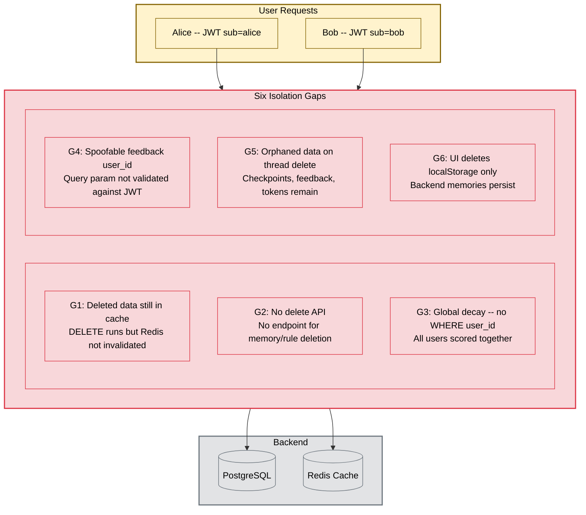

### AFTER -- Complete Isolation (All Gaps Closed)

Every query is scoped with `WHERE user_id`. JWT-extracted identity is the only source of `user_id`. Cache is invalidated on every write and delete. Thread deletion cascades across all 6 related tables.

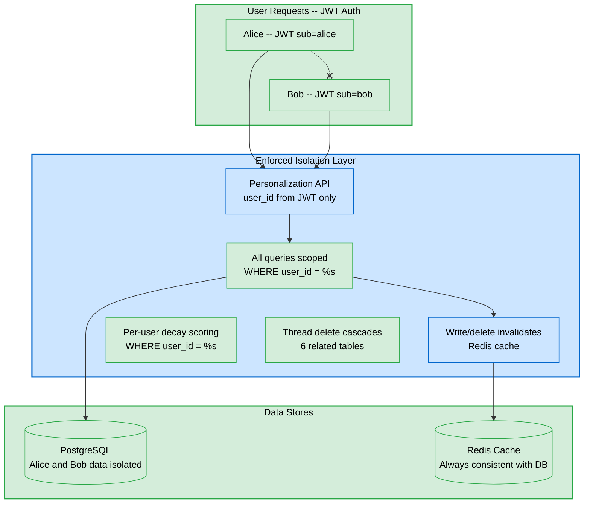

---

## Decision

Fix all six gaps and verify thread ownership through Aegra. The guiding principles:

1. **user_id always comes from JWT** -- never from query params, request body, or client-side state.
2. **Single source of truth** -- PostgreSQL is authoritative; localStorage is a local cache, not a separate store.
3. **Cache consistency** -- every write or delete invalidates the Redis personalization cache.
4. **Per-user scoping everywhere** -- background jobs (decay, consolidation) operate within user boundaries.

### Architecture: Before and After

```mermaid
flowchart TB
    subgraph BEFORE["BEFORE -- Disconnected Dual Memory System"]
        LS["localStorage\nRedux personalization slice"]
        MEM_UI["MemoryList.tsx\nadd / remove / clear"]
        RULE_UI["RulesEditor.tsx\nadd / toggle / remove / clear"]
        MEM_UI --> LS
        RULE_UI --> LS
        LS -->|"sent per-message as\nuser_memories / user_rules"| PROXY["proxy.router.ts"]
        PROXY -->|"configurable params"| GRAPH_B["graph.py"]
        GRAPH_B -->|"also loads from DB"| REPO_B["PersonalizationRepository"]
        REPO_B --> CACHE_B["Redis cache"]

        P1["UI delete clears localStorage\nbut backend memories persist"]
        P2["No API to delete\nbackend memories"]
        P3["Cache not invalidated\non delete"]
    end

    subgraph AFTER["AFTER -- Unified Memory System"]
        MEM_UI2["MemoryList.tsx"]
        RULE_UI2["RulesEditor.tsx"]
        MEM_UI2 -->|"POST / DELETE /memories"| API["Personalization API\nJWT auth required"]
        RULE_UI2 -->|"POST / DELETE /rules"| API
        API -->|"CRUD"| REPO_A["PersonalizationRepository"]
        REPO_A -->|"on write/delete"| INV["invalidate cache"]
        INV --> CACHE_A["Redis cache"]
        GRAPH_A["graph.py"] -->|"load from DB"| REPO_A
        GRAPH_A -->|"inject into prompt"| LLM["LLM"]

        F1["Single source of truth:\nPostgreSQL"]
        F2["Cache always\nconsistent"]
        F3["Users can delete\nvia API"]
    end

    style BEFORE fill:#fff3cd,stroke:#dc3545,stroke-width:2px,color:#000
    style AFTER fill:#d4edda,stroke:#28a745,stroke-width:2px,color:#000
    style P1 fill:#f8d7da,stroke:#dc3545,color:#000
    style P2 fill:#f8d7da,stroke:#dc3545,color:#000
    style P3 fill:#f8d7da,stroke:#dc3545,color:#000
    style F1 fill:#d4edda,stroke:#28a745,color:#000
    style F2 fill:#d4edda,stroke:#28a745,color:#000
    style F3 fill:#d4edda,stroke:#28a745,color:#000
    style API fill:#cce5ff,stroke:#0066cc,color:#000
    style INV fill:#cce5ff,stroke:#0066cc,color:#000
```

### Isolation Boundary -- Every Query is User-Scoped

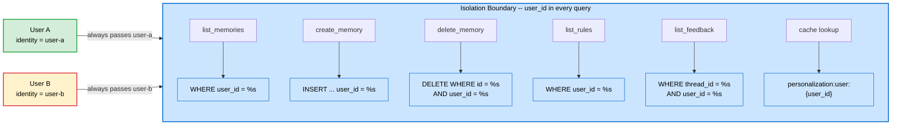

---

## Fix Summary

### Fix 1: Cache Invalidation on Delete (HIGH)

**Files:** `repository.py`, `consolidation.py`

After every `DELETE` in `delete_memory()`, `delete_rule()`, and after consolidation deletes, call `personalization_cache.invalidate(user_id)`.

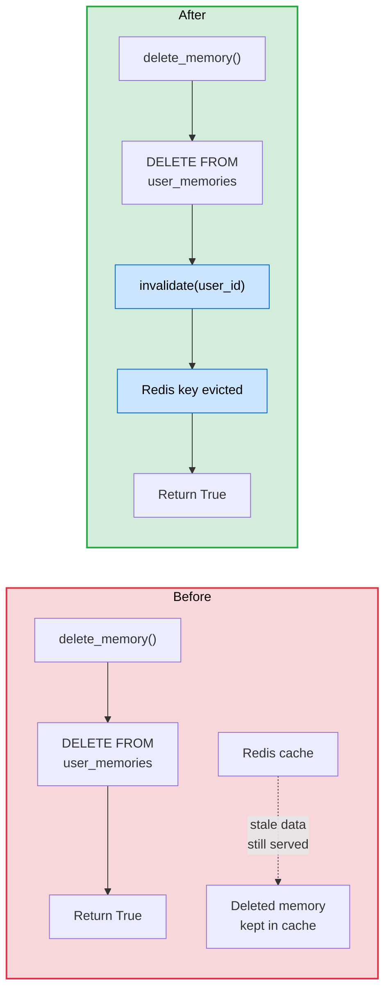

### Fix 2: Personalization REST API (HIGH)

**Files:** New `personalization_routes.py`, `http_app.py`, `repository.py`

| Method | Path | Auth | Description |
|--------|------|------|-------------|
| `GET` | `/memories` | JWT | List authenticated user's memories |
| `POST` | `/memories` | JWT | Create a memory |
| `DELETE` | `/memories/{memory_id}` | JWT | Delete a specific memory |
| `DELETE` | `/memories` | JWT | Delete all memories (bulk) |
| `GET` | `/rules` | JWT | List authenticated user's rules |
| `POST` | `/rules` | JWT | Create or update a rule |
| `DELETE` | `/rules/{rule_id}` | JWT | Delete a specific rule |
| `DELETE` | `/rules` | JWT | Delete all rules (bulk) |

`user_id` is always extracted from the JWT (`request.state.user.identity`), never from request body or query params.

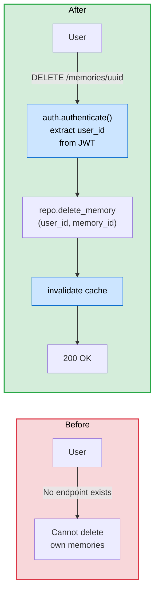

### Fix 3: Scope Decay Scoring Per-User (MEDIUM)

**Files:** `scoring.py`, `scheduler.py`

Replaced global `decay_all_memories()` with per-user `decay_user_memories(user_id)` and a `decay_all_users()` wrapper that iterates `SELECT DISTINCT user_id`.

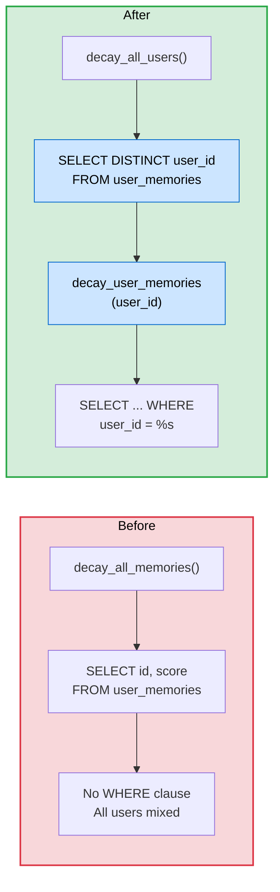

### Fix 4: Validate Feedback user_id from JWT (MEDIUM)

**File:** `feedback.py`

`GET /feedback/{thread_id}` and `POST /feedback` now extract `user_id` from `request.state.user.identity` instead of trusting a query parameter or body payload.

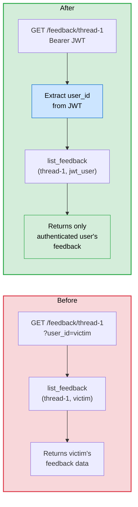

### Fix 5: Connect UI Memory Deletion to Backend API (MEDIUM)

**Repo:** `template-ui`
**Files:** `agent-rest.ts`, `MemoryList.tsx`, `RulesEditor.tsx`

UI delete actions now call the backend API first, then update local Redux state on success. Falls back to localStorage-only behavior if the backend API is unavailable (older deployments).

### Fix 6: Align user_id Between UI and Backend (LOW)

**Files:** `ChatPage.tsx`, `AppLayout.tsx`

UI now uses `window.USER_DATA.sub` (the JWT subject claim) instead of `preferred_username` for all backend-facing identification. `preferred_username` is kept for display only.

---

## Thread Ownership Analysis

Thread isolation was initially flagged as a gap, but a deep analysis of the Aegra server source code (`aegra_api/api/threads.py`) confirmed that ownership is already enforced at the SQL level.

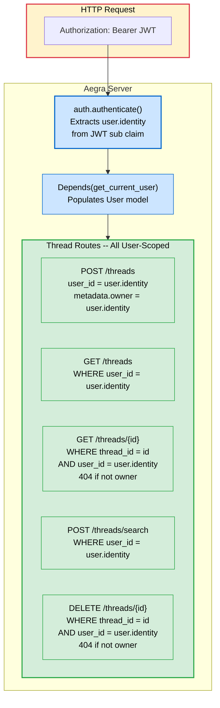

**Verification -- Exact SQL in Aegra Source:**

| Operation | Source | SQL WHERE Clause | If Not Owner |
|-----------|--------|------------------|--------------|
| Create | `threads.py:198,208` | `user_id=user.identity`, `metadata["owner"]=user.identity` | Owner stamped on creation |
| List | `threads.py:236` | `WHERE user_id = user.identity` | Empty list |
| Get | `threads.py:266` | `WHERE thread_id = ? AND user_id = user.identity` | 404 |
| Delete | `threads.py:828` | `WHERE thread_id = ? AND user_id = user.identity` | 404 |
| Search | `threads.py:882` | `WHERE user_id = user.identity` | Empty results |
| Delete runs | `threads.py:835-836` | `WHERE thread_id = ? AND user_id = user.identity` | No runs cancelled |

**Conclusion:** Thread ownership is strong -- no fix needed. The earlier investigation that flagged this as a gap was examining the LangGraph SDK client code (which has no ACLs because it is a client library), not the Aegra server code.

---

## Isolation Strength After Fixes

```mermaid
flowchart TB
    subgraph STRONG["All Layers -- Strong Isolation"]
        direction TB
        S1["Memories CRUD\nSQL WHERE user_id"]
        S2["Rules CRUD\nSQL WHERE user_id"]
        S3["Feedback CRUD\nSQL WHERE user_id + UNIQUE"]
        S4["Personalization Cache\nRedis key namespace"]
        S5["Prompt Injection\nPure function"]
        S6["MCP Auth Context\ncontextvars -- async safe"]
        S7["Thread Ownership\nAegra SQL WHERE user_id"]
        S8["Memory Deletion\nHard DELETE + cache invalidate"]
        S9["Decay Scoring\nPer-user WHERE user_id"]
        S10["Feedback Endpoints\nJWT-extracted user_id"]
        S11["Personalization API\nJWT auth + cache invalidate"]
    end

    style STRONG fill:#d4edda,stroke:#28a745,stroke-width:3px,color:#000
    style S1 fill:#d4edda,stroke:#28a745,color:#000
    style S2 fill:#d4edda,stroke:#28a745,color:#000
    style S3 fill:#d4edda,stroke:#28a745,color:#000
    style S4 fill:#cce5ff,stroke:#0066cc,color:#000
    style S5 fill:#cce5ff,stroke:#0066cc,color:#000
    style S6 fill:#cce5ff,stroke:#0066cc,color:#000
    style S7 fill:#d4edda,stroke:#28a745,color:#000
    style S8 fill:#fff3cd,stroke:#dc3545,color:#000
    style S9 fill:#fff3cd,stroke:#dc3545,color:#000
    style S10 fill:#fff3cd,stroke:#dc3545,color:#000
    style S11 fill:#fff3cd,stroke:#dc3545,color:#000
```

Legend: Green = already safe before this work. Blue = safe by design (no DB involved). Orange = fixed in this work.

---

## Test Matrix (27 Tests -- All Passing)

| # | Test | Data Layer | What It Proves | Type |
|---|------|-----------|----------------|------|
| 1 | Memory read isolation | `user_memories` | User A cannot see User B memories | Read |
| 2 | Memory write isolation | `user_memories` | Each user's creates land in own namespace | Write |
| 3 | Rule read isolation | `user_rules` | User A cannot see User B rules | Read |
| 4 | Rule write isolation | `user_rules` | Each user's rules land in own namespace | Write |
| 5 | Feedback isolation | `message_feedback` | Same message shows different feedback per user | Read+Write |
| 6 | Cross-user memory delete blocked | `user_memories` | User B cannot delete User A memory | Delete |
| 7 | Cross-user rule delete blocked | `user_rules` | User B cannot delete User A rule | Delete |
| 8 | Hard delete memory | `user_memories` | Deleted memory fully gone from DB | Lifecycle |
| 9 | Concurrent memory writes | `user_memories` | Parallel writes do not cross-contaminate | Concurrency |
| 10 | Personalization injection scoping | `inject_personalization` | Prompt contains only requesting user's data | Prompt |
| 11 | Delete memory invalidates cache | `personalization_cache` | Cache evicted after memory delete | Cache |
| 12 | No cache invalidation on miss | `personalization_cache` | No eviction if memory did not exist | Cache |
| 13 | Decay scoring per-user | `scoring.py` | SELECT includes WHERE user_id | Background |
| 14 | Bulk delete memories isolation | `user_memories` | `delete_all_memories` only removes own user | Bulk delete |
| 15 | Bulk delete rules isolation | `user_rules` | `delete_all_rules` only removes own user | Bulk delete |
| 16 | Top memories scoped | `user_memories` | `list_top_memories` returns only own data | Read |
| 17 | Hard delete rule | `user_rules` | Deleted rule fully gone from DB | Lifecycle |
| 18 | Cross-user feedback delete blocked | `message_feedback` | User B cannot delete User A feedback | Delete |
| 19 | Delete rule invalidates cache | `personalization_cache` | Cache evicted after rule delete | Cache |
| 20 | Concurrent rule writes | `user_rules` | Parallel rule writes stay isolated | Concurrency |
| 21 | Cache key namespace | `personalization_cache` | Keys include user_id, no cross-user hits | Cache |
| 22 | Three-user full isolation | All tables | 3 users' data fully separated | Integration |
| 23 | Aegra: thread create stamps owner | `aegra_api/threads.py` | `user_id=user.identity` on creation | Thread |
| 24 | Aegra: thread get scoped | `aegra_api/threads.py` | WHERE `user_id=user.identity` on GET | Thread |
| 25 | Aegra: thread list scoped | `aegra_api/threads.py` | 3+ user_id filters in source | Thread |
| 26 | Aegra: thread delete scoped | `aegra_api/threads.py` | WHERE `user_id=user.identity` on DELETE | Thread |
| 27 | Aegra: runs scoped | `aegra_api/runs.py` | 5+ `user.identity` checks in runs | Thread |

### Test Approach

Tests use an in-memory fake database that simulates PostgreSQL `WHERE` clause filtering. The fake DB applies `WHERE user_id = %s` filtering on in-memory rows, so tests prove the SQL isolation logic works -- not just that parameters are passed correctly.

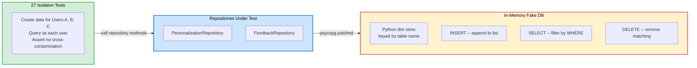

---

## Implementation Status

| # | Fix | Status | Files Changed |
|---|-----|--------|---------------|
| 1 | Cache invalidation on delete | Done | `repository.py`, `consolidation.py` |
| 2 | Personalization REST API | Done | New `personalization_routes.py`, `http_app.py`, `repository.py` |
| 3 | Scope decay scoring per-user | Done | `scoring.py`, `scheduler.py` |
| 4 | Validate feedback user_id from JWT | Done | `feedback.py` |
| 5 | UI memory deletion to backend | Done | `agent-rest.ts`, `MemoryList.tsx`, `RulesEditor.tsx` |
| 6 | Align user_id (sub claim) | Done | `ChatPage.tsx`, `AppLayout.tsx` |
| 7 | Thread ownership | Not needed | Aegra already enforces `WHERE user_id = user.identity` |
| 8 | Thread deletion data cleanup | Done | New `thread_cleanup.py` |

---

## Consequences

### Positive

- All user data is isolated at the SQL level across every layer (memories, rules, feedback, threads, cache).
- Users can delete their own data through a proper REST API with JWT authentication.
- Cache is always consistent with the database -- deletions and writes invalidate the Redis cache.
- Background jobs (decay scoring) operate within user boundaries instead of processing all users globally.
- The UI is no longer a disconnected data store -- it uses the backend API as the source of truth.

### Negative

- The new REST API adds surface area that must be maintained and versioned.
- Per-user decay iteration is slightly slower than the previous global query for large user counts, though the isolation guarantee outweighs this cost.
- UI requires the backend personalization API to be deployed before memory deletion works end-to-end. A fallback to localStorage-only behavior is included for backwards compatibility.

### Risks

- The `preferred_username` to `sub` migration (Fix 6) could cause a one-time mismatch for users who already have data stored under `preferred_username`. A migration script or dual-lookup fallback may be needed in production.

---

## Out of Scope

| Area | Reason |
|------|--------|
| Memory consolidation redesign | Background jobs (except decay) already scope per-user correctly |
| Graph cache per-user keying | Graph is stateless -- shared cache is functionally correct |
| Soft-delete pattern | Hard DELETE + cache invalidation is sufficient at this stage |
| Team-based thread sharing | Aegra supports `@auth.on.threads.*` hooks for future requirements |
