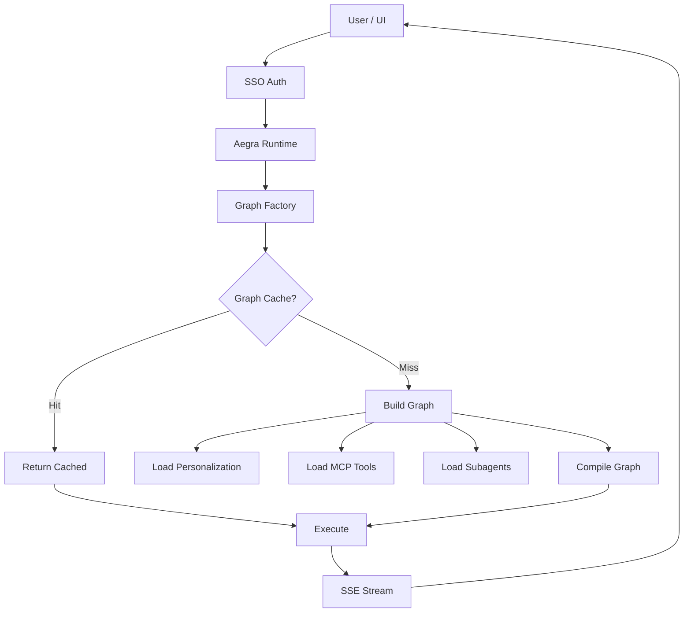
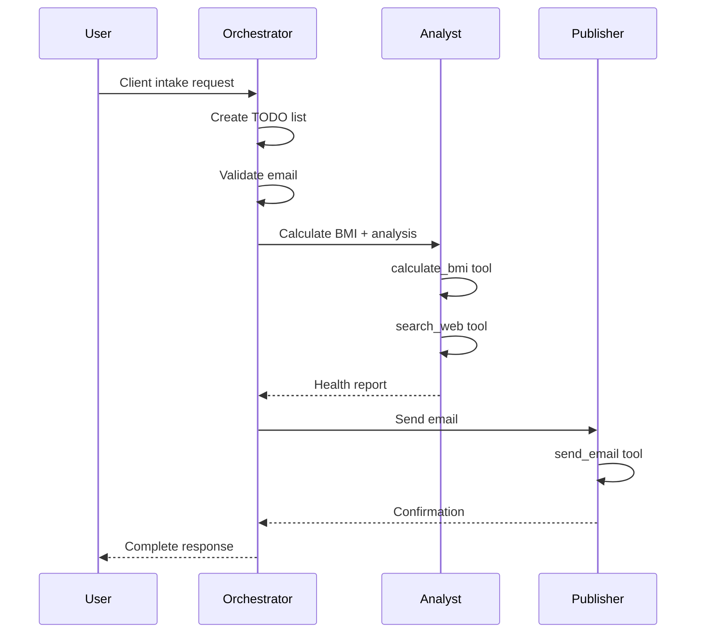

# DeepAgent Interactive Dashboard - Design Specification

**Date**: 2026-06-12
**Status**: Approved for Implementation
**Deliverable**: Single-page interactive HTML dashboard saved to Desktop

## Executive Summary

This specification defines a comprehensive, self-contained HTML dashboard that documents every aspect of the deepagent system. The dashboard serves a mixed audience (from stakeholders to deep technical users) with progressive disclosure through a three-layer navigation system. All content is sourced from the actual codebase with maximum technical depth.

## Goals

1. **Comprehensive Coverage**: Document every component, flow, and implementation detail of the deepagent system
2. **Progressive Disclosure**: Support both high-level understanding and deep technical exploration
3. **Self-Contained**: Single HTML file that works offline with no dependencies
4. **Interactive**: Rich visualizations, diagrams, and code examples with interactivity
5. **Accessible**: Serves mixed audience from executives to engineers

## User Audience

- **Primary**: Developers working with or extending the deepagent system
- **Secondary**: Team members needing to understand configuration and deployment
- **Tertiary**: Stakeholders seeking high-level understanding

**Depth Requirement**: Maximum technical depth - "don't leave anything out"

## Architecture

### High-Level Structure

```
┌─────────────────────────────────────────────────────────┐
│  FIXED HEADER                                           │
│  • Title: DeepAgent System Documentation               │
│  • Quick Navigation: [Overview] [Architecture] [Memory] │
│  • Search Box                                           │
│  • Theme Toggle (Light/Dark)                           │
└─────────────────────────────────────────────────────────┘
┌──────────┬──────────────────────────────────────────────┐
│  STICKY  │  MAIN CONTENT AREA                           │
│  SIDEBAR │                                              │
│          │  ┌────────────────────────────────────────┐ │
│  • TOC   │  │  LANDING SECTION                       │ │
│  • Jump  │  │  • Executive Summary                   │ │
│    links │  │  • System Stats                        │ │
│  • Shows │  │  • High-level Architecture Diagram     │ │
│    active│  └────────────────────────────────────────┘ │
│    section│                                             │
│          │  ┌────────────────────────────────────────┐ │
│          │  │  EXPANDABLE SECTIONS                   │ │
│          │  │  Each with 3 layers:                   │ │
│          │  │    Layer 1: Concept (what/why)         │ │
│          │  │    Layer 2: Architecture (how)         │ │
│          │  │    Layer 3: Implementation (code)      │ │
│          │  └────────────────────────────────────────┘ │
└──────────┴──────────────────────────────────────────────┘
```

### Three-Layer Information Architecture

Each major section follows this pattern:

**Layer 1 - Concept** (always visible when section is expanded)
- What is this component/system?
- Why does it exist? What problem does it solve?
- High-level visual overview
- Target: 2-3 paragraphs + simple diagram

**Layer 2 - Architecture** (expandable)
- How does it work?
- Component interactions
- Data flows
- Detailed diagrams and sequence flows
- Target: Detailed explanations + interactive visualizations

**Layer 3 - Implementation** (expandable, nested under Layer 2)
- Code examples from actual codebase
- Configuration files and formats
- File paths and module organization
- API signatures and schemas
- Algorithms and processing logic
- Target: Deep technical reference with code

## Content Coverage

### 1. Request Lifecycle & Flow

**Layer 1**: Visual journey from HTTP request to streaming response
**Layer 2**: Animated sequence diagram showing:
- HTTP Request arrives at Aegra
- Auth handler validates JWT
- Graph factory invoked (per-request)
- SSO token extracted and cached
- Personalization loaded and injected
- MCP tools loaded with auth
- Graph compiled (or retrieved from cache)
- Execution begins
- Streaming response via SSE

**Layer 3**:
- Code walkthrough of `aegra/graph.py:agent()` factory
- Request timing breakdown
- Cache hit vs miss paths
- Token refresh logic

### 2. Core Architecture

**Layer 1**: System components overview with interactive diagram
**Layer 2**:
- Graph factory pattern (per-request instantiation, caching strategy)
- Multi-agent orchestration (orchestrator → analyst/publisher subagents)
- deepagents framework integration (version 0.4.12)
- LangGraph state machine and checkpointing
- Aegra/LangGraph Platform architecture

**Layer 3**:
- Directory structure (`deep_agent/`, `config/`, `tests/`)
- Module dependency graph (interactive D3)
- Key classes: `ServerRuntime`, `create_deep_agent`, state schemas
- Graph fingerprinting algorithm for cache keys

### 3. Memory Systems

**Layer 1**: Short-term vs long-term memory comparison table
**Layer 2**:
- **Short-term**: LangGraph checkpointer, Postgres schema, conversation state persistence
- **Long-term**: Personalization repository (memories + rules), user identity scope
- Memory lifecycle: Creation → Consolidation → Decay → Clustering → Injection

**Layer 2 Diagram**: Memory flow visualization showing:
- User interaction creates memories
- Scheduler triggers processing (every 6 hours)
- Consolidation merges similar memories
- Decay scoring adjusts importance
- Clustering finds related concepts
- Top N injected into next request

**Layer 3**:
- `memory/consolidation.py` - Consolidation algorithm
- `memory/clustering.py` - Clustering with threshold 0.4
- `memory/scoring.py` - Decay function (lambda 0.05)
- `memory/relationships.py` - Relationship mapping
- `memory/scheduler.py` - Background processing
- `personalization/injector.py` - System prompt injection
- Postgres schema for memories table
- Cache implementation (`cache/personalization_cache.py`)

### 4. Streaming & Real-time

**Layer 1**: SSE streaming overview - what, why, how
**Layer 2**: Stream flow diagram:
```
LangGraph Events → Converter → Deduplicator → SSE Formatter → Client
```
- Event types (messages, tool calls, state updates)
- Deduplication strategy
- Connection management

**Layer 3**:
- `streaming/converter.py` - Event conversion logic
- `streaming/deduplicator.py` - Duplicate detection
- `streaming/handlers.py` - SSE handlers
- `streaming/tracker.py` - Stream state tracking
- `streaming/context.py` - Streaming context management

### 5. Authentication & Security

**Layer 1**: End-to-end auth flow visualization (UI → Agent → MCP)
**Layer 2**:
- SSO/OIDC flow diagram
- JWT validation and claims
- Token refresh mechanism
- Auth token caching (TTL configuration)
- PII middleware rules and strategies

**Layer 2 Sequence Diagram**:
```
User → UI (login) → SSO Provider → Access Token
  → Aegra (validate JWT) → Extract token
  → Refresh if needed → Cache token
  → Forward to MCP servers → MCP validates same token
```

**Layer 3**:
- `aegra/auth.py` - SSO handler, JWT validation
- `aegra/middleware.py` - Auth middleware (noop, api_key, jwt strategies)
- Token refresh implementation
- `cache/` - Token caching with Redis
- PII middleware configuration in `agent.yaml`
- MCP auth context setting

### 6. MCP Integration

**Layer 1**: Model Context Protocol overview - external tool integration
**Layer 2**:
- MCP server configuration (`mcp.json` format)
- Tool discovery and loading
- SSO token forwarding architecture
- Streamable HTTP transport
- Tool caching strategy

**Layer 2 Diagram**: MCP integration flow
```
Agent needs tool → Check MCP tool cache → Cache miss
  → Load from mcp.json → Connect to MCP server
  → Authenticate with SSO token → Discover tools
  → Register tools → Cache for TTL (300s)
```

**Layer 3**:
- `aegra/mcp.py` - MCP tool loading, token forwarding
- `config/agent/mcp.json` - Server registry format
- `get_mcp_tools()` implementation
- `set_mcp_auth_context()` - Token injection
- Tool caching in Redis
- Example MCP server config

### 7. Caching Strategy

**Layer 1**: What's cached and performance impact
**Layer 2**: Redis architecture diagram showing all cache types:
- Graph compilation cache (fingerprint-based, TTL 300s)
- Personalization cache (user-scoped, TTL 120s)
- Auth token cache (refresh logic)
- MCP tool list cache (TTL 300s)
- Model response cache (optional, TTL 600s)

**Layer 2 Diagram**: Cache layers visualization
```
Request arrives
  → Check auth token cache (hit = skip refresh)
  → Check personalization cache (hit = skip DB query)
  → Check graph cache (hit = skip compilation)
  → Check MCP tool cache (hit = skip server connection)
  → Execute with cached components
```

**Layer 3**:
- Graph fingerprinting algorithm (`_graph_fingerprint()`)
- Cache key computation (model + prompt + tools)
- TTL configuration in `agent.yaml`
- Redis connection setup (`aegra/redis.py`)
- `cache/personalization_cache.py` implementation
- Cache warming strategies (startup initialization)
- Cache metrics and monitoring

### 8. Middleware Pipeline

**Layer 1**: Middleware purpose - guardrails, transformations, error handling
**Layer 2**: Middleware resolution flow:
```
Defaults (agent.yaml) → Harness Profile (model-specific) → Per-Agent Overrides (PROMPT.md)
```

**Layer 2 Table**: All middleware types
| Middleware | Purpose | Configuration |
|------------|---------|---------------|
| summarization_tool | Conversation summarization | enabled: true |
| memory | Memory injection | namespaces: ["memories"] |
| patch_tool_calls | Tool call formatting | excluded for Claude |
| skills | Skills injection | enabled: true |
| model_call_limit | Prevent runaway loops | run_limit: 50 |
| tool_call_limit | Tool call throttling | run_limit: 200 |
| model_retry | Retry on failures | max_retries: 3, backoff: 2.0 |
| model_fallback | Fallback model | fallback_model config |
| tool_retry | Tool-specific retries | tools: [...] |
| pii | PII redaction/masking | rules: [...] |

**Layer 3**:
- Middleware resolution code in `src/infrastructure/middleware.py`
- Harness profiles in `agent.yaml`
- Per-agent overrides in PROMPT.md frontmatter
- Each middleware implementation details
- Middleware ordering and execution
- Custom middleware extension points

### 9. Configuration System

**Layer 1**: How agents are defined (YAML frontmatter + Markdown)
**Layer 2**: Configuration hierarchy diagram:
```
Environment Variables (highest precedence)
  ↓
.env file (secrets)
  ↓
agent.yaml (runtime defaults)
  ↓
PROMPT.md frontmatter (orchestrator)
  ↓
subagents/*.md frontmatter (subagent overrides)
```

**Layer 2**: YAML frontmatter fields explained
```yaml
name: orchestrator           # Agent identifier
description: "..."           # Human-readable description
model: gemini-2.5-pro        # Model name (resolved via providers)
tools:                       # Built-in tools or MCP tool names
  - validate_email
skills:                      # Skills to inject
  - client-intake
mcps:                        # MCP servers to connect
  - template-mcp-server
middleware:                  # Optional overrides
  memory:
    enabled: true
```

**Layer 3**:
- `src/agent/config.py` - Configuration loader
- `config/agent/PROMPT.md` - Orchestrator definition
- `config/agent/subagents/` - Subagent definitions
- `config/agent/skills/` - Skills directory structure
- `config/agent/runtime/agent.yaml` - Full runtime config
- Provider profile registration
- Model resolution logic (legacy vs deepagents)
- Settings precedence implementation

### 10. Observability & Tracing

**Layer 1**: Current state vs gaps - honest assessment
**Layer 2**:
- **Currently Implemented**:
  - Langfuse integration (when `LANGFUSE_*` env vars set)
  - Request logging (configurable via `settings.py`)
  - Python logging (DEBUG, INFO levels)

- **What's Traced**:
  - Model calls (input/output tokens)
  - Tool calls
  - Agent execution spans
  - Errors and exceptions

- **What's Missing**:
  - Distributed tracing across MCP calls
  - Request correlation IDs
  - Performance metrics (latency histograms)
  - Cache hit/miss metrics
  - Memory processing traces
  - End-to-end request tracing

- **Future Plans**:
  - OTEL integration (exporter endpoint configured but not fully wired)
  - Correlation IDs through full stack
  - Prometheus metrics export
  - Grafana dashboards
  - Distributed tracing to Jaeger/Tempo

**Layer 3**:
- `aegra/telemetry.py` - Telemetry setup
- Langfuse configuration in `settings.py`
- Logging configuration
- OTEL configuration hooks (partial)
- Where to add tracing instrumentation
- Metrics collection points

### 11. Deployment Options

**Layer 1**: Deployment mode comparison table

| Mode | Use Case | Components | External Dependencies |
|------|----------|------------|----------------------|
| Local Dev | Development | LangGraph Platform + Mock MCP | Postgres, Redis |
| Docker Compose | Full stack testing | Agent + UI + MCP + DB + Redis | None (all containerized) |
| OpenShift | Production | Agent pod + DB + Redis | OpenShift cluster, secrets |
| Kubernetes/Kind | K8s testing | Helm charts | Kind cluster |

**Layer 2**: Each deployment type with architecture diagram

**Local Development**:
```
Terminal 1: Mock MCP Server (port 5001)
Terminal 2: Aegra dev server (port 5002)
External: Postgres + Redis
```
Commands:
```bash
make mock-mcp
make local
```

**Docker Compose**:
```
┌─────────────┐  ┌─────────────┐  ┌─────────────┐
│   Agent     │  │  Postgres   │  │   Redis     │
│  (port 5002)│──│  (port 5432)│  │ (port 6379) │
└─────────────┘  └─────────────┘  └─────────────┘
```
Command: `make dev`

**OpenShift**:
```
Namespace: template-agent
├── Deployment: template-agent (3 replicas)
├── Service: template-agent-service
├── Route: https://agent.apps.cluster.example.com
├── ConfigMap: agent-config
├── Secret: db-credentials, sso-credentials
├── PVC: postgres-data
└── External: Postgres, Redis
```
Commands:
```bash
make deploy openshift NAMESPACE=your-project
make undeploy openshift NAMESPACE=your-project
```

**Kind (Kubernetes)**:
```
Kind Cluster: template-agent
├── Namespace: template-agent
├── StatefulSet: postgres
├── Deployment: agent, redis, ui, mcp-server
├── Services: Load balancers
└── Ingress: Local routing
```
Commands:
```bash
make kind
make kind-down
```

**Layer 3**:
- Environment variables per deployment
- Secrets management (env vars, ConfigMaps, OpenShift Secrets)
- Network configuration
- Volume mounts and persistence
- Resource limits and scaling
- Health checks and probes
- Deployment manifests locations
- Migration scripts

## Visualizations

### Interactive Architecture Diagrams (Mermaid.js)

**System Overview** (interactive):

- Click nodes to highlight related sections
- Hover for tooltips with descriptions

**Multi-Agent Orchestration**:


### Animated Sequence Flows (CSS + JavaScript)

**Request Lifecycle Animation**:
- Timeline showing request progression
- Each phase lights up as it's explained
- Timing indicators showing typical duration
- Click to pause/resume animation
- Scrub timeline to jump to specific phase

Phases:
1. HTTP Request (0ms)
2. Auth Validation (5-10ms)
3. Token Refresh (if needed, 100-200ms)
4. Personalization Load (cache: 5ms, DB: 50ms)
5. Graph Build (cache: 1ms, fresh: 200-500ms)
6. Tool Loading (cache: 5ms, MCP connect: 100-300ms)
7. Execution (varies, 500-5000ms)
8. Streaming Response (continuous)

### Data Flow Visualizations

**Memory Processing Pipeline**:
```
User Conversation
  ↓
Memory Extraction
  ↓
[Postgres: memories table]
  ↓
Scheduler (6 hour interval)
  ↓
┌─────────────────────┐
│ Consolidation       │ → Merge similar memories
│ Decay Scoring       │ → Adjust importance over time
│ Clustering          │ → Find related concepts
│ Relationship Mapping│ → Connect memories
└─────────────────────┘
  ↓
[Personalization Cache: Redis]
  ↓
Inject top N memories into next request
```

**Configuration Resolution Flow**:
```
User Request
  ↓
Load agent.yaml (defaults)
  ↓
Match harness profile (by model)
  ↓
Load PROMPT.md (orchestrator config)
  ↓
Apply middleware overrides
  ↓
Resolve tools (built-in + MCP)
  ↓
Load subagents
  ↓
Inject skills
  ↓
Final agent configuration
```

### Execution Timeline

Interactive timeline showing:
- Horizontal bars for each phase
- Expandable details per phase
- Timing data (from logs/Langfuse if available)
- Cache hit/miss indicators
- Color-coded by operation type:
  - Blue: I/O operations (DB, Redis, MCP)
  - Green: Cache hits
  - Yellow: Computation (graph compilation, LLM calls)
  - Red: Errors/retries

### Component Dependency Graph (D3.js)

Force-directed graph showing:
- Nodes: Python modules/classes
- Edges: Import dependencies
- Node size: Lines of code
- Node color: Module type (aegra, src, utils)
- Interactive:
  - Click node → highlight dependencies
  - Drag to rearrange
  - Zoom/pan
  - Filter by module type
  - Search for specific module

Example clusters:
- `aegra/*` (blue) - Platform integration
- `src/agent/*` (green) - Agent configuration
- `src/memory/*` (purple) - Memory systems
- `src/infrastructure/*` (orange) - Core infrastructure

### Live Code Examples (Prism.js)

Every code example includes:
```
┌────────────────────────────────────────────────┐
│ deep_agent/aegra/graph.py:81-96          [Copy]│
├────────────────────────────────────────────────┤
│  81  async def agent(runtime: ServerRuntime):  │
│  82      """Async graph factory."""           │
│  83      await _ensure_startup()               │
│  84      ...                                    │
└────────────────────────────────────────────────┘
```
- File path with line numbers
- Copy button
- Syntax highlighting
- Link to GitHub (if public)

## Technical Implementation

### File Structure

Single HTML file:
```html
<!DOCTYPE html>
<html lang="en">
<head>
  <meta charset="UTF-8">
  <meta name="viewport" content="width=device-width, initial-scale=1.0">
  <title>DeepAgent System Documentation</title>

  <!-- CDN Libraries -->
  <script src="https://cdn.jsdelivr.net/npm/mermaid@10/dist/mermaid.min.js"></script>
  <script src="https://cdn.jsdelivr.net/npm/prismjs@1.29.0/prism.min.js"></script>
  <script src="https://cdn.jsdelivr.net/npm/prismjs@1.29.0/components/prism-python.min.js"></script>
  <script src="https://cdn.jsdelivr.net/npm/prismjs@1.29.0/components/prism-yaml.min.js"></script>
  <script src="https://cdn.jsdelivr.net/npm/prismjs@1.29.0/components/prism-json.min.js"></script>
  <script src="https://cdn.jsdelivr.net/npm/prismjs@1.29.0/components/prism-bash.min.js"></script>
  <script src="https://d3js.org/d3.v7.min.js"></script>
  <link rel="stylesheet" href="https://cdn.jsdelivr.net/npm/prismjs@1.29.0/themes/prism-tomorrow.min.css">

  <style>
    /* All CSS embedded here (15-20KB) */
    /* Includes: layout, typography, themes, components, animations, responsive */
  </style>
</head>
<body>
  <!-- Fixed Header -->
  <header id="main-header">
    <!-- Navigation, search, theme toggle -->
  </header>

  <!-- Sticky Sidebar -->
  <aside id="sidebar">
    <!-- Table of contents, jump links -->
  </aside>

  <!-- Main Content -->
  <main id="content">
    <!-- Landing section -->
    <!-- All expandable sections -->
  </main>

  <script>
    /* All JavaScript embedded here (30-40KB) */
    /* Includes: navigation, search, expand/collapse, diagrams, animations */
  </script>
</body>
</html>
```

### JavaScript Features

**Navigation**:
```javascript
// Smooth scroll to section
function scrollToSection(sectionId) {
  document.getElementById(sectionId).scrollIntoView({ behavior: 'smooth' });
  updateActiveNavItem(sectionId);
  window.location.hash = sectionId;
}

// Track active section on scroll
window.addEventListener('scroll', () => {
  const sections = document.querySelectorAll('section');
  sections.forEach(section => {
    const rect = section.getBoundingClientRect();
    if (rect.top >= 0 && rect.top < 200) {
      updateActiveNavItem(section.id);
    }
  });
});
```

**Search**:
```javascript
// Real-time search with highlighting
function search(query) {
  const sections = document.querySelectorAll('.section-content');
  sections.forEach(section => {
    const text = section.textContent.toLowerCase();
    if (text.includes(query.toLowerCase())) {
      section.classList.add('search-match');
      highlightText(section, query);
      expandSection(section.closest('.expandable-section'));
    } else {
      section.classList.remove('search-match');
    }
  });
}
```

**Layer Expansion**:
```javascript
// Expand/collapse with state tracking
function toggleLayer(layerId) {
  const layer = document.getElementById(layerId);
  const isExpanded = layer.classList.toggle('expanded');

  // Save state to sessionStorage
  sessionStorage.setItem(layerId, isExpanded ? 'expanded' : 'collapsed');

  // Animate height
  if (isExpanded) {
    layer.style.maxHeight = layer.scrollHeight + 'px';
  } else {
    layer.style.maxHeight = '0';
  }
}

// Restore state on load
window.addEventListener('load', () => {
  document.querySelectorAll('.layer').forEach(layer => {
    const savedState = sessionStorage.getItem(layer.id);
    if (savedState === 'expanded') {
      toggleLayer(layer.id);
    }
  });
});
```

**Theme Toggle**:
```javascript
function toggleTheme() {
  const currentTheme = document.body.getAttribute('data-theme');
  const newTheme = currentTheme === 'dark' ? 'light' : 'dark';
  document.body.setAttribute('data-theme', newTheme);
  localStorage.setItem('theme', newTheme);

  // Update Mermaid theme
  mermaid.initialize({ theme: newTheme === 'dark' ? 'dark' : 'default' });
}

// Load saved theme
const savedTheme = localStorage.getItem('theme') || 'light';
document.body.setAttribute('data-theme', savedTheme);
```

**Diagram Interactions**:
```javascript
// Mermaid click handlers
mermaid.initialize({
  securityLevel: 'loose',
  theme: 'default',
  flowchart: {
    useMaxWidth: true,
    htmlLabels: true
  }
});

// Add click handlers after render
document.addEventListener('DOMContentLoaded', () => {
  document.querySelectorAll('.mermaid svg g.node').forEach(node => {
    node.addEventListener('click', (e) => {
      const nodeId = e.currentTarget.id;
      highlightRelatedSections(nodeId);
    });
  });
});
```

### CSS Architecture

**Layout System**:
```css
:root {
  --header-height: 60px;
  --sidebar-width: 280px;
  --max-content-width: 1400px;
  --spacing-unit: 1rem;
}

body {
  margin: 0;
  font-family: -apple-system, BlinkMacSystemFont, "Segoe UI", Roboto, sans-serif;
}

#main-header {
  position: fixed;
  top: 0;
  left: 0;
  right: 0;
  height: var(--header-height);
  z-index: 1000;
  background: var(--header-bg);
  border-bottom: 1px solid var(--border-color);
}

#sidebar {
  position: fixed;
  top: var(--header-height);
  left: 0;
  width: var(--sidebar-width);
  height: calc(100vh - var(--header-height));
  overflow-y: auto;
  background: var(--sidebar-bg);
  border-right: 1px solid var(--border-color);
}

#content {
  margin-left: var(--sidebar-width);
  margin-top: var(--header-height);
  padding: 2rem;
  max-width: var(--max-content-width);
}

@media (max-width: 768px) {
  #sidebar {
    transform: translateX(-100%);
    transition: transform 0.3s;
  }

  #sidebar.open {
    transform: translateX(0);
  }

  #content {
    margin-left: 0;
  }
}
```

**Theme Variables**:
```css
[data-theme="light"] {
  --bg-primary: #ffffff;
  --bg-secondary: #f5f5f5;
  --text-primary: #1a1a1a;
  --text-secondary: #666666;
  --accent: #2196f3;
  --border-color: #e0e0e0;
  --code-bg: #f5f5f5;
}

[data-theme="dark"] {
  --bg-primary: #1a1a1a;
  --bg-secondary: #2d2d2d;
  --text-primary: #e0e0e0;
  --text-secondary: #999999;
  --accent: #64b5f6;
  --border-color: #404040;
  --code-bg: #2d2d2d;
}
```

**Layer Depth Indicators**:
```css
.layer-1 {
  background: var(--bg-secondary);
  padding: 1.5rem;
  border-left: 4px solid var(--accent);
}

.layer-2 {
  background: color-mix(in srgb, var(--bg-secondary) 70%, var(--bg-primary));
  padding: 1.5rem;
  margin-left: 1rem;
  border-left: 4px solid color-mix(in srgb, var(--accent) 70%, transparent);
}

.layer-3 {
  background: color-mix(in srgb, var(--bg-secondary) 50%, var(--bg-primary));
  padding: 1.5rem;
  margin-left: 2rem;
  border-left: 4px solid color-mix(in srgb, var(--accent) 40%, transparent);
}
```

**Animations**:
```css
.expandable-section {
  overflow: hidden;
  transition: max-height 0.3s ease-in-out;
}

.expand-button {
  transition: transform 0.3s ease;
}

.expand-button.expanded {
  transform: rotate(90deg);
}

@keyframes fadeIn {
  from { opacity: 0; transform: translateY(10px); }
  to { opacity: 1; transform: translateY(0); }
}

.section-content {
  animation: fadeIn 0.3s ease-in-out;
}
```

## Content Extraction Strategy

All content will be sourced from:

1. **Code Analysis**:
   - Read actual implementation files
   - Extract class/function signatures
   - Document current architecture

2. **Configuration Files**:
   - `CLAUDE.md` - Project overview
   - `config/agent/runtime/agent.yaml` - Runtime config
   - `config/agent/PROMPT.md` - Orchestrator definition
   - `config/agent/mcp.json` - MCP servers

3. **Directory Structure**:
   - Map actual directory tree
   - Document module organization

4. **Comments & Docstrings**:
   - Extract purpose from docstrings
   - Include inline comments for complex logic

5. **Honest Assessment**:
   - Observability section will clearly state what's implemented vs planned
   - No speculation - only documented features

## File Output

**Location**: `/Users/nsaharan/Desktop/deepagent-dashboard.html`

**File Size**: Estimated 500KB - 1MB
- HTML structure: ~50KB
- Embedded CSS: ~20KB
- Embedded JavaScript: ~40KB
- Content (text): ~200KB
- Code examples: ~100KB
- CDN libraries loaded at runtime: ~500KB (not in file)

**Browser Compatibility**:
- Chrome/Edge: 90+
- Firefox: 88+
- Safari: 14+

**Performance**:
- Initial load: <2 seconds
- Diagram rendering: 1-2 seconds per complex diagram
- Search: <100ms for full-text search
- Section expansion: <300ms with smooth animation

## Success Criteria

1. ✅ Single HTML file that opens in any browser
2. ✅ Covers all 11 major topic areas with 3 layers each
3. ✅ All visualization types implemented and interactive
4. ✅ Search functionality works across all content
5. ✅ Dark/light themes both functional
6. ✅ Responsive design (desktop/tablet/mobile)
7. ✅ All code examples sourced from actual codebase
8. ✅ Observability section honestly assesses current state
9. ✅ Works offline (no external dependencies except CDN on first load)
10. ✅ File saved to Desktop as requested

## Why This Design

**Single-page app**: Matches requirement for Desktop file, works offline, easy to share

**Three-layer architecture**: Serves mixed audience - executives read Layer 1, developers drill to Layer 3

**Maximum technical depth**: Every component documented with code examples, no hand-waving

**Interactive visualizations**: Complex system is easier to understand visually - diagrams convey architecture better than paragraphs

**Honest observability assessment**: Transparency about what's implemented vs planned helps users set realistic expectations and plan improvements

**Layered disclosure**: Prevents overwhelming non-technical users while giving technical users full access to implementation details

## Implementation Notes

- Extract all code examples from actual files (use Read tool)
- Generate Mermaid diagrams from actual architecture (not idealized)
- Document actual TTL values from `agent.yaml`
- Include real file paths and line numbers
- Observability section: be specific about what's missing (correlation IDs, end-to-end tracing, metrics)
- Test all interactions before delivery (expand/collapse, search, theme toggle, diagram clicks)

---

**Estimated Implementation Time**: 2-3 hours for comprehensive content extraction and assembly

**Next Steps**:
1. Spec review by user
2. Implementation (create HTML file)
3. Testing (all features, all browsers)
4. Delivery to Desktop
