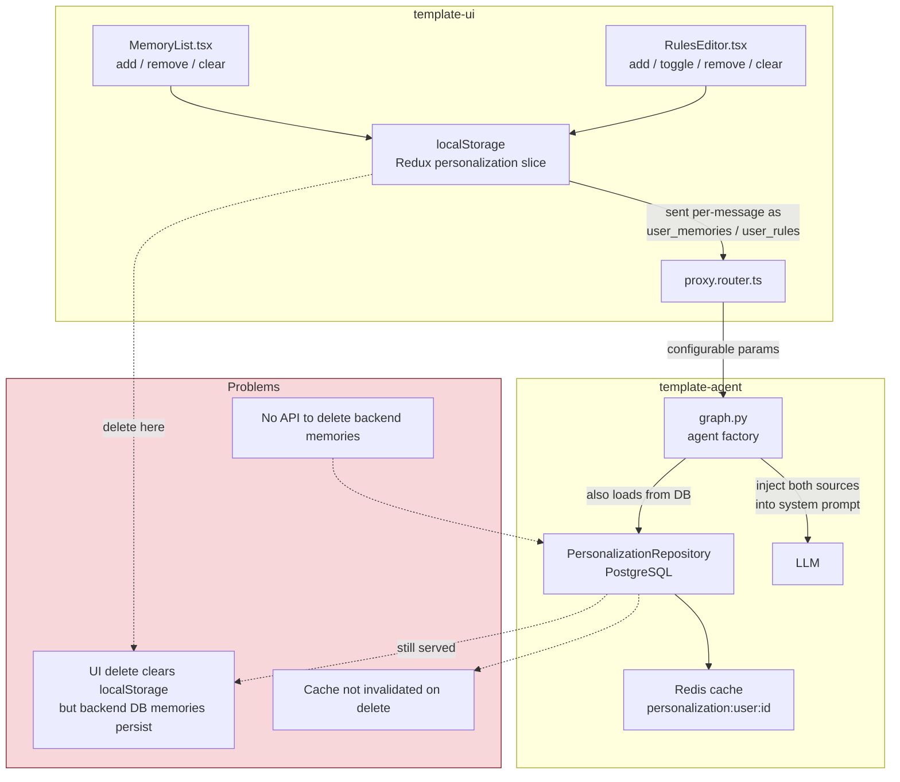
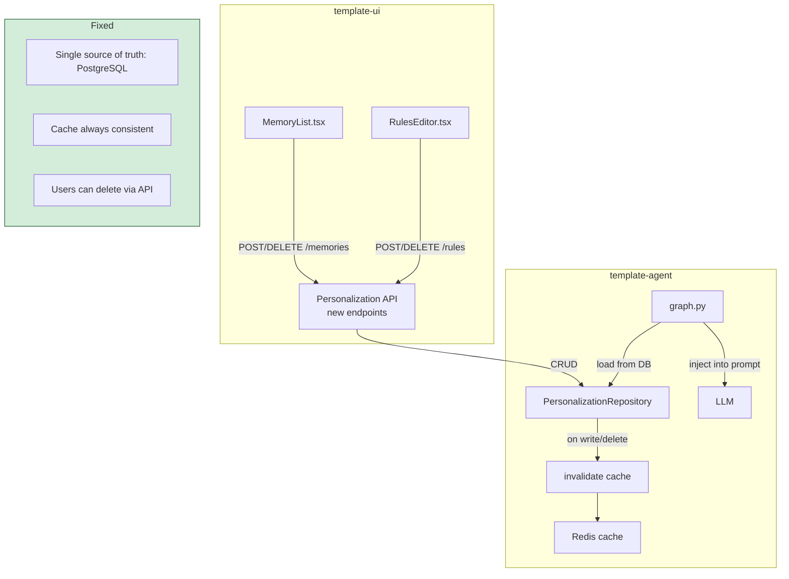
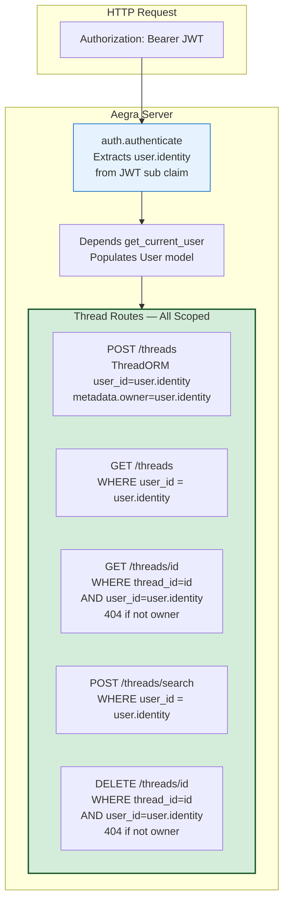

# User Isolation — Design Spec

**Date:** 2026-07-07
**Branch:** `feat/user-isolation`
**Repos:** `template-agent`, `template-ui`

---

## 1. Problem Statement

User data isolation in the template-agent + template-ui stack has multiple verified gaps. Users' memories, rules, and feedback can leak across boundaries, deleted data persists in cache, and critical deletion APIs are missing entirely.

---

## 2. Investigation Summary

Six parallel investigations were conducted across both repos. Findings:

### What's Already Safe (No Fix Needed)

| Layer | Mechanism | Status |
|-------|-----------|--------|
| Memories CRUD | SQL `WHERE user_id = %s` on every query | Strong |
| Rules CRUD | SQL `WHERE user_id = %s` on every query | Strong |
| Feedback CRUD | SQL `WHERE user_id = %s` + UNIQUE constraint | Strong |
| Personalization cache | Redis key `personalization:user:{user_id}` | Strong |
| Prompt injection | Pure function, scoped input only | Strong |
| MCP auth context | Python `contextvars` (not module globals) — async-safe | Strong |
| Thread listing (UI) | Filters by `metadata.user_identity` in search | Adequate |

### Verified Gaps (Fix Required)

| # | Gap | Severity | Location |
|---|-----|----------|----------|
| G1 | Memory/rule deletion never invalidates Redis cache — deleted data keeps being served | HIGH | `repository.py`, `consolidation.py` |
| G2 | No API endpoint for memory/rule deletion — users cannot delete their own data | HIGH | Missing entirely |
| G3 | `decay_all_memories()` queries all users globally — no `WHERE user_id` | MEDIUM | `scoring.py:79` |
| G4 | Feedback endpoint accepts `user_id` as query param, doesn't validate against JWT | MEDIUM | `feedback.py:229` |
| G5 | UI memories stored in localStorage only — deletion doesn't reach backend | MEDIUM | `personalization.ts`, `MemoryList.tsx` |
| G6 | UI uses `preferred_username` for user_id, backend uses JWT `sub` claim — potential mismatch | LOW | `feedback-api.ts`, `auth.py` |

### Deferred (Needs Aegra Assessment)

| Area | Detail |
|------|--------|
| Thread ownership | Aegra manages threads. Template-agent has no `WHERE user_id` on thread access. If Aegra enforces ownership, no fix needed. If not, middleware required. Requires Aegra team input. |

---

## 3. Architecture — Current vs Target

### Current: Dual Memory System (Disconnected)



### Target: Unified Memory System



---

## 4. Fixes — Detailed Design

### Fix 1: Cache Invalidation on Delete (HIGH)

**Files:** `deep_agent/src/personalization/repository.py`, `deep_agent/src/memory/consolidation.py`

**Change:** After every `DELETE` in `PersonalizationRepository.delete_memory()`, `delete_rule()`, and after consolidation deletes, call `personalization_cache.invalidate(user_id)`.

**Before:**
```python
async def delete_memory(self, user_id: str, memory_id: uuid.UUID) -> bool:
    # ... DELETE FROM user_memories WHERE id = %s AND user_id = %s
    await conn.commit()
    return bool(cur.rowcount > 0)  # cache NOT invalidated
```

**After:**
```python
async def delete_memory(self, user_id: str, memory_id: uuid.UUID) -> bool:
    # ... DELETE FROM user_memories WHERE id = %s AND user_id = %s
    await conn.commit()
    deleted = bool(cur.rowcount > 0)
    if deleted:
        from deep_agent.src.cache.personalization_cache import invalidate
        await invalidate(user_id)
    return deleted
```

Same pattern for `delete_rule()`. For consolidation, add invalidation after duplicate removal in `consolidation.py`.

**Test:** Verify that after `delete_memory()`, a subsequent personalization cache read returns `None` (cache miss).

---

### Fix 2: Personalization REST API (HIGH)

**New file:** `deep_agent/aegra/personalization_routes.py`
**Changed file:** `deep_agent/aegra/http_app.py` (mount new router)

**Endpoints:**

| Method | Path | Auth | Description |
|--------|------|------|-------------|
| `GET` | `/memories` | JWT required | List authenticated user's memories |
| `POST` | `/memories` | JWT required | Create a memory for authenticated user |
| `DELETE` | `/memories/{memory_id}` | JWT required | Delete authenticated user's memory |
| `DELETE` | `/memories` | JWT required | Delete all of authenticated user's memories |
| `GET` | `/rules` | JWT required | List authenticated user's rules |
| `POST` | `/rules` | JWT required | Create/update a rule for authenticated user |
| `DELETE` | `/rules/{rule_id}` | JWT required | Delete authenticated user's rule |
| `DELETE` | `/rules` | JWT required | Delete all of authenticated user's rules |

**Key principle:** `user_id` is ALWAYS extracted from the authenticated JWT (`request.state.user.identity`), never from request body or query params.

**Response format:**
```json
// GET /memories
{
  "memories": [
    {"id": "uuid", "content": "Likes Python", "score": 1.0, "created_at": "..."}
  ]
}

// DELETE /memories/{memory_id}
{"deleted": true}

// DELETE /memories (bulk)
{"deleted_count": 5}
```

**Bulk delete implementation:** New method `delete_all_memories(user_id)` in `PersonalizationRepository`:
```python
async def delete_all_memories(self, user_id: str) -> int:
    async with await psycopg.AsyncConnection.connect(self._uri) as conn:
        cur = await conn.execute(
            "DELETE FROM user_memories WHERE user_id = %s",
            (user_id,),
        )
        await conn.commit()
        count = cur.rowcount
    if count > 0:
        from deep_agent.src.cache.personalization_cache import invalidate
        await invalidate(user_id)
    return count
```

Same for `delete_all_rules(user_id)`.

---

### Fix 3: Scope Decay Scoring Per-User (MEDIUM)

**File:** `deep_agent/src/memory/scoring.py`

**Change:** Replace `decay_all_memories()` with the per-user pattern used by consolidation/clustering.

**Before (global query):**
```python
async def decay_all_memories(database_uri: str) -> int:
    cur = await conn.execute("SELECT id, score, updated_at FROM user_memories")
```

**After (per-user):**
```python
async def decay_user_memories(database_uri: str, user_id: str) -> int:
    cur = await conn.execute(
        "SELECT id, score, updated_at FROM user_memories WHERE user_id = %s",
        (user_id,),
    )

async def decay_all_users(database_uri: str) -> int:
    async with await psycopg.AsyncConnection.connect(database_uri) as conn:
        cur = await conn.execute("SELECT DISTINCT user_id FROM user_memories")
        user_ids = [row["user_id"] for row in await cur.fetchall()]
    total = 0
    for uid in user_ids:
        total += await decay_user_memories(database_uri, uid)
    return total
```

**Scheduler update:** Change `_run_memory_jobs()` in `scheduler.py` to call `decay_all_users()` instead of `decay_all_memories()`.

---

### Fix 4: Validate Feedback user_id from JWT (MEDIUM)

**File:** `deep_agent/aegra/feedback.py`

**Change in `GET /feedback/{thread_id}`:**

**Before:**
```python
@feedback_router.get("/feedback/{thread_id}")
async def get_thread_feedback(
    thread_id: str, user_id: str = "anonymous"
) -> dict[str, Any]:
```

**After:**
```python
@feedback_router.get("/feedback/{thread_id}")
async def get_thread_feedback(
    thread_id: str, request: Request
) -> dict[str, Any]:
    user = getattr(request.state, "user", None)
    user_id = getattr(user, "identity", None) if user else "anonymous"
```

**Change in `POST /feedback`:** Extract `user_id` from `request.state.user.identity` instead of trusting the body payload. If auth is disabled, fall back to body `user_id` or `"anonymous"`.

---

### Fix 5: Connect UI Memory Deletion to Backend API (MEDIUM)

**Repo:** `template-ui`

**Files to change:**
- `src/frontend/services/agent-rest.ts` — add `deleteMemory()`, `deleteAllMemories()`, `deleteRule()`, `deleteAllRules()`, `listMemories()`, `listRules()` API functions
- `src/frontend/redux/slices/personalization.ts` — add async thunks that call API then update local state
- `src/frontend/components/settings/MemoryList.tsx` — call API on delete, load from API on mount
- `src/frontend/components/settings/RulesEditor.tsx` — same pattern

**Flow after fix:**
```
User clicks "Delete memory" in UI
  → dispatch(deleteMemoryThunk(memoryId))
    → DELETE /memories/{memoryId} (backend API)
    → on success: dispatch(removeMemory(memoryId)) (Redux local state)
    → backend: SQL DELETE + cache invalidate
```

**Fallback:** If the backend API is unavailable (e.g., older deployment), fall back to localStorage-only behavior. Feature-flag this with an env var or capability check.

---

### Fix 6: Align user_id Between UI and Backend (LOW)

**Issue:** UI uses `window.USER_DATA.preferred_username` as `userId` for feedback and thread search. Backend auth uses JWT `sub` claim as `user.identity`. These could differ (e.g., `nsaharan` vs `f:abc123:nsaharan`).

**Fix in `template-ui`:** Use `window.USER_DATA.sub` (the JWT subject claim) instead of `preferred_username` for all backend-facing user identification. Keep `preferred_username` for display only.

**Files:**
- `src/frontend/pages/ChatPage.tsx` — where `feedbackUserId` is set
- `src/frontend/components/layout/AppLayout.tsx` — where `userId` for thread search is set
- `src/server/plugins/auth.plugin.ts` — ensure `sub` is exposed in `window.USER_DATA`

---

## 5. Test Plan — 12 Tests

### Test File: `tests/unit/test_user_isolation.py`

**Approach:** In-memory fake DB that simulates PostgreSQL WHERE filtering. Patches `psycopg.AsyncConnection.connect` so repository SQL logic is exercised against real data, not just mocked.

| # | Test | What It Proves |
|---|------|----------------|
| 1 | `test_memory_read_isolation` | User A cannot see User B memories |
| 2 | `test_memory_write_isolation` | Each user's creates land in their own namespace |
| 3 | `test_rule_read_isolation` | User A cannot see User B rules |
| 4 | `test_rule_write_isolation` | Each user's rules land in their own namespace |
| 5 | `test_feedback_isolation` | Same message shows different feedback per user |
| 6 | `test_cross_user_memory_delete_blocked` | User B cannot delete User A's memory |
| 7 | `test_cross_user_rule_delete_blocked` | User B cannot delete User A's rule |
| 8 | `test_hard_delete_removes_data` | Deleted memory is fully gone from DB, not soft-deleted |
| 9 | `test_concurrent_session_safety` | Parallel writes for different users don't interfere |
| 10 | `test_personalization_injection_scoping` | System prompt contains only the requesting user's data |
| 11 | `test_delete_invalidates_cache` | Cache evicted after memory deletion |
| 12 | `test_decay_scoring_per_user` | Decay operates within user boundary, not globally |

### In-Memory Fake DB Design

```python
class FakeAsyncConnection:
    """Simulates psycopg async connection with in-memory storage."""

    _tables: dict[str, list[dict]] = {}  # shared across instances

    async def execute(self, query, params=None):
        # Pattern-match known SQL shapes:
        # INSERT INTO user_memories ... → append to _tables["user_memories"]
        # SELECT * FROM user_memories WHERE user_id = %s → filter by params
        # DELETE FROM user_memories WHERE id = %s AND user_id = %s → remove matching
        ...
```

This ensures the WHERE clauses in repository code are actually exercised against real data.

---

## 6. Implementation Order

| Phase | What | Effort | Repo |
|-------|------|--------|------|
| 1 | Cache invalidation on delete (Fix 1) | Small | template-agent |
| 2 | Scope decay scoring per-user (Fix 3) | Small | template-agent |
| 3 | Validate feedback user_id from JWT (Fix 4) | Small | template-agent |
| 4 | Personalization REST API (Fix 2) | Medium | template-agent |
| 5 | Write 12 isolation tests | Medium | template-agent |
| 6 | Connect UI to backend API (Fix 5) | Medium | template-ui |
| 7 | Align user_id (Fix 6) | Small | template-ui |

Phases 1-3 are independent and can be done in parallel. Phase 4 depends on Fix 1 (cache invalidation). Phase 5 covers all fixes. Phase 6-7 depend on Phase 4 (API must exist first).

---

## 7. Thread Ownership — Deep Analysis

### Finding: Aegra Already Enforces Thread Ownership

After reading the Aegra server source code (`aegra_api/api/threads.py`), thread isolation is **already enforced at the SQL level** in every thread operation. Every query includes `WHERE user_id = user.identity`.

### Aegra Thread Isolation (Built-In)



### Verification — Exact SQL in Aegra Source

| Operation | File:Line | SQL WHERE Clause | Result if Not Owner |
|-----------|-----------|------------------|---------------------|
| Create (check existing) | `threads.py:184-187` | `WHERE thread_id = ? AND user_id = user.identity` | Creates new (no conflict) |
| Create (stamp owner) | `threads.py:198,208` | `metadata["owner"] = user.identity`, `user_id=user.identity` | Owner stamped on creation |
| List threads | `threads.py:236` | `WHERE user_id = user.identity` | Empty list |
| Get thread | `threads.py:266` | `WHERE thread_id = ? AND user_id = user.identity` | 404 Not Found |
| Delete thread | `threads.py:828` | `WHERE thread_id = ? AND user_id = user.identity` | 404 Not Found |
| Search threads | `threads.py:882` | `WHERE user_id = user.identity` | Empty results |
| Delete runs | `threads.py:835-836` | `WHERE thread_id = ? AND user_id = user.identity` | No runs cancelled |

### Additional Auth Layer (`@auth.on.*`)

Aegra also supports optional `@auth.on.threads.*` resource-level handlers for custom authorization logic (e.g., team-based access, metadata injection). These are **not needed for user isolation** since it's already enforced in SQL, but could be used for future requirements like shared threads or admin access.

### Conclusion

**Thread ownership is STRONG — no fix needed.** The earlier investigation that flagged this as a gap was examining the LangGraph SDK client code (which has no ACLs because it's a client library), not the Aegra server code. The server enforces `WHERE user_id = user.identity` on every thread operation.

---

## 8. Out of Scope

| Area | Reason |
|------|--------|
| Memory consolidation redesign | Background jobs (except decay) already scope per-user correctly |
| Graph cache per-user keying | Graph is stateless — shared cache is functionally correct |
| Soft-delete pattern | Hard DELETE + cache invalidation is sufficient at this stage |
