# CodeExecutionMiddleware Design Spec

**Date**: 2026-07-13
**Branch**: `feat/codexecmiddleware` (from `fork/deep-agent`)
**Status**: Draft — pending user approval

---

## 1. Problem Statement

Today, the template-agent can reason, call MCP tools, delegate to subagents, read/write files, and search the web — but it **cannot execute code**. When an agent needs to run a Python script, perform a calculation, process data, or validate a hypothesis, it has no way to do so.

The built-in deepagents `execute` tool exists but is disabled in production (`backend.type: state` → `StateBackend` → no `SandboxBackendProtocol`). Even if enabled, `execute` runs commands inside the agent's own container — a security and isolation concern for multi-tenant production workloads.

### What We Need

A middleware that gives agents the ability to generate code, execute it in an **ephemeral, isolated K8s Job**, and receive the output — with full observability, security enforcement, and automatic cleanup.

**Demo flow**: Agent generates Python → runs in ephemeral pod → returns output → pod auto-deleted.

---

## 2. Before & After

### Before (Current State)

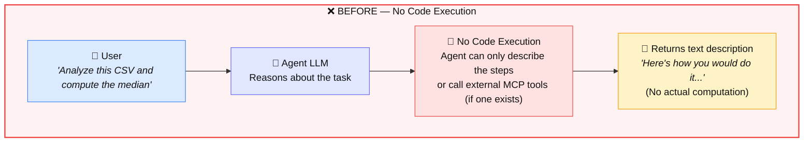
```mermaid
flowchart TD
    subgraph before["❌ BEFORE — No Code Execution"]
        style before fill:#fef2f2,stroke:#ef4444,stroke-width:2px,color:#111
        U1["👤 User<br/><i>'Analyze this CSV and compute the median'</i>"]
        A1["🤖 Agent LLM<br/>Reasons about the task"]
        X1["🚫 No Code Execution<br/>Agent can only describe the steps<br/>or call external MCP tools (if one exists)"]
        R1["📝 Returns text description<br/><i>'Here's how you would do it...'</i><br/>(No actual computation)"]

        U1 --> A1
        A1 --> X1
        X1 --> R1
    end

    style U1 fill:#dbeafe,stroke:#3b82f6,color:#111
    style A1 fill:#e0e7ff,stroke:#6366f1,color:#111
    style X1 fill:#fee2e2,stroke:#ef4444,color:#111
    style R1 fill:#fef3c7,stroke:#f59e0b,color:#111
```


**Limitations**:

- Agent cannot run calculations, data transformations, or validations
- Agent cannot verify its own outputs by executing code
- Agent cannot install/use Python libraries dynamically
- Complex multi-step analysis requires manual human execution
- No way to prototype or test code snippets during agent reasoning

### After (With CodeExecutionMiddleware)


```mermaid
flowchart TD
    subgraph after["✅ AFTER — With CodeExecutionMiddleware"]
        style after fill:#f0fdf4,stroke:#22c55e,stroke-width:2px,color:#111
        U2["👤 User<br/><i>'Analyze this CSV and compute the median'</i>"]
        A2["🤖 Agent LLM<br/>Reasons and generates Python code"]
        T2["🔧 execute_code<br/>language='python', code='import pandas...'"]

        subgraph mw["CodeExecutionMiddleware"]
            style mw fill:#ede9fe,stroke:#8b5cf6,stroke-width:2px,color:#111
            M1["📦 Create K8s Job<br/>in agent namespace"]
            M2["🐳 Ephemeral Pod<br/>python:3.12-slim"]
            M3["📊 Stream stdout/stderr"]
            M4["📈 Metrics + Audit + Traces"]
            M5["🗑️ Auto-delete Job + Pod"]
            M1 --> M2 --> M3 --> M4 --> M5
        end

        R2["✅ Agent receives result<br/><code>stdout: median=42.5</code><br/><code>exit_code: 0</code>"]
        F2["💬 Agent presents<br/>computed result to user"]

        U2 --> A2 --> T2 --> M1
        M5 --> R2 --> F2
    end

    style U2 fill:#dbeafe,stroke:#3b82f6,color:#111
    style A2 fill:#e0e7ff,stroke:#6366f1,color:#111
    style T2 fill:#fef3c7,stroke:#f59e0b,color:#111
    style M1 fill:#f3e8ff,stroke:#a855f7,color:#111
    style M2 fill:#f3e8ff,stroke:#a855f7,color:#111
    style M3 fill:#f3e8ff,stroke:#a855f7,color:#111
    style M4 fill:#f3e8ff,stroke:#a855f7,color:#111
    style M5 fill:#f3e8ff,stroke:#a855f7,color:#111
    style R2 fill:#dcfce7,stroke:#22c55e,color:#111
    style F2 fill:#dcfce7,stroke:#22c55e,color:#111
```


**Capabilities unlocked**:

- Direct computation: math, statistics, data processing
- Code verification: agent tests its own hypotheses
- Library usage: pandas, numpy, sympy in Python; npm packages in Node
- Multi-step analysis: run → inspect → refine → re-run
- Shell operations: data pipelines, file processing
- Polyglot execution: Python, shell, Node.js in isolated containers

---

## 3. Benefits & Business Value


| Benefit                         | Impact                                                                                                                                                                                  |
| ------------------------------- | --------------------------------------------------------------------------------------------------------------------------------------------------------------------------------------- |
| **Agent competence**            | Agents can answer quantitative questions with actual computation, not approximations                                                                                                    |
| **Security isolation**          | Code runs in ephemeral, sandboxed pods — never in the agent's own container. Zero K8s API access, read-only filesystem, no privilege escalation                                         |
| **Multi-tenant safety**         | Each org's executions run in the org's own namespace, inheriting existing NetworkPolicy and RBAC isolation                                                                              |
| **Resource control**            | Configurable CPU/memory limits and timeouts per execution prevent runaway code from affecting the platform                                                                              |
| **Full auditability**           | Every execution is traced end-to-end: who ran what code, when, where, how long, what it returned — across OTEL metrics, distributed tracing, platform audit events, and structured logs |
| **Zero operational burden**     | Ephemeral Jobs auto-delete on completion; K8s TTL controller provides a safety net; no persistent infrastructure to manage                                                              |
| **Extensible language support** | Adding a new language is a one-line config change (image + entrypoint mapping)                                                                                                          |
| **Demo-ready**                  | Clean, visible flow for stakeholder demos: "Agent writes Python → pod appears → output returns → pod disappears"                                                                        |


---

## 4. Architecture

### 4.1 Architectural Decision: Why Middleware, Not BaseSandbox or Subagent

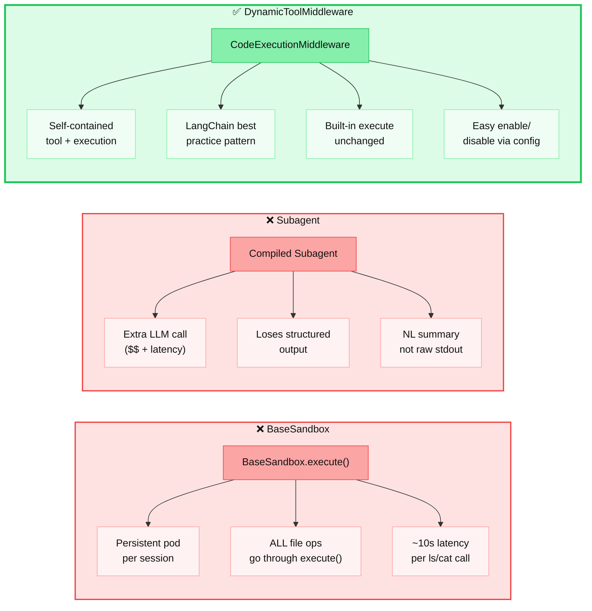
```mermaid
flowchart LR
    subgraph rejected1["❌ BaseSandbox"]
        style rejected1 fill:#fee2e2,stroke:#ef4444,stroke-width:2px,color:#111
        BS["BaseSandbox.execute()"]
        BS --> P1["Persistent pod<br/>per session"]
        BS --> P2["ALL file ops<br/>go through execute()"]
        BS --> P3["~10s latency<br/>per ls/cat call"]
    end

    subgraph rejected2["❌ Subagent"]
        style rejected2 fill:#fee2e2,stroke:#ef4444,stroke-width:2px,color:#111
        SA["Compiled Subagent"]
        SA --> S1["Extra LLM call<br/>($$ + latency)"]
        SA --> S2["Loses structured<br/>output"]
        SA --> S3["NL summary<br/>not raw stdout"]
    end

    subgraph selected["✅ DynamicToolMiddleware"]
        style selected fill:#dcfce7,stroke:#22c55e,stroke-width:3px,color:#111
        DT["CodeExecutionMiddleware"]
        DT --> D1["Self-contained<br/>tool + execution"]
        DT --> D2["LangChain best<br/>practice pattern"]
        DT --> D3["Built-in execute<br/>unchanged"]
        DT --> D4["Easy enable/<br/>disable via config"]
    end

    style BS fill:#fca5a5,stroke:#ef4444,color:#111
    style SA fill:#fca5a5,stroke:#ef4444,color:#111
    style DT fill:#86efac,stroke:#22c55e,color:#111
    style P1 fill:#fef2f2,stroke:#fca5a5,color:#111
    style P2 fill:#fef2f2,stroke:#fca5a5,color:#111
    style P3 fill:#fef2f2,stroke:#fca5a5,color:#111
    style S1 fill:#fef2f2,stroke:#fca5a5,color:#111
    style S2 fill:#fef2f2,stroke:#fca5a5,color:#111
    style S3 fill:#fef2f2,stroke:#fca5a5,color:#111
    style D1 fill:#f0fdf4,stroke:#86efac,color:#111
    style D2 fill:#f0fdf4,stroke:#86efac,color:#111
    style D3 fill:#f0fdf4,stroke:#86efac,color:#111
    style D4 fill:#f0fdf4,stroke:#86efac,color:#111
```


**Selected: DynamicToolMiddleware pattern** — following LangChain's `createCodeInterpreterMiddleware()` precedent and the `DynamicToolMiddleware` pattern from LangChain docs.

Full analysis in Section 12.

### 4.2 Platform Integration Architecture

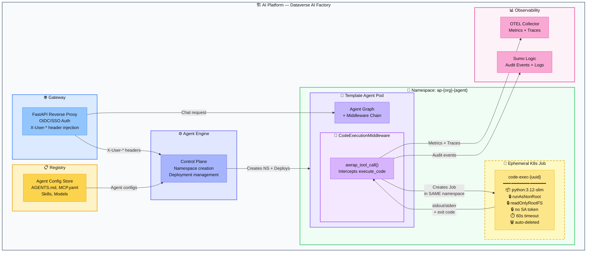
```mermaid
flowchart TB
    subgraph platform["🏗️ AI Platform — Dataverse AI Factory"]
        style platform fill:#f8fafc,stroke:#64748b,stroke-width:2px,color:#111

        subgraph gateway["🌐 Gateway"]
            style gateway fill:#dbeafe,stroke:#3b82f6,stroke-width:2px,color:#111
            GW["FastAPI Reverse Proxy<br/>OIDC/SSO Auth<br/>X-User-* header injection"]
        end

        subgraph registry["📋 Registry"]
            style registry fill:#fef3c7,stroke:#f59e0b,stroke-width:2px,color:#111
            REG["Agent Config Store<br/>AGENTS.md, MCP.yaml<br/>Skills, Models"]
        end

        subgraph engine["⚙️ Agent Engine"]
            style engine fill:#e0e7ff,stroke:#6366f1,stroke-width:2px,color:#111
            AE["Control Plane<br/>Namespace creation<br/>Deployment management"]
        end

        subgraph ns["📁 Namespace: ap-{org}-{agent}"]
            style ns fill:#f0fdf4,stroke:#22c55e,stroke-width:2px,color:#111

            subgraph agentpod["🤖 Template Agent Pod"]
                style agentpod fill:#ede9fe,stroke:#8b5cf6,stroke-width:2px,color:#111
                AGENT["Agent Graph<br/>+ Middleware Chain"]

                subgraph cemw["🔧 CodeExecutionMiddleware"]
                    style cemw fill:#f3e8ff,stroke:#a855f7,stroke-width:2px,color:#111
                    MW["awrap_tool_call()<br/>Intercepts execute_code"]
                end
            end

            subgraph job["🐳 Ephemeral K8s Job"]
                style job fill:#fef9c3,stroke:#eab308,stroke-width:2px,color:#111,stroke-dasharray: 8 4
                JOB["code-exec-{uuid}<br/>━━━━━━━━━━━━━━━━<br/>📦 python:3.12-slim<br/>🔒 runAsNonRoot<br/>🔒 readOnlyRootFS<br/>🔒 no SA token<br/>⏱️ 60s timeout<br/>🗑️ auto-deleted"]
            end
        end

        subgraph observability["📊 Observability"]
            style observability fill:#fdf2f8,stroke:#ec4899,stroke-width:2px,color:#111
            OTEL["OTEL Collector<br/>Metrics + Traces"]
            AUDIT["Sumo Logic<br/>Audit Events + Logs"]
        end
    end

    GW -->|"X-User-* headers"| AE
    REG -->|"Agent configs"| AE
    AE -->|"Creates NS + Deploys"| agentpod
    GW -->|"Chat request"| AGENT
    MW -->|"Creates Job<br/>in SAME namespace"| JOB
    JOB -->|"stdout/stderr<br/>+ exit code"| MW
    MW -->|"Metrics + Traces"| OTEL
    MW -->|"Audit events"| AUDIT

    style GW fill:#93c5fd,stroke:#3b82f6,color:#111
    style REG fill:#fcd34d,stroke:#f59e0b,color:#111
    style AE fill:#a5b4fc,stroke:#6366f1,color:#111
    style AGENT fill:#c4b5fd,stroke:#8b5cf6,color:#111
    style MW fill:#d8b4fe,stroke:#a855f7,color:#111
    style JOB fill:#fde68a,stroke:#eab308,color:#111
    style OTEL fill:#f9a8d4,stroke:#ec4899,color:#111
    style AUDIT fill:#f9a8d4,stroke:#ec4899,color:#111
```


**Key integration points**:


| Integration Point           | How                                                                                                      | Source                                                    |
| --------------------------- | -------------------------------------------------------------------------------------------------------- | --------------------------------------------------------- |
| **Namespace**               | Jobs run in the agent's own namespace (`ap-{org}-{agent}`) which already exists, created by agent-engine | Agent-engine `namespace.py`: `agent_namespace(org, name)` |
| **Identity (org/agent)**    | Read from env vars `AI_PLATFORM_AGENT_ORG` + `AI_PLATFORM_AGENT_NAME` set on agent pods by agent-engine  | Agent-engine `deployer.py`                                |
| **Identity (user)**         | From audit context ContextVar, bound by `graph.py` via `bind_audit_context(user=user_identity)`          | Audit `context.py`                                        |
| **Labels**                  | Follow platform convention: `ai-platform.io/org`, `ai-platform.io/agent`, `app.kubernetes.io/managed-by` | Agent-engine `deployer.py`                                |
| **Security context**        | Match platform standard: `runAsNonRoot`, `readOnlyRootFilesystem`, drop all caps                         | Gateway + agent-engine manifests                          |
| **K8s API auth**            | `load_incluster_config()` with `load_kube_config()` fallback                                             | Agent-engine `namespace.py`: `load_k8s_config()`          |
| **OTEL metrics**            | Register on existing `MetricsContainer` meter via `get_metrics()`                                        | `otel.py`                                                 |
| **OTEL tracing**            | Create spans via `get_tracer()`                                                                          | `otel.py`                                                 |
| **Audit events**            | Emit via `emit_audit_event()` with existing context                                                      | Audit `emitter.py`                                        |
| **Structured logs**         | Use `get_python_logger()`                                                                                | `pylogger.py`                                             |
| **Middleware registration** | Add to `build_middleware_list()` in `infrastructure/middleware.py`                                       | Existing pattern                                          |
| **Config**                  | New `code_execution:` section in `agent.yaml`, loaded by `AgentConfig`                                   | Existing config pattern                                   |


### 4.3 Request Flow (End-to-End)

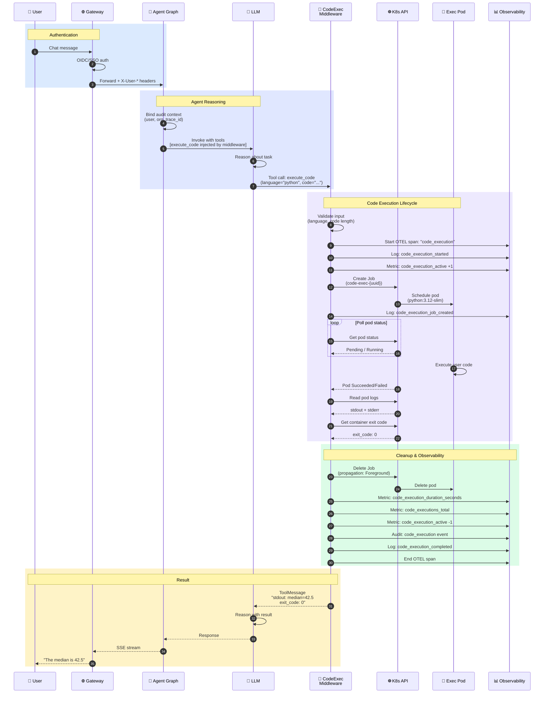
```mermaid
sequenceDiagram
    autonumber
    participant U as 👤 User
    participant GW as 🌐 Gateway
    participant AG as 🤖 Agent Graph
    participant LLM as 🧠 LLM
    participant MW as 🔧 CodeExec<br/>Middleware
    participant K8S as ☸️ K8s API
    participant POD as 🐳 Exec Pod
    participant OBS as 📊 Observability

    rect rgb(219, 234, 254)
        Note over U,GW: Authentication
        U->>GW: Chat message
        GW->>GW: OIDC/SSO auth
        GW->>AG: Forward + X-User-* headers
    end

    rect rgb(224, 231, 255)
        Note over AG,LLM: Agent Reasoning
        AG->>AG: Bind audit context<br/>(user, org, trace_id)
        AG->>LLM: Invoke with tools<br/>[execute_code injected by middleware]
        LLM->>LLM: Reason about task
        LLM->>MW: Tool call: execute_code<br/>(language="python", code="...")
    end

    rect rgb(237, 233, 254)
        Note over MW,POD: Code Execution Lifecycle
        MW->>MW: Validate input<br/>(language, code length)
        MW->>OBS: Start OTEL span: "code_execution"
        MW->>OBS: Log: code_execution_started
        MW->>OBS: Metric: code_execution_active +1

        MW->>K8S: Create Job<br/>(code-exec-{uuid})
        K8S->>POD: Schedule pod<br/>(python:3.12-slim)
        MW->>OBS: Log: code_execution_job_created

        loop Poll pod status
            MW->>K8S: Get pod status
            K8S-->>MW: Pending / Running
        end

        POD->>POD: Execute user code
        K8S-->>MW: Pod Succeeded/Failed

        MW->>K8S: Read pod logs
        K8S-->>MW: stdout + stderr

        MW->>K8S: Get container exit code
        K8S-->>MW: exit_code: 0
    end

    rect rgb(220, 252, 231)
        Note over MW,OBS: Cleanup & Observability
        MW->>K8S: Delete Job<br/>(propagation: Foreground)
        K8S->>POD: Delete pod

        MW->>OBS: Metric: code_execution_duration_seconds
        MW->>OBS: Metric: code_executions_total
        MW->>OBS: Metric: code_execution_active -1
        MW->>OBS: Audit: code_execution event
        MW->>OBS: Log: code_execution_completed
        MW->>OBS: End OTEL span
    end

    rect rgb(254, 243, 199)
        Note over MW,U: Result
        MW-->>LLM: ToolMessage<br/>"stdout: median=42.5<br/>exit_code: 0"
        LLM->>LLM: Reason with result
        LLM-->>AG: Response
        AG-->>GW: SSE stream
        GW-->>U: "The median is 42.5"
    end
```


### 4.4 Usage: Chat Agent vs Headless Agent

The middleware is **transparent to both invocation modes** — it works identically regardless of how the agent is called.


```mermaid
flowchart TB
    subgraph chat["💬 Chat Agent (via UI)"]
        style chat fill:#dbeafe,stroke:#3b82f6,stroke-width:2px,color:#111
        U["👤 User Browser"]
        UI["🖥️ template-ui<br/>(port 8080)"]
        AG1["🤖 Agent Graph<br/>+ CodeExecutionMW"]
        J1["🐳 K8s Job"]

        U -->|"'compute median'"| UI
        UI -->|"SSE /api/chat"| AG1
        AG1 -->|"execute_code"| J1
        J1 -->|"stdout: 4.5"| AG1
        AG1 -->|"SSE stream"| UI
        UI -->|"'The median is 4.5'"| U
    end

    subgraph headless["🔌 Headless Agent (via API)"]
        style headless fill:#dcfce7,stroke:#22c55e,stroke-width:2px,color:#111
        API["📡 API Client<br/>(curl, SDK, CI/CD)"]
        AG2["🤖 Agent Graph<br/>+ CodeExecutionMW"]
        J2["🐳 K8s Job"]

        API -->|"POST /api/chat"| AG2
        AG2 -->|"execute_code"| J2
        J2 -->|"stdout: 4.5"| AG2
        AG2 -->|"JSON response"| API
    end

    subgraph async_sub["🔄 Async Subagent"]
        style async_sub fill:#fef3c7,stroke:#f59e0b,stroke-width:2px,color:#111
        ORCH["🤖 Orchestrator"]
        SUB["🤖 Subagent<br/>+ own CodeExecutionMW"]
        J3["🐳 K8s Job"]

        ORCH -->|"task tool"| SUB
        SUB -->|"execute_code"| J3
        J3 -->|"result"| SUB
        SUB -->|"summary"| ORCH
    end

    style U fill:#93c5fd,stroke:#3b82f6,color:#111
    style UI fill:#93c5fd,stroke:#3b82f6,color:#111
    style AG1 fill:#bfdbfe,stroke:#3b82f6,color:#111
    style J1 fill:#bfdbfe,stroke:#3b82f6,color:#111
    style API fill:#86efac,stroke:#22c55e,color:#111
    style AG2 fill:#bbf7d0,stroke:#22c55e,color:#111
    style J2 fill:#bbf7d0,stroke:#22c55e,color:#111
    style ORCH fill:#fde68a,stroke:#f59e0b,color:#111
    style SUB fill:#fde68a,stroke:#f59e0b,color:#111
    style J3 fill:#fde68a,stroke:#f59e0b,color:#111
```


**Key behaviors by invocation mode:**


| Mode                               | How execute_code appears                                                                                                                  | Execution path                                               | Result format                                                    |
| ---------------------------------- | ----------------------------------------------------------------------------------------------------------------------------------------- | ------------------------------------------------------------ | ---------------------------------------------------------------- |
| **Chat agent** (UI)                | LLM sees it in tool list, calls it when user asks to compute/analyze                                                                      | Same middleware chain → K8s Job                              | Formatted in agent's natural-language response, streamed via SSE |
| **Headless agent** (API)           | Same — tool injected by middleware                                                                                                        | Same middleware chain → K8s Job                              | Included in JSON response body                                   |
| **Async subagent**                 | Only if subagent's own middleware has `code_execution.enabled: true`                                                                      | Independent middleware chain on remote Agent Protocol server | Returned to orchestrator as subagent result text                 |
| **Compiled subagent** (in-process) | Only via `awrap_model_call` (async path). Sync `.invoke()` subagents do NOT get the tool injected — sync `wrap_model_call` passes through | Same process, separate middleware instance                   | ToolMessage returned to orchestrator                             |


**The tool is invisible when disabled.** With `code_execution.enabled: false`, the middleware's `awrap_model_call` passes through without injecting the tool — the LLM never sees `execute_code` in its tool list and cannot call it. No config change to the agent prompt is needed.

---

## 5. Requirements Traceability Matrix

Every requirement from the original specification mapped to its implementation:


| #   | Requirement                                                | Implementation                                                                                                                                                                               | Verified By                                                      |
| --- | ---------------------------------------------------------- | -------------------------------------------------------------------------------------------------------------------------------------------------------------------------------------------- | ---------------------------------------------------------------- |
| R1  | Deepagents middleware intercepting execute_code tool calls | `CodeExecutionMiddleware(AgentMiddleware)` with `awrap_tool_call` checking `request.tool_call["name"] == "execute_code"`                                                                     | Unit test: tool routing                                          |
| R2  | Spawns ephemeral K8s Job per execution                     | `K8sJobRunner.create_job()` → `BatchV1Api.create_namespaced_job()`, `backoffLimit: 0`, `restartPolicy: Never`                                                                                | Unit test: Job manifest; Integration test: mock K8s API          |
| R3  | Configurable image                                         | `CodeExecutionConfig.images: dict[str, str]` mapping language → container image                                                                                                              | Unit test: config validation; Parametrized test: all 3 languages |
| R4  | Configurable resource limits                               | `CodeExecutionConfig.resource_requests/limits` → Job spec `resources`                                                                                                                        | Unit test: manifest generation                                   |
| R5  | Configurable timeout                                       | `CodeExecutionConfig.max_timeout_seconds` → Job `activeDeadlineSeconds` + client-side `asyncio.wait_for`                                                                                     | Unit test: timeout handling; Parametrized test: timeout scenario |
| R6  | Streams stdout/stderr back to agent                        | `CoreV1Api.read_namespaced_pod_log()` with `follow=False` (collect after completion)                                                                                                         | Unit test: log collection                                        |
| R7  | Auto-cleanup on completion/timeout                         | `ttlSecondsAfterFinished: 30` on Job spec + explicit `BatchV1Api.delete_namespaced_job(propagation_policy="Foreground")` in `finally` block                                                  | Unit test: cleanup runs on success/failure/timeout               |
| R8  | Namespace isolation per org                                | Namespace resolved from `AI_PLATFORM_AGENT_ORG` + `AI_PLATFORM_AGENT_NAME` env vars → `ap-{org}-{agent}`. Jobs execute in agent's pre-existing namespace                                     | Unit test: namespace resolution                                  |
| R9  | Supports Python, shell, Node                               | Language → image + entrypoint mapping: `python` → `["python", "-c"]`, `shell` → `["bash", "-c"]`, `node` → `["node", "-e"]`                                                                  | Parametrized test: all 3 languages                               |
| R10 | Max execution time default 60s                             | `CodeExecutionConfig.max_timeout_seconds` default=60, range 5-300                                                                                                                            | Unit test: config defaults                                       |
| R11 | Emit `code_execution_duration_seconds` metric              | OTEL Histogram recorded in metrics helper, labels: `language`, `org`, `exit_code`, `status`                                                                                                  | Unit test: metric recording                                      |
| R12 | Tests with mock K8s API                                    | `unittest.mock.patch` on `kubernetes.client.BatchV1Api` and `CoreV1Api`; mock responses for create/get/delete/logs                                                                           | Full test suite                                                  |
| R13 | Full traceability/observability                            | 4-layer observability: OTEL metrics (5 instruments), OTEL tracing (5 spans), audit events (`code_execution` type), structured logs (8 log events)                                            | Unit tests per layer                                             |
| R14 | Security isolation                                         | `automountServiceAccountToken: false`, `runAsNonRoot: true`, `readOnlyRootFilesystem: true`, `allowPrivilegeEscalation: false`, `capabilities.drop: [ALL]`, `seccompProfile: RuntimeDefault` | Unit test: manifest security fields                              |
| R15 | Demo-ready flow                                            | Agent generates Python → middleware creates Job → pod runs code → output returned → pod deleted. Visible in K8s dashboard during execution                                                   | Manual verification                                              |


---

## 6. K8s Job Specification

### Job Manifest Template

```yaml
apiVersion: batch/v1
kind: Job
metadata:
  name: code-exec-{short_uuid}            # 8-char UUID suffix for uniqueness
  namespace: ap-{org}-{agent}              # Agent's pre-existing namespace
  labels:
    app.kubernetes.io/name: code-execution
    app.kubernetes.io/component: ephemeral-job
    app.kubernetes.io/managed-by: template-agent
    ai-platform.io/org: "{org}"
    ai-platform.io/agent: "{agent}"
    ai-platform.io/execution-id: "{full_uuid}"
spec:
  activeDeadlineSeconds: 60                # K8s-enforced hard timeout
  ttlSecondsAfterFinished: 30              # Auto-cleanup safety net
  backoffLimit: 0                          # No retries — fail fast
  template:
    metadata:
      labels:
        app.kubernetes.io/name: code-execution
        app.kubernetes.io/component: ephemeral-job
        ai-platform.io/org: "{org}"
        ai-platform.io/agent: "{agent}"
      annotations:
        ai-platform.io/trace-id: "{trace_id}"
    spec:
      restartPolicy: Never
      automountServiceAccountToken: false   # Zero K8s API access
      securityContext:
        runAsNonRoot: true
        runAsUser: 1000
        runAsGroup: 1000
        fsGroup: 1000
        seccompProfile:
          type: RuntimeDefault
      containers:
      - name: executor
        image: "{configured_image}"         # e.g., python:3.12-slim
        command: ["{entrypoint}"]            # e.g., ["python", "-c"]
        args: ["{user_code}"]               # The actual code to execute
        resources:
          requests:
            cpu: "{config.resource_requests.cpu}"
            memory: "{config.resource_requests.memory}"
          limits:
            cpu: "{config.resource_limits.cpu}"
            memory: "{config.resource_limits.memory}"
        securityContext:
          allowPrivilegeEscalation: false
          readOnlyRootFilesystem: true
          capabilities:
            drop: ["ALL"]
        volumeMounts:
        - name: tmp
          mountPath: /tmp
      volumes:
      - name: tmp
        emptyDir:
          sizeLimit: 64Mi
```

### Language → Image + Entrypoint Mapping


| Language | Default Image      | Command            | Args Pattern |
| -------- | ------------------ | ------------------ | ------------ |
| `python` | `python:3.12-slim` | `["python", "-c"]` | `["{code}"]` |
| `shell`  | `bash:5`           | `["bash", "-c"]`   | `["{code}"]` |
| `node`   | `node:22-slim`     | `["node", "-e"]`   | `["{code}"]` |


Images are configurable per-deployment via `agent.yaml` to support internal registries (e.g., `images.paas.redhat.com/...`).

### Security Constraints

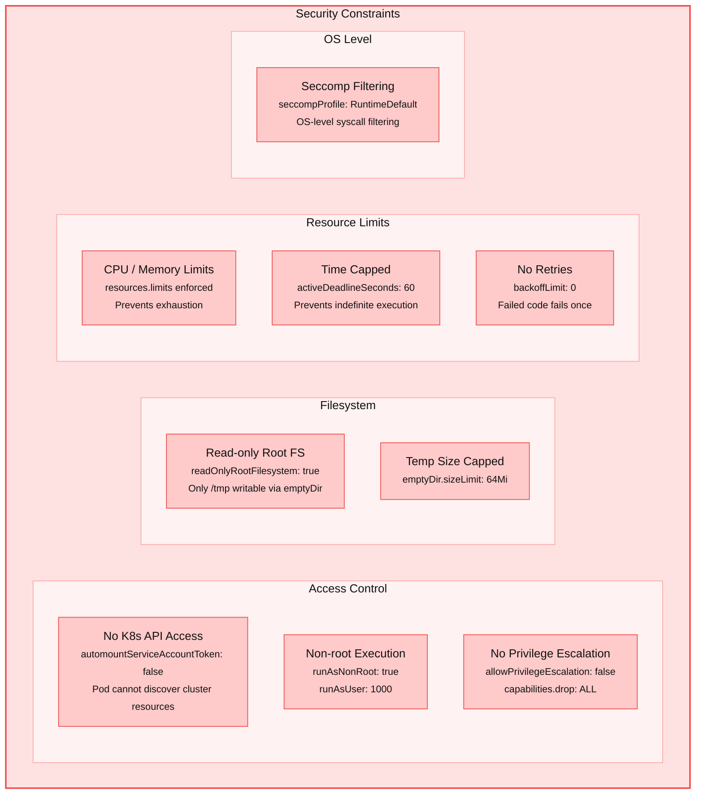
```mermaid
flowchart TB
    subgraph security["Security Constraints"]
        style security fill:#fee2e2,stroke:#ef4444,stroke-width:2px,color:#111

        subgraph access["Access Control"]
            style access fill:#fef2f2,stroke:#fca5a5,stroke-width:1px,color:#111
            A1["No K8s API Access<br/><small>automountServiceAccountToken: false<br/>Pod cannot discover cluster resources</small>"]
            A2["Non-root Execution<br/><small>runAsNonRoot: true<br/>runAsUser: 1000</small>"]
            A3["No Privilege Escalation<br/><small>allowPrivilegeEscalation: false<br/>capabilities.drop: ALL</small>"]
        end

        subgraph filesystem["Filesystem"]
            style filesystem fill:#fef2f2,stroke:#fca5a5,stroke-width:1px,color:#111
            F1["Read-only Root FS<br/><small>readOnlyRootFilesystem: true<br/>Only /tmp writable via emptyDir</small>"]
            F2["Temp Size Capped<br/><small>emptyDir.sizeLimit: 64Mi</small>"]
        end

        subgraph limits["Resource Limits"]
            style limits fill:#fef2f2,stroke:#fca5a5,stroke-width:1px,color:#111
            L1["CPU / Memory Limits<br/><small>resources.limits enforced<br/>Prevents exhaustion</small>"]
            L2["Time Capped<br/><small>activeDeadlineSeconds: 60<br/>Prevents indefinite execution</small>"]
            L3["No Retries<br/><small>backoffLimit: 0<br/>Failed code fails once</small>"]
        end

        subgraph os["OS Level"]
            style os fill:#fef2f2,stroke:#fca5a5,stroke-width:1px,color:#111
            O1["Seccomp Filtering<br/><small>seccompProfile: RuntimeDefault<br/>OS-level syscall filtering</small>"]
        end
    end

    style A1 fill:#fecaca,stroke:#ef4444,color:#111
    style A2 fill:#fecaca,stroke:#ef4444,color:#111
    style A3 fill:#fecaca,stroke:#ef4444,color:#111
    style F1 fill:#fecaca,stroke:#ef4444,color:#111
    style F2 fill:#fecaca,stroke:#ef4444,color:#111
    style L1 fill:#fecaca,stroke:#ef4444,color:#111
    style L2 fill:#fecaca,stroke:#ef4444,color:#111
    style L3 fill:#fecaca,stroke:#ef4444,color:#111
    style O1 fill:#fecaca,stroke:#ef4444,color:#111
```


---

## 7. Component Design

### 7.1 Component Architecture

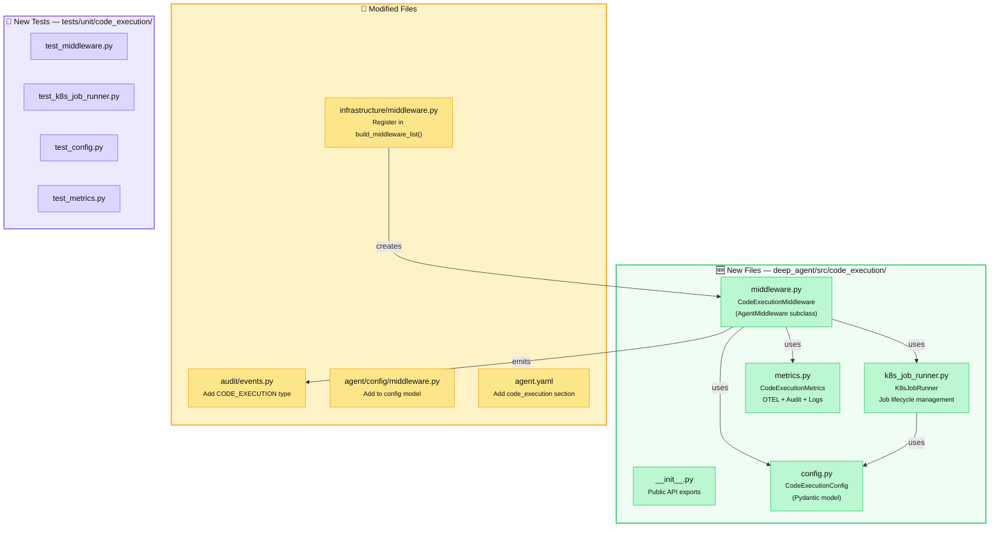
```mermaid
graph TB
    subgraph new["🆕 New Files — deep_agent/src/code_execution/"]
        style new fill:#f0fdf4,stroke:#22c55e,stroke-width:2px,color:#111
        INIT["__init__.py<br/><small>Public API exports</small>"]
        MW_F["middleware.py<br/><small>CodeExecutionMiddleware</small><br/><small>(AgentMiddleware subclass)</small>"]
        K8S_F["k8s_job_runner.py<br/><small>K8sJobRunner</small><br/><small>Job lifecycle management</small>"]
        CFG_F["config.py<br/><small>CodeExecutionConfig</small><br/><small>(Pydantic model)</small>"]
        MET_F["metrics.py<br/><small>CodeExecutionMetrics</small><br/><small>OTEL + Audit + Logs</small>"]
    end

    subgraph modified["📝 Modified Files"]
        style modified fill:#fef3c7,stroke:#f59e0b,stroke-width:2px,color:#111
        INFRA["infrastructure/middleware.py<br/><small>Register in build_middleware_list()</small>"]
        EVENTS["audit/events.py<br/><small>Add CODE_EXECUTION type</small>"]
        MWCFG["agent/config/middleware.py<br/><small>Add to config model</small>"]
        YAML["agent.yaml<br/><small>Add code_execution section</small>"]
    end

    subgraph tests["🧪 New Tests — tests/unit/code_execution/"]
        style tests fill:#ede9fe,stroke:#8b5cf6,stroke-width:2px,color:#111
        T1["test_middleware.py"]
        T2["test_k8s_job_runner.py"]
        T3["test_config.py"]
        T4["test_metrics.py"]
    end

    MW_F -->|uses| K8S_F
    MW_F -->|uses| CFG_F
    MW_F -->|uses| MET_F
    K8S_F -->|uses| CFG_F
    INFRA -->|creates| MW_F
    MW_F -->|emits| EVENTS

    style INIT fill:#bbf7d0,stroke:#22c55e,color:#111
    style MW_F fill:#bbf7d0,stroke:#22c55e,color:#111
    style K8S_F fill:#bbf7d0,stroke:#22c55e,color:#111
    style CFG_F fill:#bbf7d0,stroke:#22c55e,color:#111
    style MET_F fill:#bbf7d0,stroke:#22c55e,color:#111
    style INFRA fill:#fde68a,stroke:#f59e0b,color:#111
    style EVENTS fill:#fde68a,stroke:#f59e0b,color:#111
    style MWCFG fill:#fde68a,stroke:#f59e0b,color:#111
    style YAML fill:#fde68a,stroke:#f59e0b,color:#111
    style T1 fill:#ddd6fe,stroke:#8b5cf6,color:#111
    style T2 fill:#ddd6fe,stroke:#8b5cf6,color:#111
    style T3 fill:#ddd6fe,stroke:#8b5cf6,color:#111
    style T4 fill:#ddd6fe,stroke:#8b5cf6,color:#111
```


### 7.2 `config.py` — CodeExecutionConfig

```python
class CodeExecutionConfig(BaseModel):
    """Configuration for code execution middleware."""

    enabled: bool = False
    max_timeout_seconds: int = Field(default=60, ge=5, le=300)
    max_code_length: int = Field(default=50_000, ge=100, le=500_000)
    max_output_bytes: int = Field(default=1_048_576)  # 1MB

    images: dict[str, str] = Field(default_factory=lambda: {
        "python": "python:3.12-slim",
        "shell": "bash:5",
        "node": "node:22-slim",
    })

    entrypoints: dict[str, list[str]] = Field(default_factory=lambda: {
        "python": ["python", "-c"],
        "shell": ["bash", "-c"],
        "node": ["node", "-e"],
    })

    resource_requests: dict[str, str] = Field(
        default_factory=lambda: {"cpu": "100m", "memory": "128Mi"}
    )
    resource_limits: dict[str, str] = Field(
        default_factory=lambda: {"cpu": "500m", "memory": "256Mi"}
    )

    tmp_size_limit: str = "64Mi"
    job_ttl_after_finished: int = Field(default=30, ge=0, le=300)
    pod_poll_interval_seconds: float = Field(default=1.0, ge=0.5, le=10.0)
    pod_poll_timeout_seconds: float = Field(default=120.0, ge=10.0, le=600.0)
```

### 7.3 `middleware.py` — CodeExecutionMiddleware

```python
class CodeExecutionMiddleware(AgentMiddleware):
    """Inject execute_code tool and route calls to K8s Job backend."""

    def __init__(self, *, config: CodeExecutionConfig) -> None:
        self._config = config
        self._runner = K8sJobRunner(config)
        self._execute_code_tool = self._build_tool()

    def _build_tool(self) -> BaseTool:
        """Build the execute_code tool definition for LLM tool binding."""
        # @tool-decorated function with language, code, timeout params
        ...

    async def awrap_model_call(self, request, handler):
        """Inject execute_code tool into the agent's available tools."""
        if not self._config.enabled:
            return await handler(request)
        updated = request.override(tools=[*request.tools, self._execute_code_tool])
        return await handler(updated)

    async def awrap_tool_call(self, request, handler):
        """Intercept execute_code calls, route to K8s Job backend."""
        if request.tool_call.get("name") != "execute_code":
            return await handler(request)

        args = request.tool_call.get("args", {})
        code = args.get("code", "")
        language = args.get("language", "python")
        timeout = min(args.get("timeout", self._config.max_timeout_seconds),
                      self._config.max_timeout_seconds)

        # Validate
        if language not in self._config.images:
            return ToolMessage(
                content=f"Unsupported language: {language}. "
                        f"Supported: {', '.join(self._config.images)}",
                tool_call_id=request.tool_call["id"],
            )
        if len(code) > self._config.max_code_length:
            return ToolMessage(
                content=f"Code exceeds maximum length of {self._config.max_code_length} chars",
                tool_call_id=request.tool_call["id"],
            )

        # Execute via K8s Job with full observability
        result = await self._execute_with_observability(language, code, timeout)

        return ToolMessage(
            content=result.format(),
            tool_call_id=request.tool_call["id"],
        )

    # Sync wrappers pass through — code execution is async-only.
    # Subagents using sync .invoke() will not get execute_code injected.
    # This matches the codebase pattern: orchestrator uses async, subagents may use sync.
    def wrap_model_call(self, request, handler):
        return handler(request)

    def wrap_tool_call(self, request, handler):
        return handler(request)
```

### 7.4 `k8s_job_runner.py` — K8s Job Lifecycle

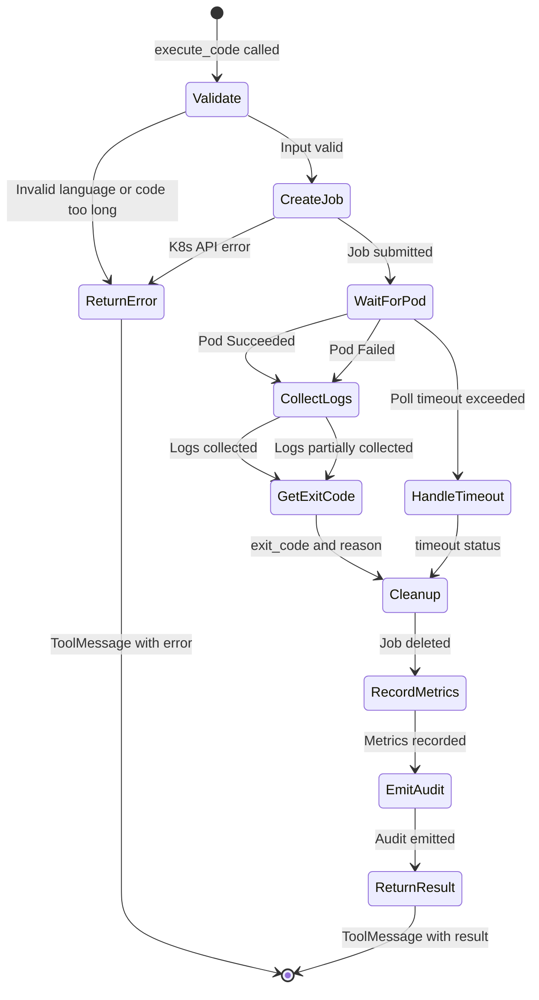
```mermaid
stateDiagram-v2
    [*] --> Validate: execute_code called
    Validate --> CreateJob: Input valid
    Validate --> ReturnError: Invalid language or code too long

    CreateJob --> WaitForPod: Job submitted
    CreateJob --> ReturnError: K8s API error

    WaitForPod --> CollectLogs: Pod Succeeded
    WaitForPod --> CollectLogs: Pod Failed
    WaitForPod --> HandleTimeout: Poll timeout exceeded

    CollectLogs --> GetExitCode: Logs collected
    CollectLogs --> GetExitCode: Logs partially collected

    GetExitCode --> Cleanup: exit_code and reason
    HandleTimeout --> Cleanup: timeout status

    Cleanup --> RecordMetrics: Job deleted
    RecordMetrics --> EmitAudit: Metrics recorded
    EmitAudit --> ReturnResult: Audit emitted

    ReturnError --> [*]: ToolMessage with error
    ReturnResult --> [*]: ToolMessage with result
```


```python
@dataclass
class ExecutionResult:
    stdout: str
    stderr: str
    exit_code: int
    duration_seconds: float
    status: str             # "success", "failed", "timeout", "oom_killed"
    job_name: str
    namespace: str

    def format(self) -> str:
        parts = []
        if self.stdout:
            parts.append(f"stdout:\n{self.stdout}")
        if self.stderr:
            parts.append(f"stderr:\n{self.stderr}")
        parts.append(f"exit_code: {self.exit_code}")
        if self.status == "timeout":
            parts.append(f"(timed out after {self.duration_seconds:.1f}s)")
        if self.status == "oom_killed":
            parts.append("(killed: out of memory)")
        return "\n".join(parts)


class K8sJobRunner:
    """Manages the lifecycle of ephemeral K8s Jobs for code execution."""

    def __init__(self, config: CodeExecutionConfig) -> None:
        self._config = config
        self._batch_api: BatchV1Api | None = None
        self._core_api: CoreV1Api | None = None

    def _ensure_k8s_client(self) -> None:
        """Lazy init K8s client. In-cluster first, kubeconfig fallback."""
        ...

    def _build_job_manifest(self, ...) -> client.V1Job:
        """Build the K8s Job manifest from config + execution params."""
        ...

    async def _create_job(self, ...) -> str:
        """Submit Job to K8s API. Returns job_name."""
        ...

    async def _wait_for_pod(self, ...) -> tuple[str, str]:
        """Poll until pod reaches terminal state. Returns (pod_name, status)."""
        ...

    async def _collect_logs(self, ...) -> tuple[str, str]:
        """Read stdout/stderr from pod logs. Truncates at max_output_bytes."""
        ...

    async def _get_exit_code(self, ...) -> tuple[int, str]:
        """Extract exit code and termination reason from container status."""
        ...

    async def _cleanup(self, ...) -> None:
        """Delete Job with Foreground propagation (cascades to pods)."""
        ...

    async def run(self, language, code, timeout, namespace) -> ExecutionResult:
        """Full lifecycle: create → wait → logs → exit_code → cleanup."""
        ...
```

### 7.5 `metrics.py` — Observability Helpers

All four observability layers coordinated in one module:

```python
class CodeExecutionMetrics:
    """Centralized observability for code execution."""

    def __init__(self) -> None:
        self._init_otel_metrics()

    def _init_otel_metrics(self) -> None:
        """Register OTEL metric instruments on the global meter."""
        from deep_agent.aegra.otel import get_metrics
        meter = get_metrics()
        # If OTEL not initialized, metrics are no-ops
        ...

    # --- OTEL Metrics ---
    def record_execution(self, *, language, org, exit_code, status, duration): ...
    def record_error(self, *, language, org, error_type): ...
    def record_scheduling_latency(self, *, org, duration): ...
    def increment_active(self, *, org): ...
    def decrement_active(self, *, org): ...

    # --- OTEL Tracing ---
    def start_span(self, name, **attributes) -> Span: ...
    def child_span(self, parent, name, **attributes) -> Span: ...

    # --- Platform Audit ---
    def emit_audit(self, *, language, status, exit_code, latency_ms,
                   code_hash, namespace, image, job_name, timeout,
                   stdout_bytes, stderr_bytes): ...

    # --- Structured Logging ---
    def log_started(self, **fields): ...
    def log_completed(self, **fields): ...
    def log_timeout(self, **fields): ...
    def log_oom(self, **fields): ...
    def log_failed(self, **fields): ...
    def log_cleanup(self, **fields): ...
```

---

## 8. Observability Design (4 Layers)

### Full Observability Architecture

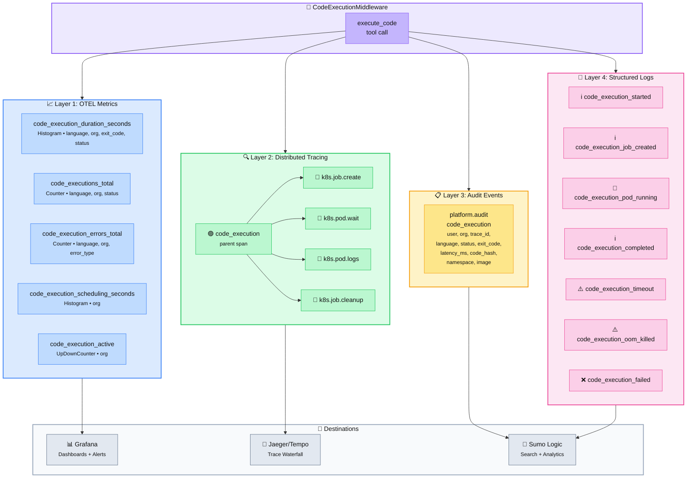
```mermaid
flowchart TB
    subgraph middleware["🔧 CodeExecutionMiddleware"]
        style middleware fill:#ede9fe,stroke:#8b5cf6,stroke-width:2px,color:#111
        EXEC["execute_code<br/>tool call"]
    end

    subgraph layer1["📈 Layer 1: OTEL Metrics"]
        style layer1 fill:#dbeafe,stroke:#3b82f6,stroke-width:2px,color:#111
        M1["code_execution_duration_seconds<br/><small>Histogram • language, org, exit_code, status</small>"]
        M2["code_executions_total<br/><small>Counter • language, org, status</small>"]
        M3["code_execution_errors_total<br/><small>Counter • language, org, error_type</small>"]
        M4["code_execution_scheduling_seconds<br/><small>Histogram • org</small>"]
        M5["code_execution_active<br/><small>UpDownCounter • org</small>"]
    end

    subgraph layer2["🔍 Layer 2: Distributed Tracing"]
        style layer2 fill:#dcfce7,stroke:#22c55e,stroke-width:2px,color:#111
        S1["🟣 code_execution<br/><small>parent span</small>"]
        S2["🔵 k8s.job.create"]
        S3["🔵 k8s.pod.wait"]
        S4["🔵 k8s.pod.logs"]
        S5["🔵 k8s.job.cleanup"]
        S1 --> S2
        S1 --> S3
        S1 --> S4
        S1 --> S5
    end

    subgraph layer3["📋 Layer 3: Audit Events"]
        style layer3 fill:#fef3c7,stroke:#f59e0b,stroke-width:2px,color:#111
        AE["platform.audit<br/>code_execution<br/><small>user, org, trace_id,<br/>language, status, exit_code,<br/>latency_ms, code_hash,<br/>namespace, image</small>"]
    end

    subgraph layer4["📝 Layer 4: Structured Logs"]
        style layer4 fill:#fce7f3,stroke:#ec4899,stroke-width:2px,color:#111
        L1["ℹ️ code_execution_started"]
        L2["ℹ️ code_execution_job_created"]
        L3["🐛 code_execution_pod_running"]
        L4["ℹ️ code_execution_completed"]
        L5["⚠️ code_execution_timeout"]
        L6["⚠️ code_execution_oom_killed"]
        L7["❌ code_execution_failed"]
    end

    subgraph destinations["🎯 Destinations"]
        style destinations fill:#f8fafc,stroke:#94a3b8,stroke-width:2px,color:#111
        GRAF["📊 Grafana<br/><small>Dashboards + Alerts</small>"]
        JAEG["🔎 Jaeger/Tempo<br/><small>Trace Waterfall</small>"]
        SUMO["📑 Sumo Logic<br/><small>Search + Analytics</small>"]
    end

    EXEC --> layer1
    EXEC --> layer2
    EXEC --> layer3
    EXEC --> layer4

    layer1 --> GRAF
    layer2 --> JAEG
    layer3 --> SUMO
    layer4 --> SUMO

    style EXEC fill:#c4b5fd,stroke:#8b5cf6,color:#111
    style M1 fill:#bfdbfe,stroke:#3b82f6,color:#111
    style M2 fill:#bfdbfe,stroke:#3b82f6,color:#111
    style M3 fill:#bfdbfe,stroke:#3b82f6,color:#111
    style M4 fill:#bfdbfe,stroke:#3b82f6,color:#111
    style M5 fill:#bfdbfe,stroke:#3b82f6,color:#111
    style S1 fill:#bbf7d0,stroke:#22c55e,color:#111
    style S2 fill:#bbf7d0,stroke:#22c55e,color:#111
    style S3 fill:#bbf7d0,stroke:#22c55e,color:#111
    style S4 fill:#bbf7d0,stroke:#22c55e,color:#111
    style S5 fill:#bbf7d0,stroke:#22c55e,color:#111
    style AE fill:#fde68a,stroke:#f59e0b,color:#111
    style L1 fill:#fbcfe8,stroke:#ec4899,color:#111
    style L2 fill:#fbcfe8,stroke:#ec4899,color:#111
    style L3 fill:#fbcfe8,stroke:#ec4899,color:#111
    style L4 fill:#fbcfe8,stroke:#ec4899,color:#111
    style L5 fill:#fbcfe8,stroke:#ec4899,color:#111
    style L6 fill:#fbcfe8,stroke:#ec4899,color:#111
    style L7 fill:#fbcfe8,stroke:#ec4899,color:#111
    style GRAF fill:#e2e8f0,stroke:#64748b,color:#111
    style JAEG fill:#e2e8f0,stroke:#64748b,color:#111
    style SUMO fill:#e2e8f0,stroke:#64748b,color:#111
```


### Trace Correlation — Single trace_id Across All Layers

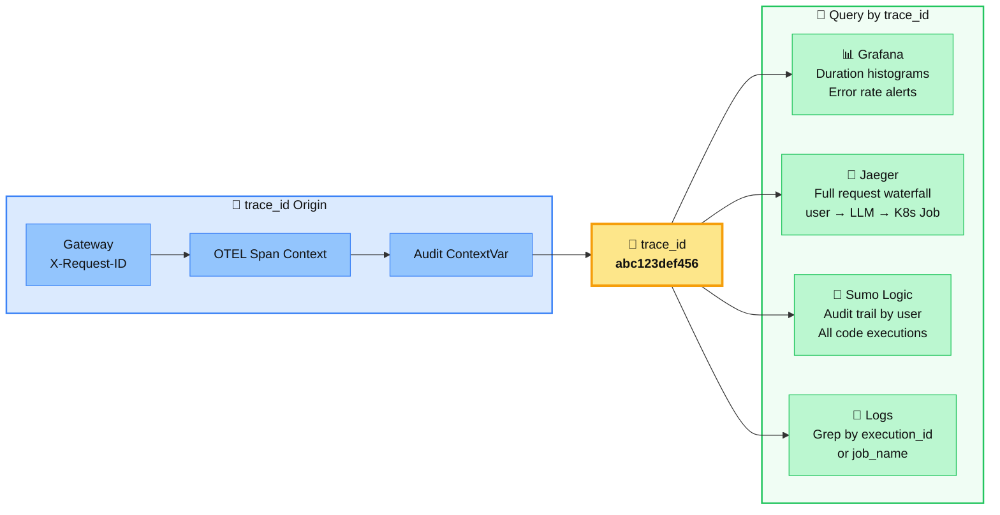
```mermaid
flowchart LR
    subgraph origin["🔑 trace_id Origin"]
        style origin fill:#dbeafe,stroke:#3b82f6,stroke-width:2px,color:#111
        O1["Gateway<br/>X-Request-ID"]
        O2["OTEL Span Context"]
        O3["Audit ContextVar"]
        O1 --> O2 --> O3
    end

    TID["🔗 trace_id<br/><b>abc123def456</b>"]

    subgraph query["🔎 Query by trace_id"]
        style query fill:#f0fdf4,stroke:#22c55e,stroke-width:2px,color:#111
        Q1["📊 Grafana<br/>Duration histograms<br/>Error rate alerts"]
        Q2["🔎 Jaeger<br/>Full request waterfall<br/>user → LLM → K8s Job"]
        Q3["📑 Sumo Logic<br/>Audit trail by user<br/>All code executions"]
        Q4["📝 Logs<br/>Grep by execution_id<br/>or job_name"]
    end

    O3 --> TID
    TID --> Q1
    TID --> Q2
    TID --> Q3
    TID --> Q4

    style O1 fill:#93c5fd,stroke:#3b82f6,color:#111
    style O2 fill:#93c5fd,stroke:#3b82f6,color:#111
    style O3 fill:#93c5fd,stroke:#3b82f6,color:#111
    style TID fill:#fde68a,stroke:#f59e0b,color:#111,stroke-width:3px
    style Q1 fill:#bbf7d0,stroke:#22c55e,color:#111
    style Q2 fill:#bbf7d0,stroke:#22c55e,color:#111
    style Q3 fill:#bbf7d0,stroke:#22c55e,color:#111
    style Q4 fill:#bbf7d0,stroke:#22c55e,color:#111
```


### Audit Event Example

```json
{
  "event": "platform.audit",
  "audit_event_type": "code_execution",
  "user": "user@example.com",
  "org": "my-org",
  "trace_id": "abc123def456...",
  "timestamp": "2026-07-13T14:30:00.000Z",
  "details": {
    "agent": "orchestrator",
    "language": "python",
    "status": "success",
    "exit_code": 0,
    "latency_ms": 4523.7,
    "job_name": "code-exec-abc12345",
    "namespace": "ap-my-org-my-agent",
    "image": "python:3.12-slim",
    "timeout_seconds": 60,
    "stdout_bytes": 1234,
    "stderr_bytes": 0,
    "code_hash": "sha256:e3b0c44298fc..."
  },
  "logger": "platform.audit",
  "level": "info",
  "service": "my-agent"
}
```

**Security**: `code_hash` is a SHA256 digest of the submitted code — enables tracking which code ran without logging potentially sensitive source. The actual code content is never written to audit logs. Existing `_scrub_details()` in `emitter.py` redacts any sensitive keys automatically.

---

## 9. Error Handling

### Error Flow

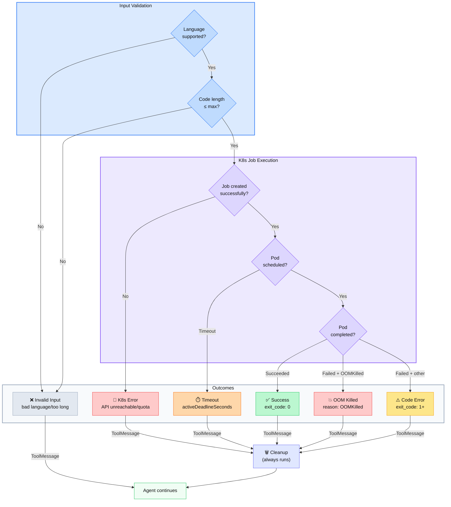
```mermaid
flowchart TD
    subgraph input["Input Validation"]
        style input fill:#dbeafe,stroke:#3b82f6,stroke-width:2px,color:#111
        V1{"Language<br/>supported?"}
        V2{"Code length<br/>≤ max?"}
    end

    subgraph execution["K8s Job Execution"]
        style execution fill:#ede9fe,stroke:#8b5cf6,stroke-width:2px,color:#111
        E1{"Job created<br/>successfully?"}
        E2{"Pod<br/>scheduled?"}
        E3{"Pod<br/>completed?"}
    end

    subgraph outcomes["Outcomes"]
        style outcomes fill:#f8fafc,stroke:#94a3b8,stroke-width:2px,color:#111
        OK["✅ Success<br/>exit_code: 0"]
        FAIL["⚠️ Code Error<br/>exit_code: 1+"]
        TIMEOUT["⏱️ Timeout<br/>activeDeadlineSeconds"]
        OOM["💥 OOM Killed<br/>reason: OOMKilled"]
        K8SERR["🚫 K8s Error<br/>API unreachable/quota"]
        INVALID["❌ Invalid Input<br/>bad language/too long"]
    end

    V1 -->|No| INVALID
    V1 -->|Yes| V2
    V2 -->|No| INVALID
    V2 -->|Yes| E1
    E1 -->|No| K8SERR
    E1 -->|Yes| E2
    E2 -->|Timeout| TIMEOUT
    E2 -->|Yes| E3
    E3 -->|Succeeded| OK
    E3 -->|Failed + OOMKilled| OOM
    E3 -->|Failed + other| FAIL

    OK -->|"ToolMessage"| CLEANUP["🗑️ Cleanup<br/>(always runs)"]
    FAIL -->|"ToolMessage"| CLEANUP
    TIMEOUT -->|"ToolMessage"| CLEANUP
    OOM -->|"ToolMessage"| CLEANUP
    K8SERR -->|"ToolMessage"| CLEANUP
    INVALID -->|"ToolMessage"| DONE["Agent continues"]
    CLEANUP --> DONE

    style V1 fill:#bfdbfe,stroke:#3b82f6,color:#111
    style V2 fill:#bfdbfe,stroke:#3b82f6,color:#111
    style E1 fill:#ddd6fe,stroke:#8b5cf6,color:#111
    style E2 fill:#ddd6fe,stroke:#8b5cf6,color:#111
    style E3 fill:#ddd6fe,stroke:#8b5cf6,color:#111
    style OK fill:#bbf7d0,stroke:#22c55e,color:#111
    style FAIL fill:#fde68a,stroke:#f59e0b,color:#111
    style TIMEOUT fill:#fed7aa,stroke:#f97316,color:#111
    style OOM fill:#fecaca,stroke:#ef4444,color:#111
    style K8SERR fill:#fecaca,stroke:#ef4444,color:#111
    style INVALID fill:#e2e8f0,stroke:#94a3b8,color:#111
    style CLEANUP fill:#e0e7ff,stroke:#6366f1,color:#111
    style DONE fill:#f0fdf4,stroke:#22c55e,color:#111
```


### Error Taxonomy & Agent Responses


| Scenario             | Detection                                                    | ToolMessage Content                                                                   | Metric                             | Audit Status            |
| -------------------- | ------------------------------------------------------------ | ------------------------------------------------------------------------------------- | ---------------------------------- | ----------------------- |
| Code exits 0         | Pod `Succeeded`                                              | `stdout: ...\nstderr: ...\nexit_code: 0`                                              | `status=success`                   | `success`               |
| Code exits non-zero  | Pod `Failed`, exit_code > 0                                  | `stdout: ...\nstderr: ...\nexit_code: 1`                                              | `status=failed`                    | `failed`                |
| Timeout              | `activeDeadlineSeconds` exceeded OR `asyncio.wait_for` fires | `"Execution timed out after 60s. The code did not complete within the allowed time."` | `error_type=timeout`               | `timeout`               |
| OOM killed           | Container `reason: OOMKilled`                                | `"Execution killed: out of memory (limit: 256Mi). Reduce data size or memory usage."` | `error_type=oom_killed`            | `oom_killed`            |
| Job creation fails   | K8s API 4xx/5xx (quota, image pull)                          | `"Code execution unavailable: {sanitized_reason}"`                                    | `error_type=job_creation_failed`   | `job_creation_failed`   |
| Log collection fails | Pod logs API error                                           | Partial result with `"[warning: logs partially collected]"`                           | `error_type=log_collection_failed` | `log_collection_failed` |
| K8s API unreachable  | Connection error                                             | `"Code execution service temporarily unavailable"`                                    | `error_type=k8s_unavailable`       | `k8s_unavailable`       |
| Code too long        | `len(code) > max_code_length`                                | `"Code exceeds maximum length of 50000 characters"`                                   | Rejected pre-Job                   | —                       |
| Invalid language     | Language not in `images` config                              | `"Unsupported language: {lang}. Supported: python, shell, node"`                      | Rejected pre-Job                   | —                       |
| Output too large     | `len(output) > max_output_bytes`                             | Truncated with `"\n[truncated at 1MB]"` suffix                                        | `status=truncated`                 | `truncated`             |


### Design Principles

1. **Never raise from `awrap_tool_call`** — always return a `ToolMessage` so the agent can recover, retry with different code, or explain the failure to the user
2. **Cleanup in `finally`** — Job deletion runs regardless of outcome (success, failure, timeout, cancellation, OOM)
3. **Client-side timeout as safety net** — `asyncio.wait_for` wraps the entire execution with `max_timeout_seconds + 30s` buffer beyond the K8s `activeDeadlineSeconds`, catching cases where K8s timeout controller is slow
4. **Sanitize K8s errors** — never expose internal K8s API details in ToolMessage; log full details at `error` level
5. **Truncate, don't fail** — large outputs are truncated with a clear marker, not rejected

---

## 10. Configuration

### `agent.yaml` Addition

```yaml
middleware:
  # ... existing middleware config ...

  code_execution:
    enabled: false                    # Opt-in per deployment
    max_timeout_seconds: 60           # Hard limit per execution
    max_code_length: 50000            # Max source code chars
    max_output_bytes: 1048576         # 1MB max stdout+stderr

    images:
      python: "python:3.12-slim"
      shell: "bash:5"
      node: "node:22-slim"

    resource_requests:
      cpu: "100m"
      memory: "128Mi"
    resource_limits:
      cpu: "500m"
      memory: "256Mi"

    tmp_size_limit: "64Mi"            # /tmp emptyDir size cap
    job_ttl_after_finished: 30        # K8s auto-cleanup (seconds)
    pod_poll_interval_seconds: 1.0    # Status polling interval
    pod_poll_timeout_seconds: 120.0   # Max wait for pod scheduling
```

### Required RBAC

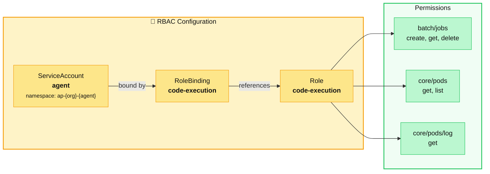
```mermaid
flowchart LR
    subgraph rbac["🔐 RBAC Configuration"]
        style rbac fill:#fef3c7,stroke:#f59e0b,stroke-width:2px,color:#111
        SA["ServiceAccount<br/><b>agent</b><br/><small>namespace: ap-{org}-{agent}</small>"]
        RB["RoleBinding<br/><b>code-execution</b>"]
        ROLE["Role<br/><b>code-execution</b>"]

        SA -->|bound by| RB
        RB -->|references| ROLE
    end

    subgraph perms["Permissions"]
        style perms fill:#f0fdf4,stroke:#22c55e,stroke-width:2px,color:#111
        P1["batch/jobs<br/>create, get, delete"]
        P2["core/pods<br/>get, list"]
        P3["core/pods/log<br/>get"]
    end

    ROLE --> P1
    ROLE --> P2
    ROLE --> P3

    style SA fill:#fde68a,stroke:#f59e0b,color:#111
    style RB fill:#fde68a,stroke:#f59e0b,color:#111
    style ROLE fill:#fde68a,stroke:#f59e0b,color:#111
    style P1 fill:#bbf7d0,stroke:#22c55e,color:#111
    style P2 fill:#bbf7d0,stroke:#22c55e,color:#111
    style P3 fill:#bbf7d0,stroke:#22c55e,color:#111
```


This Role can be added to the agent-engine's namespace provisioning (in `prerequisites.py`) when code execution is enabled.

### Python Dependency

```toml
# pyproject.toml
[project.optional-dependencies]
code-execution = ["kubernetes>=28.0,<36.0"]
```

The `kubernetes` client is an optional dependency — only needed when `code_execution.enabled: true`.

---

## 11. Testing Strategy

### Test Matrix

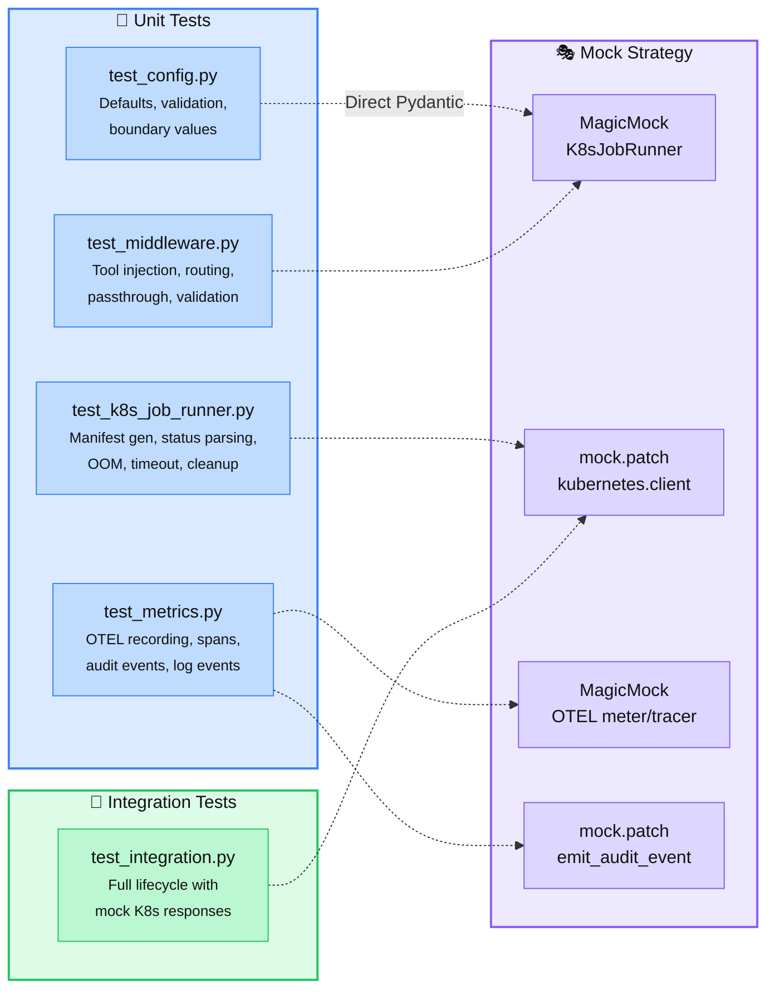
```mermaid
flowchart LR
    subgraph unit["🧪 Unit Tests"]
        style unit fill:#dbeafe,stroke:#3b82f6,stroke-width:2px,color:#111
        UT1["test_config.py<br/><small>Defaults, validation,<br/>boundary values</small>"]
        UT2["test_middleware.py<br/><small>Tool injection, routing,<br/>passthrough, validation</small>"]
        UT3["test_k8s_job_runner.py<br/><small>Manifest gen, status parsing,<br/>OOM, timeout, cleanup</small>"]
        UT4["test_metrics.py<br/><small>OTEL recording, spans,<br/>audit events, log events</small>"]
    end

    subgraph integration["🔗 Integration Tests"]
        style integration fill:#dcfce7,stroke:#22c55e,stroke-width:2px,color:#111
        IT1["test_integration.py<br/><small>Full lifecycle with<br/>mock K8s responses</small>"]
    end

    subgraph mocks["🎭 Mock Strategy"]
        style mocks fill:#ede9fe,stroke:#8b5cf6,stroke-width:2px,color:#111
        MK1["MagicMock<br/>K8sJobRunner"]
        MK2["mock.patch<br/>kubernetes.client"]
        MK3["MagicMock<br/>OTEL meter/tracer"]
        MK4["mock.patch<br/>emit_audit_event"]
    end

    UT1 -.->|"Direct Pydantic"| MK1
    UT2 -.-> MK1
    UT3 -.-> MK2
    UT4 -.-> MK3
    UT4 -.-> MK4
    IT1 -.-> MK2

    style UT1 fill:#bfdbfe,stroke:#3b82f6,color:#111
    style UT2 fill:#bfdbfe,stroke:#3b82f6,color:#111
    style UT3 fill:#bfdbfe,stroke:#3b82f6,color:#111
    style UT4 fill:#bfdbfe,stroke:#3b82f6,color:#111
    style IT1 fill:#bbf7d0,stroke:#22c55e,color:#111
    style MK1 fill:#ddd6fe,stroke:#8b5cf6,color:#111
    style MK2 fill:#ddd6fe,stroke:#8b5cf6,color:#111
    style MK3 fill:#ddd6fe,stroke:#8b5cf6,color:#111
    style MK4 fill:#ddd6fe,stroke:#8b5cf6,color:#111
```


### Parametrized Test Cases

```python
@pytest.mark.parametrize("language,image,entrypoint", [
    ("python", "python:3.12-slim", ["python", "-c"]),
    ("shell", "bash:5", ["bash", "-c"]),
    ("node", "node:22-slim", ["node", "-e"]),
])
def test_job_manifest_language_mapping(language, image, entrypoint): ...

@pytest.mark.parametrize("scenario,pod_status,container_reason,expected_status", [
    ("success", "Succeeded", None, "success"),
    ("code_error", "Failed", "Error", "failed"),
    ("timeout", "Failed", "DeadlineExceeded", "timeout"),
    ("oom", "Failed", "OOMKilled", "oom_killed"),
])
def test_execution_result_status(scenario, pod_status, container_reason, expected_status): ...
```

### Test Patterns (Following Existing Conventions)

- `pytest.mark.asyncio` (auto mode from `pyproject.toml`)
- `pytest.mark.unit` / `pytest.mark.integration`
- `unittest.mock.patch` for K8s client and OTEL singletons
- `MagicMock` / `AsyncMock` for service stubs
- Fixtures in `conftest.py` for common setup

---

## 12. Alternatives Considered

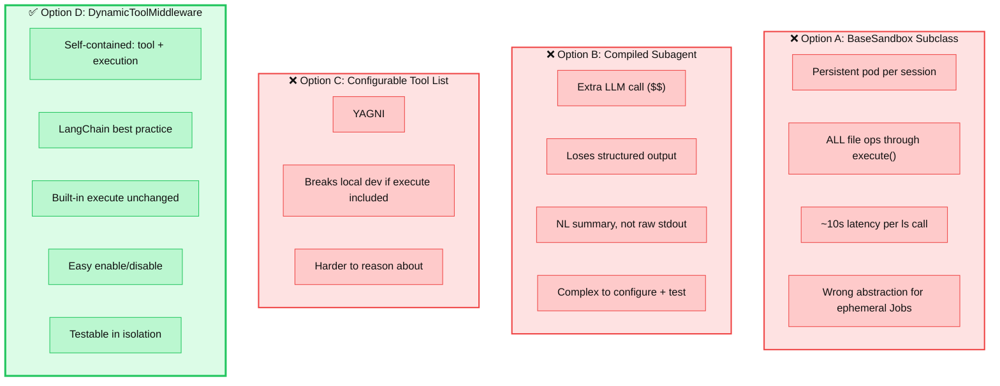
```mermaid
flowchart TB
    subgraph optA["❌ Option A: BaseSandbox Subclass"]
        style optA fill:#fee2e2,stroke:#ef4444,stroke-width:2px,color:#111
        A1["Persistent pod per session"]
        A2["ALL file ops through execute()"]
        A3["~10s latency per ls call"]
        A4["Wrong abstraction for ephemeral Jobs"]
    end

    subgraph optB["❌ Option B: Compiled Subagent"]
        style optB fill:#fee2e2,stroke:#ef4444,stroke-width:2px,color:#111
        B1["Extra LLM call ($$)"]
        B2["Loses structured output"]
        B3["NL summary, not raw stdout"]
        B4["Complex to configure + test"]
    end

    subgraph optC["❌ Option C: Configurable Tool List"]
        style optC fill:#fee2e2,stroke:#ef4444,stroke-width:2px,color:#111
        C1["YAGNI"]
        C2["Breaks local dev if execute included"]
        C3["Harder to reason about"]
    end

    subgraph optD["✅ Option D: DynamicToolMiddleware"]
        style optD fill:#dcfce7,stroke:#22c55e,stroke-width:3px,color:#111
        D1["Self-contained: tool + execution"]
        D2["LangChain best practice"]
        D3["Built-in execute unchanged"]
        D4["Easy enable/disable"]
        D5["Testable in isolation"]
    end

    style A1 fill:#fecaca,stroke:#ef4444,color:#111
    style A2 fill:#fecaca,stroke:#ef4444,color:#111
    style A3 fill:#fecaca,stroke:#ef4444,color:#111
    style A4 fill:#fecaca,stroke:#ef4444,color:#111
    style B1 fill:#fecaca,stroke:#ef4444,color:#111
    style B2 fill:#fecaca,stroke:#ef4444,color:#111
    style B3 fill:#fecaca,stroke:#ef4444,color:#111
    style B4 fill:#fecaca,stroke:#ef4444,color:#111
    style C1 fill:#fecaca,stroke:#ef4444,color:#111
    style C2 fill:#fecaca,stroke:#ef4444,color:#111
    style C3 fill:#fecaca,stroke:#ef4444,color:#111
    style D1 fill:#bbf7d0,stroke:#22c55e,color:#111
    style D2 fill:#bbf7d0,stroke:#22c55e,color:#111
    style D3 fill:#bbf7d0,stroke:#22c55e,color:#111
    style D4 fill:#bbf7d0,stroke:#22c55e,color:#111
    style D5 fill:#bbf7d0,stroke:#22c55e,color:#111
```


---

## 13. Implemented Capabilities and Future Roadmap

Sections 13.1–13.6 document the design for capabilities that are now **implemented** (Phase 2, commit `904908a`). Each section retains the architectural detail for reference. Section 13.7 lists what remains for future work.

### 13.1 File Input/Output — IMPLEMENTED — Passing Files To/From Execution Pods

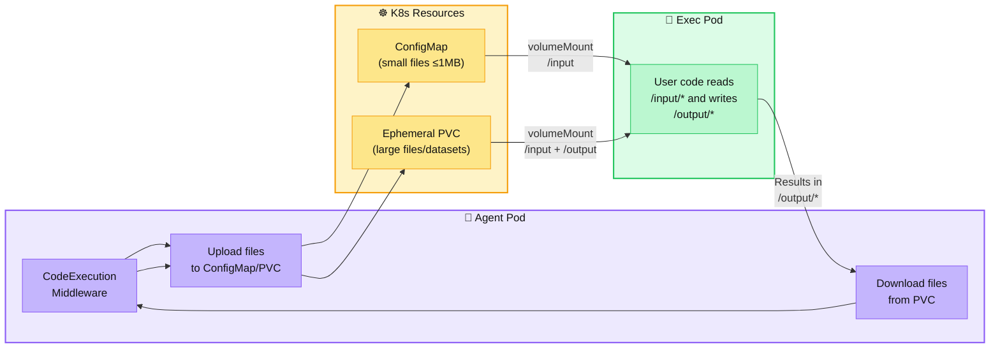
```mermaid
flowchart LR
    subgraph agent["🤖 Agent Pod"]
        style agent fill:#ede9fe,stroke:#8b5cf6,stroke-width:2px,color:#111
        MW["CodeExecution<br/>Middleware"]
        UPLOAD["Upload files<br/>to ConfigMap/PVC"]
        DOWNLOAD["Download files<br/>from PVC"]
    end

    subgraph k8s["☸️ K8s Resources"]
        style k8s fill:#fef3c7,stroke:#f59e0b,stroke-width:2px,color:#111
        CM["ConfigMap<br/>(small files ≤1MB)"]
        PVC["Ephemeral PVC<br/>(large files/datasets)"]
    end

    subgraph job["🐳 Exec Pod"]
        style job fill:#dcfce7,stroke:#22c55e,stroke-width:2px,color:#111
        CODE["User code reads<br/>/input/* and writes<br/>/output/*"]
    end

    MW --> UPLOAD --> CM
    MW --> UPLOAD --> PVC
    CM -->|"volumeMount<br/>/input"| CODE
    PVC -->|"volumeMount<br/>/input + /output"| CODE
    CODE -->|"Results in<br/>/output/*"| DOWNLOAD
    DOWNLOAD --> MW

    style MW fill:#c4b5fd,stroke:#8b5cf6,color:#111
    style UPLOAD fill:#c4b5fd,stroke:#8b5cf6,color:#111
    style DOWNLOAD fill:#c4b5fd,stroke:#8b5cf6,color:#111
    style CM fill:#fde68a,stroke:#f59e0b,color:#111
    style PVC fill:#fde68a,stroke:#f59e0b,color:#111
    style CODE fill:#bbf7d0,stroke:#22c55e,color:#111
```


**Design approach:**

- **Small files (≤1MB)**: Use K8s ConfigMaps. The middleware creates a ConfigMap with file contents, mounts it at `/input/` in the Job pod. ConfigMap is deleted with the Job.
- **Large files/datasets**: Use ephemeral PVCs (`ReadWriteOnce`). The middleware writes data to the PVC via a transient init pod, mounts it in the executor pod at `/input/` (read) and `/output/` (write). After execution, the middleware reads output files from the PVC via another transient pod, then deletes the PVC.
- **Tool schema change**: `execute_code` gains optional `input_files: dict[str, str]` (filename → content) and returns `output_files: dict[str, str]` alongside stdout/stderr.
- **Size limits**: ConfigMap path for files < 1MB total; PVC path for larger payloads. Configurable threshold in `CodeExecutionConfig`.
- **Security**: File contents are ephemeral — ConfigMaps and PVCs are deleted in the `finally` block alongside the Job.

---

### 13.2 Network Access Control — IMPLEMENTED

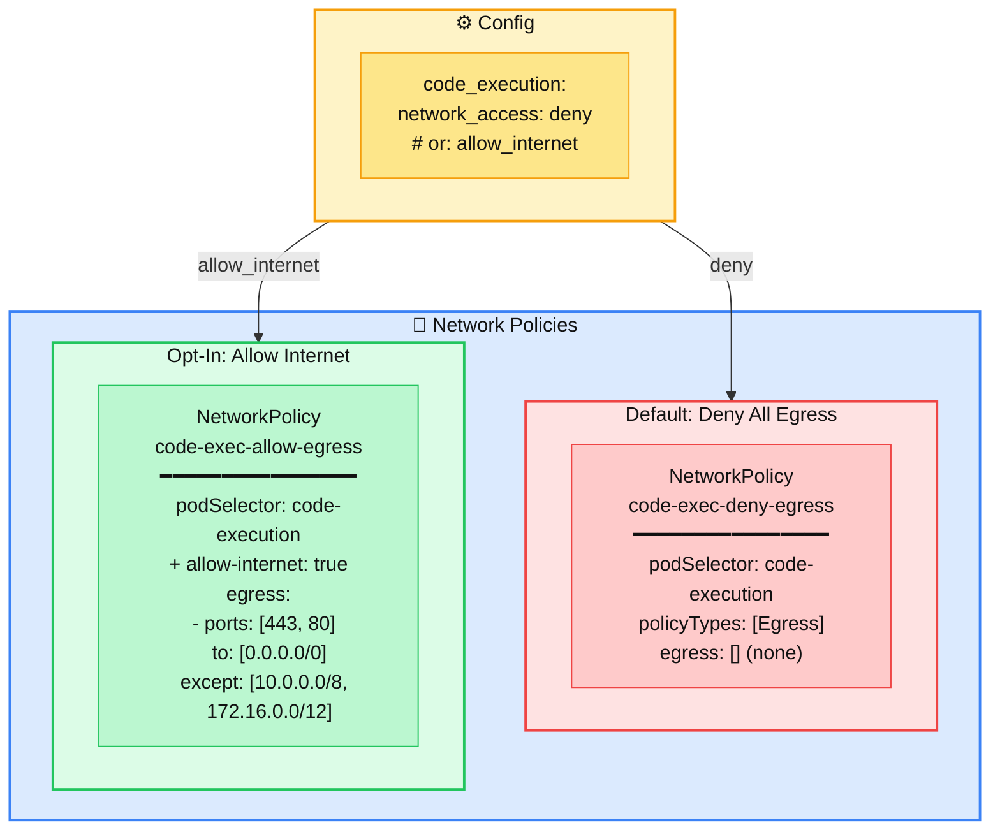
```mermaid
flowchart TD
    subgraph policies["🔐 Network Policies"]
        style policies fill:#dbeafe,stroke:#3b82f6,stroke-width:2px,color:#111

        subgraph deny["Default: Deny All Egress"]
            style deny fill:#fee2e2,stroke:#ef4444,stroke-width:2px,color:#111
            NP1["NetworkPolicy<br/>code-exec-deny-egress<br/>━━━━━━━━━━━━━━━━<br/>podSelector: code-execution<br/>policyTypes: [Egress]<br/>egress: [] (none)"]
        end

        subgraph allow["Opt-In: Allow Internet"]
            style allow fill:#dcfce7,stroke:#22c55e,stroke-width:2px,color:#111
            NP2["NetworkPolicy<br/>code-exec-allow-egress<br/>━━━━━━━━━━━━━━━━<br/>podSelector: code-execution<br/>+ allow-internet: true<br/>egress:<br/>  - ports: [443, 80]<br/>    to: [0.0.0.0/0]<br/>  except: [10.0.0.0/8,<br/>    172.16.0.0/12]"]
        end
    end

    subgraph config["⚙️ Config"]
        style config fill:#fef3c7,stroke:#f59e0b,stroke-width:2px,color:#111
        CFG["code_execution:<br/>  network_access: deny<br/>  # or: allow_internet"]
    end

    config -->|"deny"| deny
    config -->|"allow_internet"| allow

    style NP1 fill:#fecaca,stroke:#ef4444,color:#111
    style NP2 fill:#bbf7d0,stroke:#22c55e,color:#111
    style CFG fill:#fde68a,stroke:#f59e0b,color:#111
```


**Design approach:**

- **Default: deny all egress.** Execution pods cannot reach the internet or internal services. A namespace-scoped `NetworkPolicy` with `podSelector: app.kubernetes.io/name: code-execution` and empty `egress: []` blocks all outbound traffic.
- **Opt-in: allow internet.** A second `NetworkPolicy` with an additional label (`allow-internet: "true"`) permits egress to ports 443/80 while blocking internal RFC1918 ranges (`10.0.0.0/8`, `172.16.0.0/12`, `192.168.0.0/16`). The middleware adds the label to the Job pod when `network_access: allow_internet` is configured.
- **Per-execution override**: The `execute_code` tool gains an optional `network: bool = False` param. When `True` and config allows it, the pod gets the `allow-internet` label.
- **Config addition**: `code_execution.network_access: deny | allow_internet | per_execution`
- **RBAC**: No additional RBAC needed — NetworkPolicies are namespace-scoped and pre-provisioned.

---

### 13.3 Custom Package Installation — IMPLEMENTED (config), FUTURE (CI/CD pipeline)

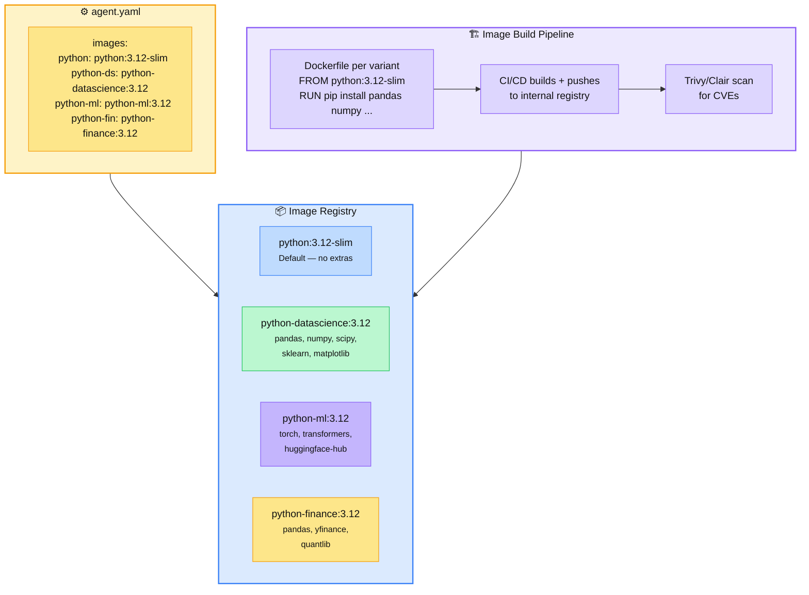
```mermaid
flowchart TB
    subgraph registry["📦 Image Registry"]
        style registry fill:#dbeafe,stroke:#3b82f6,stroke-width:2px,color:#111
        BASE["python:3.12-slim<br/><small>Default — no extras</small>"]
        DS["python-datascience:3.12<br/><small>pandas, numpy, scipy,<br/>sklearn, matplotlib</small>"]
        ML["python-ml:3.12<br/><small>torch, transformers,<br/>huggingface-hub</small>"]
        FIN["python-finance:3.12<br/><small>pandas, yfinance,<br/>quantlib</small>"]
    end

    subgraph config["⚙️ agent.yaml"]
        style config fill:#fef3c7,stroke:#f59e0b,stroke-width:2px,color:#111
        CFG["images:<br/>  python: python:3.12-slim<br/>  python-ds: python-datascience:3.12<br/>  python-ml: python-ml:3.12<br/>  python-fin: python-finance:3.12"]
    end

    subgraph build["🏗️ Image Build Pipeline"]
        style build fill:#ede9fe,stroke:#8b5cf6,stroke-width:2px,color:#111
        DF["Dockerfile per variant<br/>FROM python:3.12-slim<br/>RUN pip install pandas numpy ..."]
        CI["CI/CD builds + pushes<br/>to internal registry"]
        SCAN["Trivy/Clair scan<br/>for CVEs"]
        DF --> CI --> SCAN
    end

    config --> registry
    build --> registry

    style BASE fill:#bfdbfe,stroke:#3b82f6,color:#111
    style DS fill:#bbf7d0,stroke:#22c55e,color:#111
    style ML fill:#c4b5fd,stroke:#8b5cf6,color:#111
    style FIN fill:#fde68a,stroke:#f59e0b,color:#111
    style CFG fill:#fde68a,stroke:#f59e0b,color:#111
    style DF fill:#ddd6fe,stroke:#8b5cf6,color:#111
    style CI fill:#ddd6fe,stroke:#8b5cf6,color:#111
    style SCAN fill:#ddd6fe,stroke:#8b5cf6,color:#111
```


**Design approach:**

- **Pre-built images** for common domains: `python-datascience`, `python-ml`, `python-finance`, each with curated library sets. Dockerfiles maintained in the platform repo, built by CI/CD, pushed to the internal registry (`images.paas.redhat.com/...`).
- **Config-driven**: Add image variants to `code_execution.images` in `agent.yaml`. The `language` field in `execute_code` becomes a variant selector: `python` (base), `python-ds` (data science), etc.
- **Security**: All images scanned for CVEs via Trivy/Clair in the CI pipeline. Only images from the internal registry are allowed (enforced by OpenShift image policy). No runtime `pip install` — read-only filesystem prevents it.
- **Per-org customization**: Orgs can register custom images via the registry component's agent frontmatter `runtime.images` field. The agent-engine propagates these to the agent pod's config.
- **Version pinning**: Each image variant is tagged with semver + build SHA. The `images` config supports explicit tags: `python-datascience:1.2.3-abc123`.

### Image Configuration Flow — Who Controls What

The image configuration flows through 3 levels, from platform defaults to per-agent overrides:

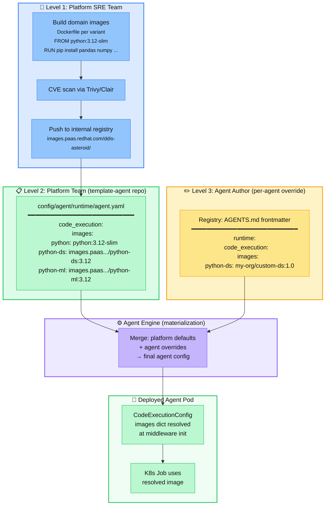
```mermaid
flowchart TB
    subgraph sre["🔧 Level 1: Platform SRE Team"]
        style sre fill:#dbeafe,stroke:#3b82f6,stroke-width:2px,color:#111
        BUILD["Build domain images<br/><small>Dockerfile per variant<br/>FROM python:3.12-slim<br/>RUN pip install pandas numpy ...</small>"]
        SCAN["CVE scan via Trivy/Clair"]
        PUSH["Push to internal registry<br/><small>images.paas.redhat.com/ddis-asteroid/</small>"]
        BUILD --> SCAN --> PUSH
    end

    subgraph platform["📋 Level 2: Platform Team (template-agent repo)"]
        style platform fill:#dcfce7,stroke:#22c55e,stroke-width:2px,color:#111
        YAML["config/agent/runtime/agent.yaml<br/>━━━━━━━━━━━━━━━━━━━━━━━━━━━━<br/>code_execution:<br/>  images:<br/>    python: python:3.12-slim<br/>    python-ds: images.paas.../python-ds:3.12<br/>    python-ml: images.paas.../python-ml:3.12"]
    end

    subgraph author["✏️ Level 3: Agent Author (per-agent override)"]
        style author fill:#fef3c7,stroke:#f59e0b,stroke-width:2px,color:#111
        AGENTS["Registry: AGENTS.md frontmatter<br/>━━━━━━━━━━━━━━━━━━━━━━━━━━━━<br/>runtime:<br/>  code_execution:<br/>    images:<br/>      python-ds: my-org/custom-ds:1.0"]
    end

    subgraph engine["⚙️ Agent Engine (materialization)"]
        style engine fill:#ede9fe,stroke:#8b5cf6,stroke-width:2px,color:#111
        MERGE["Merge: platform defaults<br/>+ agent overrides<br/>→ final agent config"]
    end

    subgraph pod["🤖 Deployed Agent Pod"]
        style pod fill:#f0fdf4,stroke:#22c55e,stroke-width:2px,color:#111
        CONFIG["CodeExecutionConfig<br/>images dict resolved<br/>at middleware init"]
        JOB["K8s Job uses<br/>resolved image"]
    end

    PUSH --> YAML
    YAML --> MERGE
    AGENTS --> MERGE
    MERGE --> CONFIG
    CONFIG --> JOB

    style BUILD fill:#93c5fd,stroke:#3b82f6,color:#111
    style SCAN fill:#93c5fd,stroke:#3b82f6,color:#111
    style PUSH fill:#93c5fd,stroke:#3b82f6,color:#111
    style YAML fill:#bbf7d0,stroke:#22c55e,color:#111
    style AGENTS fill:#fde68a,stroke:#f59e0b,color:#111
    style MERGE fill:#c4b5fd,stroke:#8b5cf6,color:#111
    style CONFIG fill:#bbf7d0,stroke:#22c55e,color:#111
    style JOB fill:#bbf7d0,stroke:#22c55e,color:#111
```


**Configuration levels (highest wins):**


| Level                    | Who           | Where                                                                 | When                                              |
| ------------------------ | ------------- | --------------------------------------------------------------------- | ------------------------------------------------- |
| **Platform default**     | Platform team | `config/agent/runtime/agent.yaml` in template-agent repo              | Committed to repo, deployed with every agent      |
| **Per-agent override**   | Agent author  | `AGENTS.md` frontmatter in Registry (`runtime.code_execution.images`) | Agent-engine materializes overrides during deploy |
| **Environment variable** | Ops/SRE       | OpenShift ConfigMap → env vars on agent pod                           | Runtime override without config change            |


**How it flows in production:**

1. **SRE team** maintains Dockerfiles for domain images in the platform CI repo. Each image is built, scanned (Trivy/Clair), and pushed to `images.paas.redhat.com/ddis-asteroid/`
2. **Platform team** updates `agent.yaml` with the image URLs as defaults — all agents get these unless overridden
3. **Agent author** can override specific images in their `AGENTS.md` frontmatter via the Registry. The agent-engine's `resolve_middleware()` merges these overrides with platform defaults during materialization
4. **Agent-engine** deploys the agent pod with the merged config. The `CodeExecutionConfig.images` dict contains the final resolved image URLs
5. **CodeExecutionMiddleware** reads `config.images[language]` at Job creation time to select the container image

**Local development:** Use `python:3.12-slim` (base) for all variants. Build and `kind load` custom images only when testing domain-specific libraries.

**OpenShift:** Images must be from the internal registry (enforced by cluster image policy). The `readOnlyRootFilesystem: true` constraint prevents runtime `pip install` — all libraries must be pre-installed in the image.

---

### 13.4 Execution Queuing — IMPLEMENTED

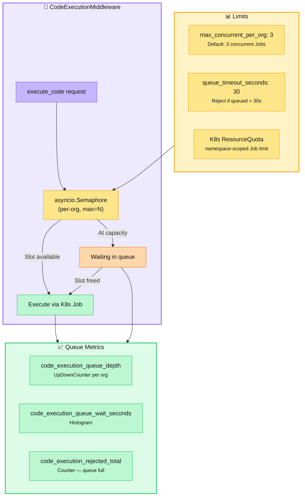
```mermaid
flowchart TD
    subgraph middleware["🔧 CodeExecutionMiddleware"]
        style middleware fill:#ede9fe,stroke:#8b5cf6,stroke-width:2px,color:#111
        REQ["execute_code request"]
        SEM["asyncio.Semaphore<br/>(per-org, max=N)"]
        QUEUE["Waiting in queue"]
        EXEC["Execute via K8s Job"]

        REQ --> SEM
        SEM -->|"Slot available"| EXEC
        SEM -->|"At capacity"| QUEUE
        QUEUE -->|"Slot freed"| EXEC
    end

    subgraph limits["📊 Limits"]
        style limits fill:#fef3c7,stroke:#f59e0b,stroke-width:2px,color:#111
        L1["max_concurrent_per_org: 3<br/><small>Default: 3 concurrent Jobs</small>"]
        L2["queue_timeout_seconds: 30<br/><small>Reject if queued > 30s</small>"]
        L3["K8s ResourceQuota<br/><small>namespace-scoped Job limit</small>"]
    end

    subgraph metrics["📈 Queue Metrics"]
        style metrics fill:#dcfce7,stroke:#22c55e,stroke-width:2px,color:#111
        M1["code_execution_queue_depth<br/><small>UpDownCounter per org</small>"]
        M2["code_execution_queue_wait_seconds<br/><small>Histogram</small>"]
        M3["code_execution_rejected_total<br/><small>Counter — queue full</small>"]
    end

    limits --> SEM
    EXEC --> metrics
    QUEUE --> metrics

    style REQ fill:#c4b5fd,stroke:#8b5cf6,color:#111
    style SEM fill:#fde68a,stroke:#f59e0b,color:#111
    style QUEUE fill:#fed7aa,stroke:#f97316,color:#111
    style EXEC fill:#bbf7d0,stroke:#22c55e,color:#111
    style L1 fill:#fde68a,stroke:#f59e0b,color:#111
    style L2 fill:#fde68a,stroke:#f59e0b,color:#111
    style L3 fill:#fde68a,stroke:#f59e0b,color:#111
    style M1 fill:#bbf7d0,stroke:#22c55e,color:#111
    style M2 fill:#bbf7d0,stroke:#22c55e,color:#111
    style M3 fill:#bbf7d0,stroke:#22c55e,color:#111
```


**Design approach:**

- **Client-side**: `asyncio.Semaphore` per org in the middleware, defaulting to `max_concurrent_per_org: 3`. If all slots are occupied, requests queue with a `queue_timeout_seconds: 30` — after which the agent receives `"Code execution queue full, try again later"`.
- **Server-side**: K8s `ResourceQuota` on the agent namespace limits total Jobs: `count/jobs.batch: 5`. This is a hard backstop independent of the client-side semaphore.
- **Queue metrics**: `code_execution_queue_depth` (how many are waiting), `code_execution_queue_wait_seconds` (how long they waited), `code_execution_rejected_total` (how many were dropped).
- **Config**: `code_execution.max_concurrent_per_org: 3` and `code_execution.queue_timeout_seconds: 30`.
- **Fairness**: Per-org semaphores prevent one org from monopolizing cluster resources. Combined with K8s resource limits on each Job, total resource consumption is bounded.

---

### 13.5 Cost Tracking — IMPLEMENTED (OTEL metrics), FUTURE (Postgres persistence)

```mermaid
flowchart LR
    subgraph collection["📊 Data Collection"]
        style collection fill:#dbeafe,stroke:#3b82f6,stroke-width:2px,color:#111
        MW["Middleware records<br/>per-execution:<br/>cpu_seconds, memory_mb_seconds,<br/>duration, org, language"]
        K8S["K8s Metrics Server<br/>actual resource usage<br/>from cAdvisor"]
    end

    subgraph storage["💾 Storage"]
        style storage fill:#fef3c7,stroke:#f59e0b,stroke-width:2px,color:#111
        PG["PostgreSQL<br/>code_execution_usage<br/>━━━━━━━━━━━━━━━━<br/>org, timestamp,<br/>cpu_seconds, mem_mb_s,<br/>executions_count,<br/>language"]
    end

    subgraph reporting["📈 Reporting"]
        style reporting fill:#dcfce7,stroke:#22c55e,stroke-width:2px,color:#111
        API["GET /api/v1/usage<br/>?org=myorg&period=7d"]
        DASH["Grafana Dashboard<br/>Resource usage by org"]
        ALERT["Budget alerts<br/>when org exceeds<br/>monthly threshold"]
    end

    MW --> PG
    K8S --> PG
    PG --> API
    PG --> DASH
    PG --> ALERT

    style MW fill:#93c5fd,stroke:#3b82f6,color:#111
    style K8S fill:#93c5fd,stroke:#3b82f6,color:#111
    style PG fill:#fde68a,stroke:#f59e0b,color:#111
    style API fill:#bbf7d0,stroke:#22c55e,color:#111
    style DASH fill:#bbf7d0,stroke:#22c55e,color:#111
    style ALERT fill:#bbf7d0,stroke:#22c55e,color:#111
```


**Design approach:**

- **Data points per execution**: `cpu_seconds` (from K8s Metrics API or request-based estimate), `memory_mb_seconds` (peak memory × duration), `execution_count`, `language`, `org`, `timestamp`.
- **Collection**: The middleware already records `code_execution_duration_seconds` with org/language labels. For cost tracking, extend to persist aggregated usage to PostgreSQL (the platform's existing database) via a periodic flush (every 5 minutes) or per-execution insert.
- **K8s Metrics API**: Optionally query the Metrics Server (`/apis/metrics.k8s.io/v1beta1/namespaces/{ns}/pods/{pod}`) before cleanup to get actual CPU/memory usage. Falls back to config-based estimates if Metrics API is unavailable.
- **Reporting API**: New endpoint on the agent-engine: `GET /api/v1/usage?org=myorg&period=7d` returns aggregated usage. Powers a Grafana dashboard and budget alerts.
- **Budget alerts**: Configurable per-org monthly thresholds. When `cpu_hours > threshold`, emit a warning audit event and optionally disable code execution for that org until the next billing period.

---

### 13.6 Log Streaming — IMPLEMENTED (callback), FUTURE (SSE to UI)

```mermaid
sequenceDiagram
    autonumber
    participant UI as 🖥️ Browser UI
    participant GW as 🌐 Gateway
    participant AG as 🤖 Agent
    participant MW as 🔧 Middleware
    participant K8S as ☸️ K8s API
    participant POD as 🐳 Exec Pod

    rect rgb(219, 234, 254)
        Note over UI,GW: WebSocket Upgrade
        UI->>GW: WS /api/v1/exec/stream/{execution_id}
        GW->>AG: Proxy WebSocket
    end

    rect rgb(237, 233, 254)
        Note over MW,POD: Streamed Execution
        MW->>K8S: Create Job
        K8S->>POD: Schedule pod

        loop Pod log stream
            MW->>K8S: read_namespaced_pod_log(follow=True)
            K8S-->>MW: Log chunk (stdout line)
            MW-->>AG: Stream chunk via callback
            AG-->>GW: WS frame
            GW-->>UI: WS frame (real-time)
        end

        POD->>POD: Code completes
        K8S-->>MW: Pod Succeeded
    end

    rect rgb(220, 252, 231)
        Note over MW,UI: Final Result
        MW-->>AG: ToolMessage (full output)
        AG-->>GW: SSE response
        GW-->>UI: Final answer
    end
```


**Design approach:**

- **Dual output path**: The middleware streams log chunks in real-time via a callback mechanism AND collects the full output for the `ToolMessage`. The agent/UI gets live feedback while code runs.
- **K8s log streaming**: `CoreV1Api.read_namespaced_pod_log(follow=True, _preload_content=False)` returns a streaming response. The middleware reads chunks and forwards them.
- **Transport**: SSE (Server-Sent Events) through the existing Aegra streaming infrastructure. Each chunk is a `code_execution_output` SSE event with `{execution_id, stream: "stdout"|"stderr", data: "line..."}`.
- **Fallback**: If streaming fails (network interruption, pod crash), the middleware falls back to post-completion log collection (current behavior). The `ToolMessage` always contains the complete output regardless of streaming success.
- **UI integration**: The template-ui listens for `code_execution_output` SSE events and renders them in a live terminal widget during execution. When the `ToolMessage` arrives, the terminal closes and the result is shown inline.
- **Config**: `code_execution.streaming_enabled: true` (default: false). When false, current behavior (post-completion collection) is used.

---

### Roadmap Priority

```mermaid
flowchart LR
    subgraph done["IMPLEMENTED"]
        style done fill:#dcfce7,stroke:#22c55e,stroke-width:2px,color:#111
        D1["Core middleware + K8s Jobs"]
        D2["File I/O via ConfigMap"]
        D3["NetworkPolicy per execution"]
        D4["Per-org execution queuing"]
        D5["Custom image config"]
        D6["Cost tracking via OTEL"]
        D7["Log streaming via callback"]
    end

    subgraph future["NOT YET IMPLEMENTED"]
        style future fill:#fef3c7,stroke:#f59e0b,stroke-width:2px,color:#111
        F1["CI/CD pipeline for<br/>domain images"]
        F2["SSE streaming to UI<br/>middleware callback not<br/>wired to SSE transport"]
        F3["Postgres cost persistence<br/>and reporting API"]
        F4["Per-agent image overrides<br/>via Registry frontmatter"]
        F5["Persistent sandbox mode<br/>BaseSandbox subclass"]
    end

    style D1 fill:#bbf7d0,stroke:#22c55e,color:#111
    style D2 fill:#bbf7d0,stroke:#22c55e,color:#111
    style D3 fill:#bbf7d0,stroke:#22c55e,color:#111
    style D4 fill:#bbf7d0,stroke:#22c55e,color:#111
    style D5 fill:#bbf7d0,stroke:#22c55e,color:#111
    style D6 fill:#bbf7d0,stroke:#22c55e,color:#111
    style D7 fill:#bbf7d0,stroke:#22c55e,color:#111
    style F1 fill:#fde68a,stroke:#f59e0b,color:#111
    style F2 fill:#fde68a,stroke:#f59e0b,color:#111
    style F3 fill:#fde68a,stroke:#f59e0b,color:#111
    style F4 fill:#fde68a,stroke:#f59e0b,color:#111
    style F5 fill:#fde68a,stroke:#f59e0b,color:#111
```


---

## 14. Ephemeral Pod Observability — What Happened, Where to Find It

Ephemeral execution pods are deleted after each run. All evidence of what happened is captured **before deletion** across 4 sources. This section documents where to find every piece of information about a past execution.

### Observability Sources

```mermaid
flowchart TB
    subgraph pod["🐳 Ephemeral Pod (exists ~2-5 seconds)"]
        style pod fill:#fef3c7,stroke:#f59e0b,stroke-width:2px,color:#111,stroke-dasharray: 8 4
        CODE["User code runs"]
        STDOUT["stdout / stderr"]
        EXIT["exit code"]
        CODE --> STDOUT
        CODE --> EXIT
    end

    subgraph capture["📸 Captured BEFORE Deletion"]
        style capture fill:#dcfce7,stroke:#22c55e,stroke-width:2px,color:#111
        LOGS["CoreV1Api<br/>read_namespaced_pod_log()"]
        STATUS["CoreV1Api<br/>read_namespaced_pod()"]
        METRICS["CustomObjectsApi<br/>metrics.k8s.io"]
    end

    subgraph persist["💾 Persisted After Pod Deletion"]
        style persist fill:#dbeafe,stroke:#3b82f6,stroke-width:2px,color:#111
        TM["ToolMessage<br/>(in agent state)"]
        SLOG["Structured Logs<br/>(stderr → Sumo Logic)"]
        K8SEVT["K8s Events<br/>(persist ~1 hour)"]
        AUDIT["Audit Events<br/>(stdout → Sumo Logic)"]
    end

    STDOUT --> LOGS --> TM
    EXIT --> STATUS --> SLOG
    METRICS --> SLOG
    CODE --> K8SEVT
    LOGS --> AUDIT

    style CODE fill:#fde68a,stroke:#f59e0b,color:#111
    style STDOUT fill:#fde68a,stroke:#f59e0b,color:#111
    style EXIT fill:#fde68a,stroke:#f59e0b,color:#111
    style LOGS fill:#bbf7d0,stroke:#22c55e,color:#111
    style STATUS fill:#bbf7d0,stroke:#22c55e,color:#111
    style METRICS fill:#bbf7d0,stroke:#22c55e,color:#111
    style TM fill:#93c5fd,stroke:#3b82f6,color:#111
    style SLOG fill:#93c5fd,stroke:#3b82f6,color:#111
    style K8SEVT fill:#93c5fd,stroke:#3b82f6,color:#111
    style AUDIT fill:#93c5fd,stroke:#3b82f6,color:#111
```


### Where to Find What


| What You Want to Know                      | Source                                      | How to Query                                                                                | Retention                  |
| ------------------------------------------ | ------------------------------------------- | ------------------------------------------------------------------------------------------- | -------------------------- |
| **What code was sent**                     | Agent structured logs                       | `grep code_execution_started <logfile>` → `code_length` field                               | Log retention (Sumo Logic) |
| **What the code returned (stdout/stderr)** | ToolMessage in chat UI + agent thread state | Visible in chat; also in LangGraph checkpointer (Postgres)                                  | Thread lifetime            |
| **Did the pod actually run**               | K8s Events                                  | `kubectl get events -n ap-{org}-{agent}` → `Scheduled, Pulled, Created, Started, Completed` | ~1 hour after deletion     |
| **How long it took**                       | Agent structured logs                       | `grep code_execution_completed <logfile>` → `duration_ms` field                             | Log retention              |
| **Exit code (success/failure)**            | Agent structured logs                       | `grep code_execution_completed <logfile>` → `exit_code`, `status` fields                    | Log retention              |
| **Was it OOM killed / timed out**          | Agent structured logs                       | `grep code_execution_timeout|code_execution_oom <logfile>`                                  | Log retention              |
| **Resource usage (CPU/memory)**            | Agent structured logs                       | `grep code_execution_resource_usage <logfile>` → `cpu_seconds`, `memory_mb_seconds`         | Log retention              |
| **Who ran it (user/org)**                  | Audit events                                | `grep code_execution <audit_log>` → `user`, `org`, `trace_id`                               | Audit retention            |
| **Which code produced which result**       | Audit events                                | `code_hash=sha256:...` — hash of code without logging actual source                         | Audit retention            |
| **Pod lifecycle timing**                   | K8s Events                                  | Timestamps on `Scheduled → Pulled → Created → Started → Completed` events                   | ~1 hour                    |
| **Was a ConfigMap created (file I/O)**     | Agent structured logs                       | `grep configmap_created|configmap_deleted <logfile>`                                        | Log retention              |
| **Was a NetworkPolicy created**            | Agent structured logs                       | `grep network_policy_created|network_policy_deleted <logfile>`                              | Log retention              |
| **Queue wait time**                        | Agent structured logs                       | `grep code_execution_queue_wait <logfile>` → `wait_seconds`                                 | Log retention              |


### Example: Reconstructing a Past Execution

Given a `job_name` like `code-exec-c2024058`, you can reconstruct the full story:

```bash
# 1. What was sent
grep c2024058 /tmp/agent-stderr.log | grep started
# → language=python, code_length=168, timeout=60s, network=false

# 2. What happened
grep c2024058 /tmp/agent-stderr.log | grep "completed\|metric\|resource"
# → exit_code=0, status=success, duration=3047ms, cpu=0.304s, memory=388.8MB·s

# 3. K8s pod lifecycle
kubectl get events -n ap-default-agent --field-selector involvedObject.name=code-exec-c2024058
# → Scheduled → Created → Started → Completed (timestamps)

# 4. The actual output
# → Visible in the chat UI under the execute_code tool result
# → Also in LangGraph thread state (Postgres checkpointer)
```

### What Is NOT Captured (Security by Design)


| Data                          | Why Not Captured                                     | Alternative                                                        |
| ----------------------------- | ---------------------------------------------------- | ------------------------------------------------------------------ |
| **Actual source code**        | May contain secrets, PII, or proprietary logic       | `code_hash` (SHA-256) in audit events — correlate without exposure |
| **Full stdout in logs**       | May be large (up to 1MB) or contain sensitive output | Stored in ToolMessage (agent thread state), not in structured logs |
| **Container filesystem**      | Ephemeral — destroyed with pod                       | Use `/output` volume + future output file collection               |
| **Node-level container logs** | Deleted when pod is garbage collected                | Captured by middleware before deletion                             |


### Log Lifecycle Across Environments

```mermaid
flowchart LR
    subgraph local["🖥️ Local Dev"]
        style local fill:#f0fdf4,stroke:#22c55e,stroke-width:2px,color:#111
        L1["stderr → /tmp/agent-stderr.log"]
        L2["kubectl get events"]
        L3["Chat UI shows ToolMessage"]
    end

    subgraph kind["☸️ Kind Cluster"]
        style kind fill:#dbeafe,stroke:#3b82f6,stroke-width:2px,color:#111
        K1["stderr → container logs"]
        K2["kubectl get events"]
        K3["Jaeger (if OTEL enabled)"]
    end

    subgraph openshift["🔴 OpenShift Production"]
        style openshift fill:#fce7f3,stroke:#ec4899,stroke-width:2px,color:#111
        O1["stderr → Sumo Logic sidecar<br/>→ Sumo Logic dashboard"]
        O2["OTEL metrics → Prometheus<br/>→ Grafana dashboard"]
        O3["OTEL traces → Jaeger/Tempo<br/>→ request waterfall"]
        O4["Audit events → stdout<br/>→ Sumo Logic audit trail"]
    end

    style L1 fill:#bbf7d0,stroke:#22c55e,color:#111
    style L2 fill:#bbf7d0,stroke:#22c55e,color:#111
    style L3 fill:#bbf7d0,stroke:#22c55e,color:#111
    style K1 fill:#93c5fd,stroke:#3b82f6,color:#111
    style K2 fill:#93c5fd,stroke:#3b82f6,color:#111
    style K3 fill:#93c5fd,stroke:#3b82f6,color:#111
    style O1 fill:#f9a8d4,stroke:#ec4899,color:#111
    style O2 fill:#f9a8d4,stroke:#ec4899,color:#111
    style O3 fill:#f9a8d4,stroke:#ec4899,color:#111
    style O4 fill:#f9a8d4,stroke:#ec4899,color:#111
```


---

## 15. Glossary


| Term                        | Definition                                                                                                  |
| --------------------------- | ----------------------------------------------------------------------------------------------------------- |
| **AgentMiddleware**         | LangChain interface for intercepting model and tool calls in the agent execution loop                       |
| **DynamicToolMiddleware**   | LangChain pattern where middleware injects tools via `wrap_model_call` and handles them in `wrap_tool_call` |
| **BaseSandbox**             | Deepagents abstract class for persistent execution environments (Docker, LangSmith, etc.)                   |
| **SandboxBackendProtocol**  | Deepagents protocol that enables the built-in `execute` tool on a backend                                   |
| **K8s Job**                 | Kubernetes batch workload that runs a pod to completion and tracks success/failure                          |
| **activeDeadlineSeconds**   | K8s Job spec field that sets a hard timeout — the Job is terminated after this many seconds                 |
| **ttlSecondsAfterFinished** | K8s Job spec field that auto-deletes completed Jobs after a delay                                           |
| **ToolMessage**             | LangChain message type returned from tool execution back to the LLM                                         |
| **ContextVar**              | Python `contextvars.ContextVar` — async-safe per-request state (used for audit context)                     |
| **OTEL**                    | OpenTelemetry — vendor-neutral observability framework for metrics, traces, and logs                        |
