# User Isolation — Architecture Analysis, Gap Report & Fix Plan

## 1. How User Isolation Works

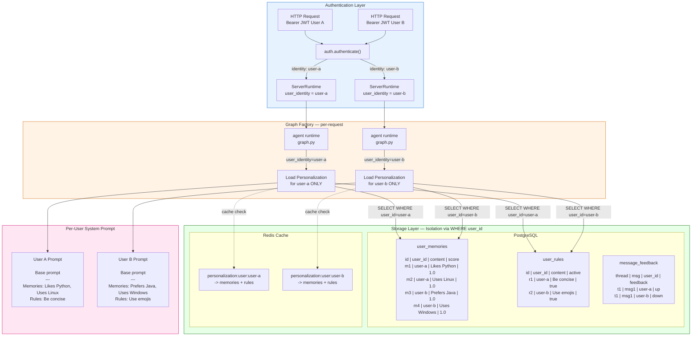

---

## 2. Isolation Boundary Analysis

### Isolation Boundary — Every Query is User-Scoped

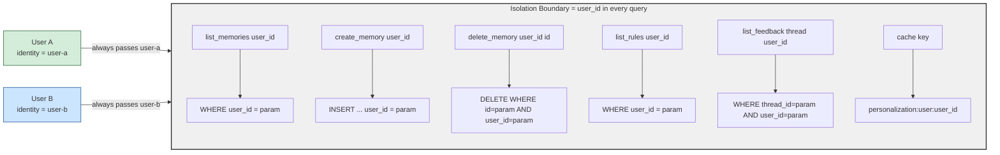

### Strong Isolation (Proven in Code)

| Layer | Isolation | Enforced By | Source File | How It Works |
|-------|-----------|-------------|-------------|--------------|
| Memories (CRUD) | **Strong** | SQL `WHERE user_id = %s` | `src/personalization/repository.py` | Every method (`list_memories`, `create_memory`, `delete_memory`) requires `user_id`. No method queries across users. Delete requires both `id` AND `user_id` to match. |
| Rules (CRUD) | **Strong** | SQL `WHERE user_id = %s` | `src/personalization/repository.py` | Same pattern — `list_rules`, `upsert_rule`, `delete_rule` all filter by `user_id`. |
| Feedback (CRUD) | **Strong** | SQL `WHERE user_id = %s` + UNIQUE constraint | `src/feedback/repository.py` | `user_id` in every query. Unique constraint on `(thread_id, message_id, user_id)` enforces per-user scoping. |
| Personalization Cache | **Strong** | Redis key namespace | `src/cache/personalization_cache.py` | Keys are `personalization:user:{user_id}` — no cross-user cache hits possible. |
| Prompt Injection | **Strong** | Pure function, scoped input | `src/personalization/injector.py` | `inject_personalization()` only receives the data passed to it. `graph.py` only passes the authenticated user's data. |
| MCP Auth Context | **Strong** | Python `contextvars` | `aegra/mcp.py:43-54` | Uses `contextvars.ContextVar` (not module globals). Each async task has isolated context. Safe under concurrent requests. |

### Verified Gaps (Investigated and Fixed)

| Layer | Was | Now | Fix Applied |
|-------|-----|-----|-------------|
| Chat history / threads | Appeared unclear | **Strong** | No fix needed — Aegra enforces `WHERE user_id = user.identity` on every thread operation. Verified in `aegra_api/api/threads.py` and `runs.py`. |
| Memory deletion + cache | **Broken** | **Fixed** | `delete_memory()` and `delete_rule()` now call `personalization_cache.invalidate(user_id)` after DELETE. |
| Memory deletion API | **Missing** | **Fixed** | New REST API at `personalization_routes.py`: `GET/POST/DELETE /memories`, `GET/POST/DELETE /rules` with JWT auth. |
| Decay scoring | **Broken** | **Fixed** | Replaced global `decay_all_memories()` with per-user `decay_user_memories()` + `decay_all_users()`. |
| Feedback endpoint auth | **Weak** | **Fixed** | `GET /feedback/{thread_id}` and `POST /feedback` now extract `user_id` from JWT instead of query param/body. |
| MCP auth context | Appeared unclear | **Strong** | No fix needed — uses Python `contextvars`, not module globals. Each async request is isolated. |
| Graph cache | **OK** | **OK** | No fix needed — graph is stateless, shared cache is functionally correct. |

### Isolation Strength Diagram (After Fixes)

```mermaid
flowchart TB
    subgraph STRONG["ALL LAYERS — STRONG ISOLATION"]
        direction TB
        S1["Memories CRUD\nSQL WHERE user_id"]
        S2["Rules CRUD\nSQL WHERE user_id"]
        S3["Feedback CRUD\nSQL WHERE user_id + UNIQUE"]
        S4["Personalization Cache\nRedis key namespace"]
        S5["Prompt Injection\nPure function"]
        S6["MCP Auth Context\ncontextvars - async safe"]
        S7["Thread Ownership\nAegra SQL WHERE user_id"]
        S8["Memory Deletion\nHard DELETE + cache invalidate"]
        S9["Decay Scoring\nPer-user WHERE user_id"]
        S10["Feedback Endpoints\nJWT-extracted user_id"]
        S11["Personalization API\nJWT auth + cache invalidate"]
    end

    style STRONG fill:#d4edda,stroke:#155724,stroke-width:2px
```

---

## 3. Fix Plan — What Needs to Change

### Fix 1: Cache Invalidation on Memory/Rule Deletion (HIGH)

**Problem:** `delete_memory()` and `delete_rule()` perform hard SQL DELETE but never call `personalization_cache.invalidate(user_id)`. Deleted data keeps being served from Redis cache.

**Files to change:**
- `deep_agent/src/personalization/repository.py` — add cache invalidation after delete
- `deep_agent/src/memory/consolidation.py` — add cache invalidation after consolidation deletes

**Change:**
```python
# In PersonalizationRepository.delete_memory() — after conn.commit()
from deep_agent.src.cache.personalization_cache import invalidate
await invalidate(user_id)

# Same pattern in delete_rule()
```

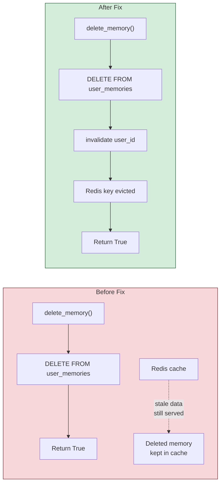

### Fix 2: Expose Memory Deletion API (MEDIUM)

**Problem:** `delete_memory()` and `delete_rule()` exist in the repository but are never called in production. No HTTP endpoint or agent tool allows users to delete their own data.

**Files to create/change:**
- `deep_agent/aegra/feedback.py` or new `deep_agent/aegra/personalization_routes.py` — add REST endpoints
- Register routes in `deep_agent/aegra/http_app.py`

**New endpoints:**
```
DELETE /memories/{memory_id}     — delete authenticated user's memory
DELETE /rules/{rule_id}          — delete authenticated user's rule
GET    /memories                 — list authenticated user's memories
GET    /rules                    — list authenticated user's rules
```

**Key:** Extract `user_id` from the authenticated JWT (not from query params). The repository already enforces `WHERE user_id = %s`, so the endpoint just needs to pass the correct identity.

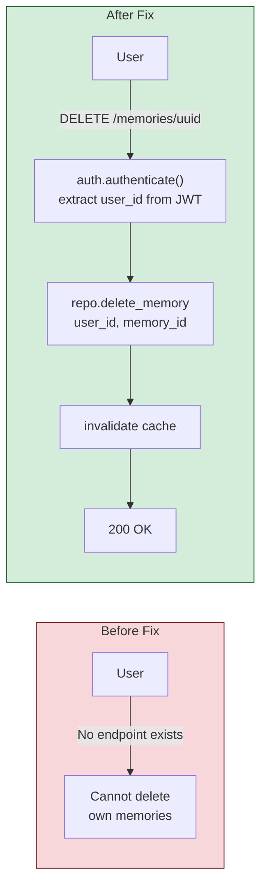

### Fix 3: Scope Decay Scoring Per-User (MEDIUM)

**Problem:** `decay_all_memories()` in `scoring.py:79` runs `SELECT id, score, updated_at FROM user_memories` with no WHERE clause — processes all users' memories in one global query.

**File to change:** `deep_agent/src/memory/scoring.py`

**Change:** Follow the same pattern as consolidation/clustering — add `decay_user_memories(database_uri, user_id)` and iterate per-user in the scheduler.

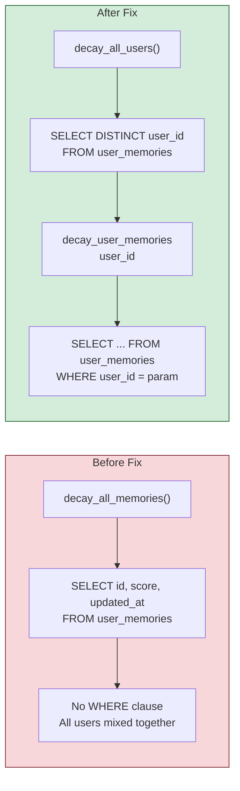

### Fix 4: Validate Feedback Endpoint user_id from JWT (MEDIUM)

**Problem:** `GET /feedback/{thread_id}` accepts `user_id` as a query parameter with default `"anonymous"`. It does not validate that the `user_id` matches the authenticated user from the JWT. Anyone can pass any `user_id` and read that user's feedback.

**File to change:** `deep_agent/aegra/feedback.py`

**Change:** Extract `user_id` from the authenticated request instead of accepting it as a query parameter.

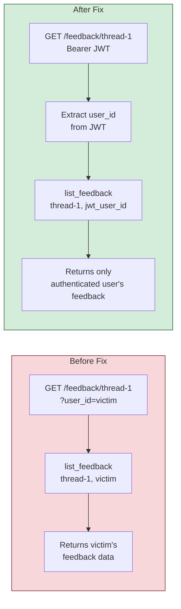

### Thread Ownership (Deferred — Needs Aegra Assessment)

**Problem:** Template-agent does not validate thread ownership. This is delegated to Aegra.

**Assessment needed:** Does Aegra enforce that only the thread creator can access `GET /threads/{thread_id}` and `POST /threads/{thread_id}/runs`? If not, a middleware layer is needed.

**Possible approach (if Aegra does not enforce):**
- Store `user_id` in thread metadata at creation time
- Add middleware that validates `request.user.identity == thread.metadata.user_id` before allowing access
- This requires access to Aegra's thread store/checkpointer

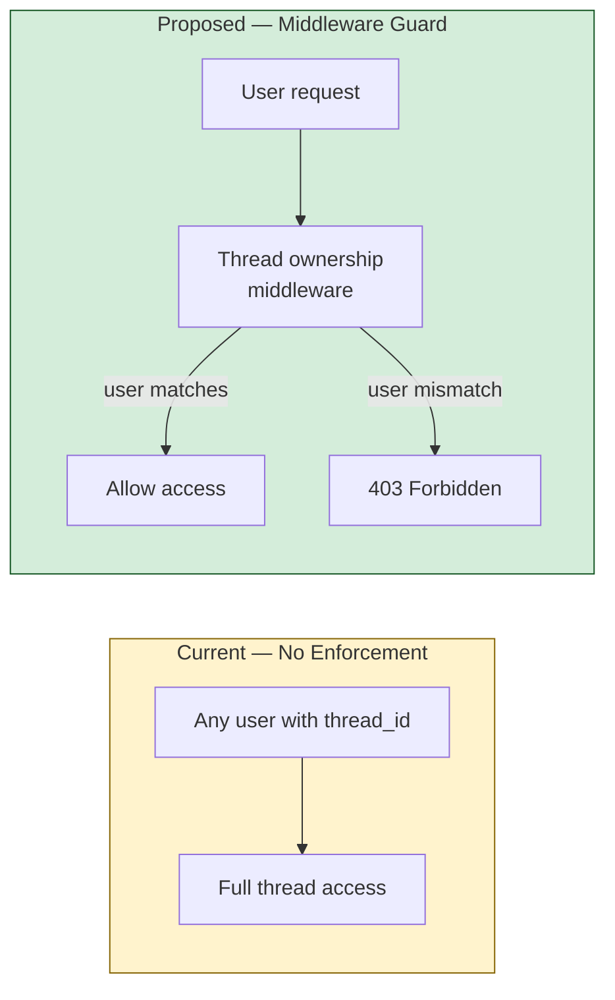

---

## 4. Fixes Applied

| # | Fix | Status | Files Changed |
|---|-----|--------|---------------|
| 1 | Cache invalidation on delete | **Done** | `repository.py`, `consolidation.py` |
| 2 | Personalization REST API | **Done** | New `personalization_routes.py`, `http_app.py`, `repository.py` |
| 3 | Scope decay scoring per-user | **Done** | `scoring.py`, `scheduler.py` |
| 4 | Validate feedback user_id from JWT | **Done** | `feedback.py` |
| 5 | UI memory deletion to backend | **Done** | `agent-rest.ts`, `MemoryList.tsx`, `RulesEditor.tsx` |
| 6 | Align user_id (sub claim) | **Done** | `ChatPage.tsx`, `AppLayout.tsx` |
| 7 | Thread ownership | **Not needed** | Aegra already enforces `WHERE user_id = user.identity` |
| 8 | Thread deletion data cleanup | **Done** | New `thread_cleanup.py` — deletes checkpoints, feedback, token usage on thread delete |

---

## 5. What Tests Must Prove

```mermaid
flowchart TB
    subgraph T1["Test 1-2: Memory Isolation"]
        direction LR
        MA["User A creates memory\nLikes Python"]
        MB["User B creates memory\nPrefers Java"]
        MA --> CHECK1["User A queries\nsees ONLY Likes Python\nNEVER sees Prefers Java"]
        MB --> CHECK2["User B queries\nsees ONLY Prefers Java\nNEVER sees Likes Python"]
    end

    subgraph T2["Test 3-4: Rule Isolation"]
        direction LR
        RA["User A creates rule\nBe concise"]
        RB["User B creates rule\nUse emojis"]
        RA --> CHECK3["User A rules\nBe concise only"]
        RB --> CHECK4["User B rules\nUse emojis only"]
    end

    subgraph T3["Test 5: Feedback Isolation"]
        direction LR
        FA["User A: thumbs-up on msg1"]
        FB["User B: thumbs-down on msg1"]
        FA --> CHECK5["User A sees up\nUser B sees down\nSame message, different views"]
    end

    subgraph T4["Test 6: Cross-User Delete Blocked"]
        direction LR
        DEL["User B tries to delete\nUser A memory"]
        DEL --> CHECK6["Returns False\nUser A memory survives"]
    end

    subgraph T5["Test 7: Hard Delete Verified"]
        direction LR
        CREATE["User A creates memory"]
        CREATE --> DELETE["User A deletes it"]
        DELETE --> CHECK7["SELECT returns 0 rows\nData is GONE\nNot soft-deleted"]
    end

    subgraph T6["Test 8: Concurrent Sessions"]
        direction LR
        CONC_A["User A writes memories\nasync"]
        CONC_B["User B writes memories\nasync simultaneously"]
        CONC_A --> CHECK8["Both complete\nNo cross-contamination\nNo race conditions"]
        CONC_B --> CHECK8
    end

    subgraph T7["Test 9: Personalization Injection Scoping"]
        direction LR
        INJ_A["inject_personalization\nwith User A data"]
        INJ_B["inject_personalization\nwith User B data"]
        INJ_A --> CHECK9["Prompt A has ONLY\nUser A data"]
        INJ_B --> CHECK10["Prompt B has ONLY\nUser B data"]
    end

    subgraph T8["Test 10: Cache Namespace Isolation"]
        direction LR
        CACHE_SET["Cache User A personalization"]
        CACHE_SET --> CHECK11["User B lookup returns None\nKeys are namespaced per user"]
    end

    subgraph T9["Test 11: Delete Invalidates Cache"]
        direction LR
        CACHED["Memory cached in Redis"]
        CACHED --> DEL_FIX["delete_memory called"]
        DEL_FIX --> CHECK12["Cache evicted\nSubsequent read\nhits DB not cache"]
    end

    subgraph T10["Test 12: Decay Scoping"]
        direction LR
        DECAY_A["User A memories decayed"]
        DECAY_B["User B memories untouched"]
        DECAY_A --> CHECK13["Only user-a memories\nhave updated scores"]
    end

    style T1 fill:#ffe6e6,stroke:#cc0000
    style T2 fill:#e6e6ff,stroke:#0000cc
    style T3 fill:#e6fff2,stroke:#00cc66
    style T4 fill:#fff2e6,stroke:#cc6600
    style T5 fill:#f2e6ff,stroke:#6600cc
    style T6 fill:#e6ffff,stroke:#00cccc
    style T7 fill:#ffe6f9,stroke:#cc0099
    style T8 fill:#f9ffe6,stroke:#66cc00
    style T9 fill:#ffe6e6,stroke:#cc0000
    style T10 fill:#e6e6ff,stroke:#0000cc
```

---

## 6. Test Matrix (27 Tests — All Passing)

| # | Test | Data Layer | What It Proves | Type |
|---|------|-----------|----------------|------|
| 1 | Memory read isolation | `user_memories` | User A cannot see User B memories | Read |
| 2 | Memory write isolation | `user_memories` | Each user's creates in own namespace | Write |
| 3 | Rule read isolation | `user_rules` | User A cannot see User B rules | Read |
| 4 | Rule write isolation | `user_rules` | Each user's rules in own namespace | Write |
| 5 | Feedback isolation | `message_feedback` | Same message, different feedback per user | Read+Write |
| 6 | Cross-user memory delete blocked | `user_memories` | User B cannot delete User A memory | Delete |
| 7 | Cross-user rule delete blocked | `user_rules` | User B cannot delete User A rule | Delete |
| 8 | Hard delete memory | `user_memories` | Deleted memory fully gone from DB | Lifecycle |
| 9 | Concurrent memory writes | `user_memories` | Parallel writes don't cross-contaminate | Concurrency |
| 10 | Personalization injection scoping | `inject_personalization` | Prompt has only requesting user's data | Prompt |
| 11 | Delete memory invalidates cache | `personalization_cache` | Cache evicted after memory delete | Cache |
| 12 | No cache invalidation on miss | `personalization_cache` | No eviction if memory didn't exist | Cache |
| 13 | Decay scoring per-user | `scoring.py` | SELECT includes WHERE user_id | Background |
| 14 | Bulk delete memories isolation | `user_memories` | delete_all_memories only removes own user | Bulk delete |
| 15 | Bulk delete rules isolation | `user_rules` | delete_all_rules only removes own user | Bulk delete |
| 16 | Top memories scoped | `user_memories` | list_top_memories returns only own data | Read |
| 17 | Hard delete rule | `user_rules` | Deleted rule fully gone from DB | Lifecycle |
| 18 | Cross-user feedback delete blocked | `message_feedback` | User B cannot delete User A feedback | Delete |
| 19 | Delete rule invalidates cache | `personalization_cache` | Cache evicted after rule delete | Cache |
| 20 | Concurrent rule writes | `user_rules` | Parallel rule writes stay isolated | Concurrency |
| 21 | Cache key namespace | `personalization_cache` | Keys include user_id, no cross-user hits | Cache |
| 22 | Three-user full isolation | All tables | 3 users' data fully separated | Integration |
| 23 | Aegra: thread create stamps owner | `aegra_api/threads.py` | user_id=user.identity on creation | Thread |
| 24 | Aegra: thread get scoped | `aegra_api/threads.py` | WHERE user_id=user.identity on GET | Thread |
| 25 | Aegra: thread list scoped | `aegra_api/threads.py` | 3+ user_id filters in source | Thread |
| 26 | Aegra: thread delete scoped | `aegra_api/threads.py` | WHERE user_id=user.identity on DELETE | Thread |
| 27 | Aegra: runs scoped | `aegra_api/runs.py` | 5+ user.identity checks in runs | Thread |

---

## 7. Template-UI Findings

### Dual Memory System (Disconnected)

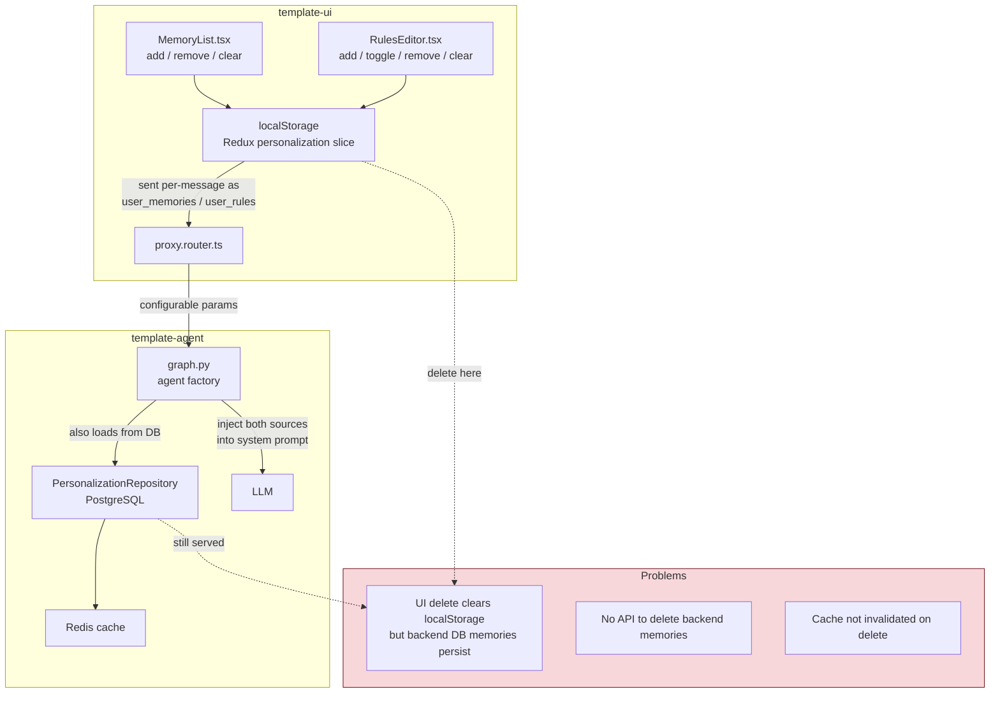

### UI-Specific Gaps

| Gap | Detail | Impact |
|-----|--------|--------|
| localStorage-only memories | UI memories/rules stored in Redux + localStorage, sent per-message. Deletion only clears local state. | Backend memories in PostgreSQL persist and keep being injected into prompts. |
| No backend memory API | No HTTP endpoint for memory/rule CRUD. `delete_memory()` exists in repo but is never called. | Users have no way to delete server-side memories. |
| user_id mismatch | UI uses `preferred_username` for feedback and thread search. Backend uses JWT `sub` claim. | Feedback and threads could be stored under wrong user identity. |
| Feedback user_id in query param | `GET /feedback/{thread_id}?user_id=X` accepts user_id from URL, not JWT. | Anyone can read any user's feedback by passing their username. |

---

## 8. Test Approach

**Strategy:** In-memory fake database that simulates PostgreSQL WHERE clause filtering.

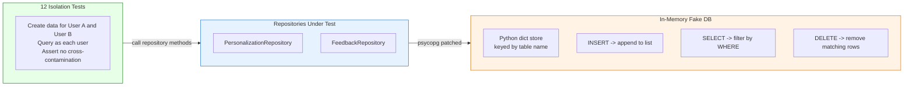

The fake DB actually applies `WHERE user_id = %s` filtering on the in-memory rows, so tests prove the SQL isolation logic works — not just that parameters are passed correctly.

---

## 9. Full Design Spec

See [2026-07-07-user-isolation-design.md](superpowers/specs/2026-07-07-user-isolation-design.md) for the complete design spec including all fixes, implementation order, and test plan.
